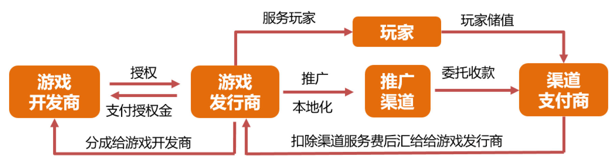
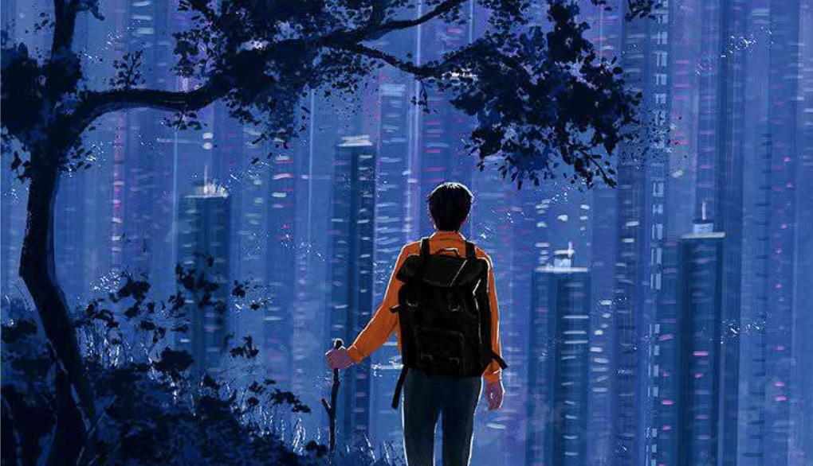

&#8195;&#8195;2020就这样过去了。在这极其短暂的一年里，我进入了新的工作，和老莫完整地的度过我们的第一个周年庆。

## 回顾

&#8195;&#8195;19年的11月入职byte dance，主要做的是游戏发行中的基础工具建设工作。对于游戏发行的业务理解有了一定的提升：针对休闲、轻度游戏，通过买量方式吸引用户，从广告收入中覆盖买量消耗。但是私以为这种方式：没有足够的核心竞争力（如果不追求全链路的追踪、分析，那发行业务只需要数人即可完成游戏筛选、买量、运营等日常工作）（其他内部优势此处不讨论）；游戏供应不稳定（流水收益十分依赖游戏数量、游戏质量，而优秀的游戏开发商基本都是注重重度游戏，而外部中小型开发者游戏数量、质量参差不齐），私以为应通过平台建设来吸引/产生优秀游戏，自研仅作为尝试，不可强依赖；影响收入最重要的因素是留存，而当前在流失召回方面仍旧薄弱；提供完善的发行工具，提升开发者效率，从而支持开发者快速迭代，形成良好的用户习惯和口碑；对于小型开发者，如果出现能够盈利（哪怕不多）的游戏，应快速进行分成；等等。其他内容此处不太方便表述。

&#8195;&#8195;回顾这一年，有很多地方都做得不够好：书读的不多，只有寥寥的十本八本，其中过半为文学类，三五本为技术工具类，针对底层远离知识的书籍阅读严重不足；每周博客（本来是打算）没能坚持下去；运动不足，不过在11月搬了新家后，运动量倒有了一定的增加，感谢莫老师一直陪我跑步(不过一到了冬天天气湿冷后，脚病有复发了，难受......)。

&#8195;&#8195;出行相关：10月份去了躺重庆，逛了逛磁器口，但由于天气多雨阴沉，因此没有很好了领略这座”山城“的风光。但是在重庆的三天里，一起走走、买菜、做饭，已经很满足了。

## 展望
- 身体健康，保持运动
- 阅读基础书籍、文学书籍各半（各五本+）；其他类型书籍（证券、地理等），并形成读书笔记
- 了解其他行业（游戏开发常见技术、流程；付费应用）
- 年度省内外游，此处<strong>@莫老师</strong>
