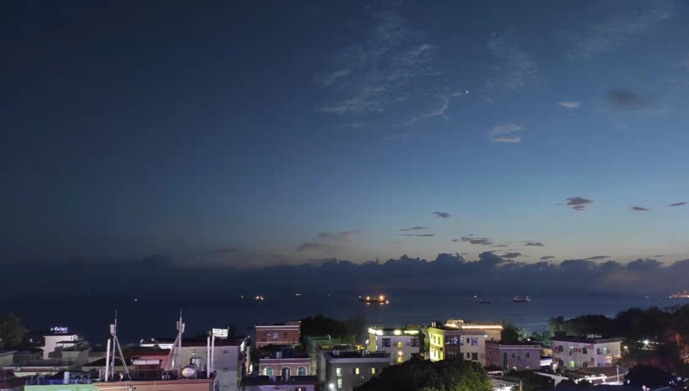

&#8195;&#8195;已经很久没有写东西了，上一次写总结已经是一年半前了，2022也已经过了一个季度。这一年多的时间里发生了很多事情。

&#8195;&#8195;生活上的事情倒没什么。去年年初到11月都住在联检大院，领导就住在隔壁栋，因此生活上交流比较方便。很多晚上，我们都上天台看星星，看月亮。中秋的那个晚上，搬了张小凳子、水果、月饼上天台赏月。周末的时光里，大部分时候都是一起吃的午饭、晚饭，兴致来的话还能一起到楼下公园跑下步、打打羽毛球。生活平淡、简单，快乐。11月后就搬到了南园村，住在七楼，除了上下楼需要爬楼梯外，其他都挺好的，房子通光、透风比之前好多了。

&#8195;&#8195;工作上没啥太大变动，对发行业务更加熟练了、sdk相关的事情少了，但是相对地，其他工作多了。八九月的时候，政策开始收紧，实名、防沉迷的规定变更了很多。仍旧记得九月的一天，请假休息，但是紧急政策需求，就下午开始加班，到半夜3点多完成上线。部门在一整年，基本注意力都放在了摸摸鱼<!-- （上半年烧的钱比我清明烧给我外公、爷爷的都多）-->。 我有1/3左右的工作是在支持这条摸摸鱼业务线。下半年主要的变动是产品leader变动，px完全离开公司，回家带娃遛狗炒股。说实话，sdk这边总共已经三个pm了，但是其实sdk是没啥搞头的（发行业务），养这么多人其实没啥收益。总的来说，发行业务进入平稳期，甚至衰落。

&#8195;&#8195;学习上就说来惭愧了：这一整年都没什么显著的成长。这一年里更加系统地学习了关于os的知识，以及关于链接的整体过程。这些学习让我对os、程序有了更加深刻的认识，特别是io、信号、中断、堆栈、进程生命周期。除此之外，还看了下一些开源项目的源码，略有所得，此外则无太多可讲。字节的工作占据了我的太多时间了，而工作带来的所得，除了钱，没有其他太多的东西（当然钱很重要）。况且工资是要交税的，是有上限的。除了开发相关的提升，让我最快乐的却是《毛选》。本来仅仅是想稍微了解下毛泽东同志，但是没想到他一下子就俘获了我。

&#8195;&#8195;新的一年里，希望能够有更多的思考，不仅仅是专业知识，还有在其他知识上，更或者找到一个适合自己的并培养到职业级的能力。当然，可预见这是一个长期、崎岖的过程。