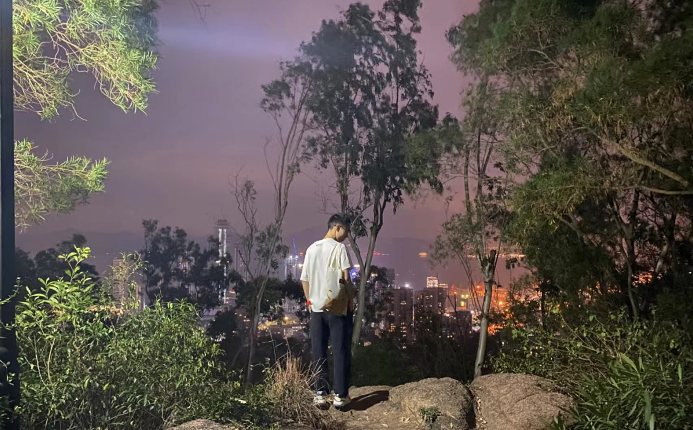

&#8195;&#8195;2023年就这样过去了，2022定的很多目标都没有实现，实在是羞愧。（不过2023跑步超过了200 KM，是个小安慰）。

&#8195;&#8195;2023年的上半年，原部门发生了很大的变动，减员、LD转岗、业务收缩、打包并入其他部门。毕竟没有（足够的）收入就没有发言权。工作的调整，我知道这对于各位同事、朋友都是一个痛苦的事情，也知道，在公司政策面前，我们这种小部门连稍微挣扎一下的机会都没有。

&#8195;&#8195;发行业务的锦姐姐和勉崽继续留在OHY，希望这星星之火，能够一直燃烧下去。MMY的各位被打包到直播游戏后，同时因为各种各样的原因，主动或被动地转到了其他部门：YL和我的同学火乐去了上海、山哥去了Pangle、其他人去了AI。

&#8195;&#8195;十月份，我转岗到了国际电商部门。具体的评价暂时不方便些了，大概也许会在离开的时候补充。

&#8195;&#8195;今天是2024.1.7，在此写一下接下来一年的一些思考：
1. 希望能在新部门比较好的完成工作。不求很好的得到老板的肯定，但是提的需求希望能够比较好的完成。不希望为了卷而卷，不希望为了所谓的好绩效失去生活的时间和热情。
2. 调研下其他行业对计算机的招聘条件、就业规模、待遇、稳定性，如果有合适的计划，咨询下这些行业中的朋友、亲人，再做下一步的决策。
3. 希望多学习数据库和AI相关的知识，了解这些领域的专业原理、工具、使用方法，最好还是亲自动手写一些小作品。
4. 保持锻炼，保持健康的体魄。
5. 可能、大概、也许会做件人生大事。

&#8195;&#8195;我亲爱的朋友们、家人们啊，希望大家都有健康的体魄、光明的未来。