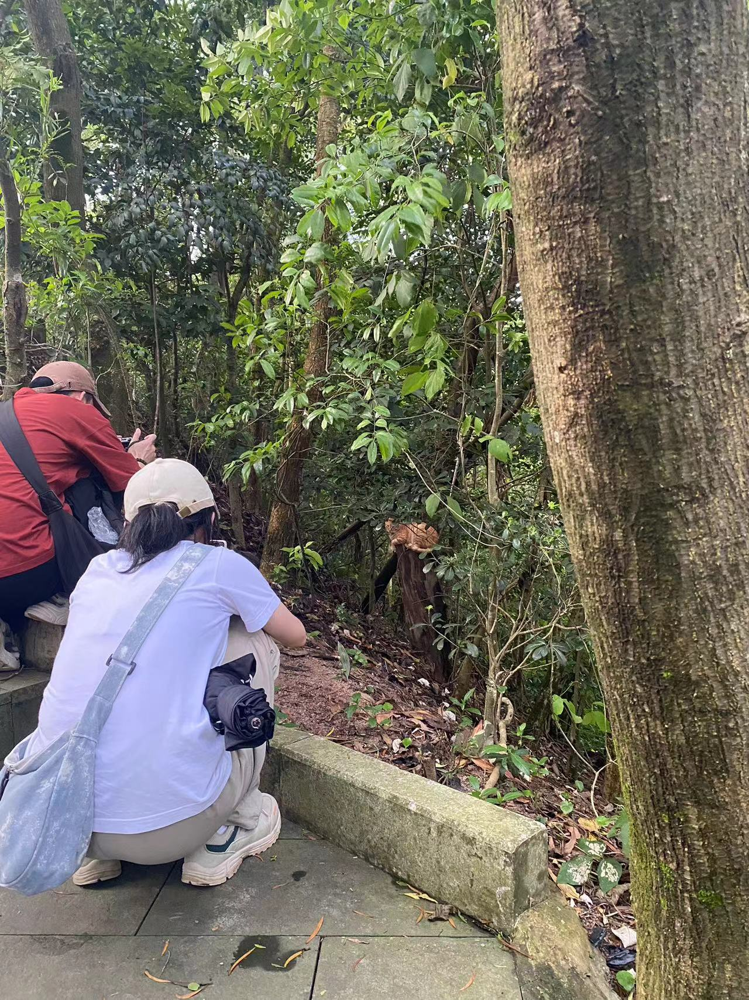
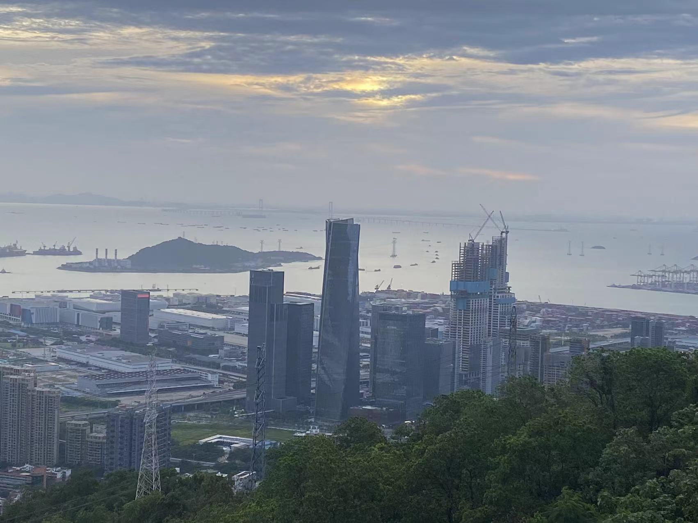

&#8195;&#8195;4年半了，在这个时间，选择了离职。

&#8195;&#8195;离职的原因，一部分是因为累和卷，身心疲惫，不是很喜欢这个没有边界的氛围。23年的10月份，我转岗到Tiktok国际电商，做备货计划相关的项目。计划24年1月份来了个新老板，他base上海，因此如果有大一点的项目、需求，就得要到上海去，基本上一待就是两周、三周。24年2月份，新来的同事进行了一次系统重构，给系统带来了很多问题，接下来半年出现很多次故障。（我没有很强硬的坚持自己的反对观点，有责任。）24年的4月份，开始了为期两个月的珠海封闭开发。珠海横琴创新方挺偏僻的，人少，都是打工人。出差住在酒店，没啥生活界限，下班了也还是干活，晚上十一二点，同事还在群里@人。总的来说，新过来的BH从工程的视角，对系统提出并做了很多修复、改造，做的很好。

&#8195;&#8195;我在电商的半年，也让我明确地认知到：我对于电商没有任何激情（不确定是团队导致的还是业务形态导致的）。我以后会再重试电商行业吗？大概率不会。

&#8195;&#8195;另一方面，这几个月发生了很多事情，让我感叹人生苦短。很多事情，是人力无法左右的。我也在想，未来5年、10年应该做什么？或者说还能持续工作妈？是否应该在30岁之前换另外的方向呢？亦或者，离开故土，去外面的世界看看？还没有答案，或者还在对答案感到怀疑。

&#8195;&#8195;我还是很喜欢字节跳动的，在这里我遇到了很多亲爱的朋友（lx、山哥、锦姐姐、渣岚、朝夕、阿达...，还有北京的朋友）。很感谢他们的帮助，和他们一起工作，是我在字节最快乐的时间。人生何处不相逢，希望再次相遇的时候，大家都保持着快乐。

&#8195;&#8195;离职的这个周末，莫老师还在老家。我一个人去跑了南山。石梯上遇到抱怨妈妈体力差的小朋友、刚开始约会感到局促不安的小情侣，各种形色的人汇集到同一条登山道上，他们是漂亮的风景。山上二三千米的石梯两旁长出了七八颗橘子树，间隔几百米，大抵是前两年爬山人吐出的种子，在山上落地生根，不知道再过几年是否有机会长出果子。到了山顶，没有看到落日。那一天多云，天际边只有橘黄色的一小抹云彩。晚上七点开始下山，八点回到家，吃胡椒虾仁鸡煲。生活啊，是有很多美好的，但是要是没有了生命，就看不到了。

&#8195;&#8195;未来，要保持锻炼、保持对生命的热爱。人生苦短，要好好生活，好好学习，好好工作，好好珍惜身边人。