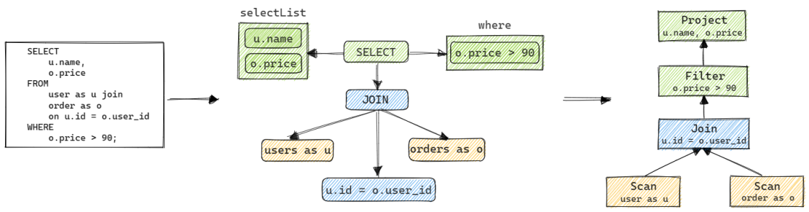
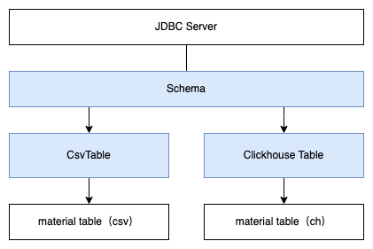

在实际业务中，我们的数据常处于不同的存储引擎中，比如用户账号我们一般存储在RDS中，而用户的点击日志则存储在离线存储（比如clickhouse、hive、kafka等）中，如果我们要关联两个存储系统，那么一般会使用如下方法之一：
1. 当产生点击日志的时候，将用户信息也加入到日志中，随着日志一起落入离线存储或者数据流
2. 将用户账号也dump到和点击日志相同的离线存储中，再通过离线系统将用户信息和点击日志join 上
3. 自行编写应用，分别读取rds和离线存储，并自行实现join操作。

以上三种要么时效性较差、要么实现较为复杂。Calcite的出现提供了另一种选择。（这只是Calcite的功能之一）

Calcite是Apache孵化的一个项目，主要作用是提供标准的SQL语言查询底层各种数据源的一个工具，注意它不是个服务，一般常用作集成到某些框架里，比如Apache Drill、Apache Hive、Apache Kylin、Apache Phoenix、Apache Samza、Apache Flink、Lingual等。

Calcite采用的是业界大数据查询框架的一种通用思路，它的目标是“one size fits all（一种方案适应所有需求场景）”，希望能为不同计算平台和数据源提供统一的查询引擎。Calcite抽象了数据存储、sql解析、查询规划等，可以对外提供统一的SQL查询。

我们常用的hive sql，就是基于Calcite进行sql 解析：Calcite首先将sql进行语法分析（基于JavaCC，也可以替换成Antlr）；解析成AST，随后将AST转换成Query Plan，得到RelNode（关系代数节点），并对QueryPlan基于成本进行优化，最后转变成Operator Tree。随后hive自行根据Operator Tree进行数据物理查询

# 功能特性
- 支持[标准SQL语言](https://calcite.apache.org/docs/reference.html)，也可以自定义语法
- 独立于编程语言和数据源（提供[adapter标准](https://calcite.apache.org/docs/redis_adapter.html)），可以支持不同的前端和后端
- 支持关系代数、可定制的逻辑规划规则和基于成本模型优化的查询引擎
- 支持物化视图（[materialized view](https://calcite.apache.org/docs/materialized_views.html)）的管理（创建、丢弃、持久化和自动识别）
- 基于物化视图的[Lattice](https://calcite.apache.org/docs/lattice.html)和Tile机制，以应用于OLAP分析；
- 支持对流数据的查询 

其他特性
- 跨数据源查询
- 缓存Schema、Function等信息（我们目前没用到，自己在内存里缓存的）
- 支持复合指标计算(a+b as c)、常用聚合函数(sum、count、distinct)、sort、group by、join、limit等 
- 架构比较精简，利用Calcite写几百行代码就可以实现一个SQL查询方案；
- 灵活绑定优化规则，对于一个条件，我们可以自定义多个优化规则，只要命中，可以根据不同的规则多次优化同一个查询条件 

# 架构


- JDBC：对外提供基于JDBC协议的server port，用户可以通过http、jdbc client连接Calcite server
- SQL Parser负责语法解析，生成AST
- Operator Experssion生成关系表达式（RelNode Tree）


```sql
select * from TEST_CSV.TEST01 where TEST01.NAME1='hello';

//RelNode关系树
Project(ID=[$0], NAME1=[$1], NAME2=[$2])
  Filter(condition=[=($1, 'hello')])
    TableScan(table=[[TEST_CSV, TEST01]])
```

- Query Optimizer：基于成本、规则优化查询计划
- Metadata Provider：元数据管理，比如我们可以将物理表中的行数、索引分布、单位查询消耗作为元数据输入Query Optimizer
- Pluggable Rules：规则。Calcite已有默认规则，用户也可以使用自定义规则

以上各个模块都是可插拔的，用户可以单独使用不同的模块。


# 基本概念




Calcite将数据抽象成[adatper](https://calcite.apache.org/docs/adapter.html)，adapter用于成本预估、规则优化、访问不同的物理数据源【calcite默认支持近二十种不同的存储系统】。大致分为schema和table两个模块:

- Schema: 一堆抽象表的集合，一个schema下存在多个抽象表。Calcite提供了一些常见的schema实现：比如csv factory、jdbc factory。
- Table：抽象表，实现了AbstractTable，Calcite提供了一些常见的实现Table实现：csv、json等

# 例子

## CSV
Calcite Tutorial就是基于CSV为例子的，简单，易懂。

配置文件
```json
{
  version: '1.0',
  defaultSchema: 'SALES',
  schemas: [
    {
      name: 'SALES',
      type: 'custom',
      factory: 'org.apache.calcite.adapter.csv.CsvSchemaFactory',
      operand: {
        directory: 'sales'
      }
    }
  ]
}
```
通过以上配置文件初始化Calcite，Calcite会根据配置文件中的factory，进行schema的初始化，接下来用户代码就能使用sql等方式查询该schema：
```java
@Test
public void common() throws SQLException {
    Properties info = new Properties();
    info.put("上面的json配置文件内容");
    try (Connection connection = DriverManager.getConnection("jdbc:calcite:", info);
         Statement statement = connection.createStatement();
         // 假设sales 目录下有一个emps.csv文件
         ResultSet resultSet = statement.executeQuery("select * from emps")) {
        while (resultSet.next()) {
            // logic
            System.out.println(resultSet.getLong(1));
        }
    }
}
```

org.apache.calcite.adapter.csv.CsvSchemaFactory的实现如下：
1. 读取目录directory
2. 遍历directory下的所有csv文件
3. 每个csv文件抽象成一个csv table


```java
@SuppressWarnings("UnusedDeclaration")
public class CsvSchemaFactory implements SchemaFactory {
  public static final CsvSchemaFactory INSTANCE = new CsvSchemaFactory();

  private CsvSchemaFactory() {
  }

  // 根据directory构建csv schema
  @Override public Schema create(SchemaPlus parentSchema, String name,
      Map<String, Object> operand) {
    final String directory = (String) operand.get("directory");
    final File base =
        (File) operand.get(ModelHandler.ExtraOperand.BASE_DIRECTORY.camelName);
    File directoryFile = new File(directory);
    if (base != null && !directoryFile.isAbsolute()) {
      directoryFile = new File(base, directory);
    }
    String flavorName = (String) operand.get("flavor");
    CsvTable.Flavor flavor;
    if (flavorName == null) {
      flavor = CsvTable.Flavor.SCANNABLE;
    } else {
      flavor = CsvTable.Flavor.valueOf(flavorName.toUpperCase(Locale.ROOT));
    }
    // CsvSchema会遍历directory，构建一个具体实现的schema，该schema下包含多个csv table
    return new CsvSchema(directoryFile, flavor);
  }
}
```

## redis
假设我们redis里面有个集合，key=user，每个元素表示用户名及其年龄：
```sh
# 用户及其年龄
redis-> sadd user '{"name": "Tom", "age": 12}'
redis-> sadd user '{"name": "Jerry", "age": 28}'

# 用户对应的母校
redis-> sadd user_school '{"name": "Tom", "school": "Harvard"}'
```

```sql
SELECT USER.NAME,
       age,
       school
FROM   USER
       LEFT JOIN user_school
              ON USER.NAME = user_school.user_name 
```

现在我想通过以上sql来查询用户的年龄、学校，那该怎么实现呢？
1. 实现一个自定义个schema，如下配置文件
2. 支持key名列表

```json
{
  "version": "1.0",
  "defaultSchema": "user",
  "schemas": [
    {
      "name": "SALES",
      "type": "custom",
      // RedisSetSchemaFactory 用于抽象redis 集合作为schema
      "factory": "org.apache.calcite.adapter.redis.RedisSetSchemaFactory",
      "operand": {
        // 需要连接的dsn实例
        "dsn": "redis://localhost:6379/0",
        "sets": ["user", "user_school"]
      }
    }
  ]
}
```

```java
@SuppressWarnings("UnusedDeclaration")
public class RedisSetSchemaFactory implements SchemaFactory {
  private RedisSetSchemaFactory() {
  }

  // 根据directory构建csv schema
  @Override public Schema create(SchemaPlus parentSchema, String name,
      Map<String, Object> operand) {
    final String dsn = (String) operand.get("dsn");
    String[] sets = (String[]) operand.get("sets");
    // CsvSchema会遍历directory，构建一个具体实现的schema，该schema下包含多个csv table
    return new RedisSetSchema(dsn, sets);
  }
}
```

```java
public class RedisSetSchema extends AbstractSchema {
  private final String dsn;
  private final String[] sets;
 
  private Map<String, Table> tableMap;

  public RedisSetSchema(String dsn, String[] sets) {
    super();
    this.dsn = dsn;
    this.set = sets;
  }

  @Override protected Map<String, Table> getTableMap() {
    if (tableMap == null) {
      tableMap = createTableMap();
    }
    return tableMap;
  }

  private Map<String, Table> createTableMap() {
    final ImmutableMap.Builder<String, Table> builder = ImmutableMap.builder();
    // 伪代码
    // 遍历redis sets
      // 构建一个 table
      // builder.put(set_key, new RedisSetTable(dsn, set_key))
    return builder.Build()
  }
}
```


```java
public class RedisSetTable implements ScannableTable {
  private String dsn;
  private String key;
  private Jedis.Client client;
  /** Creates a CsvScannableTable. */
  public RedisSetTable(String dsn, String key) {
    this.dsn = dsn;
    this.key = key;
    // 连接redis实例
    this.client = Jedis.connect(dst)
  }

  @Override public String toString() {
    return "RedisSetTable";
  }

  @Override public Enumerable<@Nullable Object[]> scan(DataContext root) {
    Set<String> set = client.smembers(s.key)
    // 1. 解析set的所有元素，每个元素都是map
     List<@Nullable User> list = set.foreach(r => new User(r))
    // 2. 构建enumerable
    return JsonEnumerator(list);
  }
}
```

# 跨源
```java
// operand 里有db的ip:port, 账号密码
Schema gbasedbt = JdbcSchema.create(rootSchema, "gbasedbt" , (Map<String,Object>)schemas.get(1).get("operand"));
        Schema mysql = JdbcSchema.create(rootSchema, "mysql" , (Map<String,Object>)schemas.get(0).get("operand"));
        rootSchema.add("gbasedbt",gbasedbt);
        rootSchema.add("mysql",mysql);
Statement statement - calciteConnection.createStatement();

String sql = "SELECT o.oid,o.iid,o.icount,i.catalog,i.pname,i.price FROM gbasedbt.order_table AS o join mysql.item AS i on o.iid = i.i_id";
// 执行
ReultSet result = statement.executeQuery(sql)
// 获取逻辑计划
SqlParser.Config insensitiveParser = SqlParser.configBuilder()
        .setCaseSensitive(false)
        .build();

FrameworkConfig config = Frameworks.newConfigBuilder()
        .parserConfig(insensitiveParser)
        .defaultSchema(rootSchema)
        .build();

Planner planner = Frameworks.getPlanner(config);
SqlNode sqlNode = planner.parse(sql);
SqlNode sqlNodeValidated = planner.validate(sqlNode);
RelRoot relRoot = planner.rel(sqlNodeValidated);
RelNode relNode = relRoot.project();

System.out.println(sqlNode.toSqlString(MysqlSqlDialect.DEFAULT));
System.out.println();
System.out.println(relNode.explain());
```

以上跨源读取会被解析成如下逻辑计划

```json
LogicalProject(OID=[$0], IID=[$1], ICOUNT=[$2], CATALOG=[$4], PNAME=[$5], PRICE=[$6])
  LogicalJoin(condition=[=($1, $3)], joinType=[inner])
    JdbcTableScan(table=[[gbasedbt, order_table]])
    JdbcTableScan(table=[[mysql, item]])
```
自底向上
1. 从gbasedbt读取order_table的数据并写入内存/磁盘
2. 从mysql读取iterm表，并写入内存/磁盘
3. 在内存根据字段1和字段3进行inner join
4. 返回字段$0， alias 为OID。其他字段同理

以上是一个很简单的例子，实际应用中可能还会有where、having、limit等条件，calcite可以自动分析数据，并将查询/计算下推到计算引擎（如果可以）。对于自定义的数据源，我们得要自定义规则（比如允许哪些能够下推）


# 优化器


查询优化器是传统数据库的核心模块，也是大数据计算引擎的核心模块，开源大数据引擎如 Impala、Presto、Drill、HAWQ、 Spark、Hive 等都有自己的查询优化器。Calcite 就是从 Hive 的优化器演化而来的。优化器的作用：将解析器生成的关系代数表达式转换成执行计划，供执行引擎执行，在这个过程中，会应用一些规则优化，以帮助生成更高效的执行计划。


常见的优化器有两种：
1. 基于代价的优化器(Cost-Based Optimizer，CBO)：根据优化规则对关系表达式进行转换，这里的转换是说一个关系表达式经过优化规则后会生成另外一个关系表达式，同时原有表达式也会保留，经过一系列转换后会生成多个执行计划，然后 CBO 会根据统计信息和代价模型 (Cost Model) 计算每个执行计划的 Cost，从中挑选 Cost 最小的执行计划。由上可知，CBO 中有两个依赖：统计信息和代价模型。统计信息的准确与否、代价模型的合理与否都会影响 CBO 选择最优计划。


2. 基于规则的优化器（Rule-Based Optimizer，RBO）：根据优化规则对关系表达式进行转换，这里的转换是说一个关系表达式经过优化规则后会变成另外一个关系表达式，同时原有表达式会被裁剪掉，经过一系列转换后生成最终的执行计划。RBO 中包含了一套有着严格顺序的优化规则，同样一条 SQL，无论读取的表中数据是怎么样的，最后生成的执行计划都是一样的。同时，在 RBO 中 SQL 写法的不同很有可能影响最终的执行计划，从而影响执行计划的性能。


从上述描述可知，CBO 是优于 RBO 的，原因是 RBO 是一种只认规则，对数据不敏感的呆板的优化器，而在实际过程中，数据往往是有变化的，通过 RBO 生成的执行计划很有可能不是最优的。事实上目前各大数据库和大数据计算引擎都倾向于使用 CBO，但是对于流式计算引擎来说，使用 CBO 还是有很大难度的，因为并不能提前预知数据量等信息，这会极大地影响优化效果，CBO 主要还是应用在离线的场景。

无论是CBO还是RBO，都包含一系列的优化规则，对关系表达式进行等价转换，比如：
- 谓词下推：比如将筛选、聚合下推到存储系统（如mysql），最常见的例子就是 join 与 filter 操作一起出现时，提前执行 filter 操作以减少join处理的数据量，即将 filter 操作下推，
- 常量折叠: 常量表达式将会被计算，而不用每行数据都进行计算
```sql
select 10+20, name from student;

select 30, name from student;
```
- 列裁剪: 比如下面course 表中的course_name 是没有用到的，将会被优化器裁剪
```sql
select student.name from student 
  left join (select student_id , course_name from course) t
on student.id = t.student_id
```
- 索引选择


规则的选取有多种顺序，calcite/业界它提供了一下几种顺序，默认是深度优先顺序：
- ARBITRARY：按任意顺序匹配（因为它是有效的，而且大部分的 Rule 并不关心匹配顺序）；
- BOTTOM_UP：自下而上，先从子节点开始匹配；
- TOP_DOWN：自上而下，先从父节点开始匹配；
- DEPTH_FIRST：深度优先匹配，某些情况下比 ARBITRARY 高效（为了避免新的 vertex 产生后又从 root 节点开始匹配）。

## 自定义规则
用户可以自己继承RelOptRule来定义自己的规则，主要实现以下两个方法：
```java
@Override
public boolean matches(RelOptRuleCall call) {
        // your implement
       return super.matches(call);
}

@Override
public void onMatch(final RelOptRuleCall call) {
  // 从表达式call可以得到父子节点
  // 调整父子节点的关系、计算逻辑，得到新的关系表达式newRelNode
  // 调用transformTo替换原来的子树
  call.transformTo(newRelNode);
}
```

## 自定义成本
calcite自定义成本/代价的简单例子
```java
public class CSVTableScan extends TableScan implements CSVRel {
    private RelOptCost cost;
    public CSVTableScan(RelOptCluster cluster, RelTraitSet traitSet, RelOptTable table) {
        super(cluster, traitSet, table);
    }

    @Override public double estimateRowCount(RelMetadataQuery mq) {
        return 50;
    }

    @Override
    public RelOptCost computeSelfCost(RelOptPlanner planner, RelMetadataQuery mq) {
        //return super.computeSelfCo(planner, mq);

        if (cost != null) {
            return cost;
        }
        //通过工厂生成 RelOptCost ，注入自定义 cost 值并返回
        cost = planner.getCostFactory().makeCost(1, 1, 0);
        return cost;
    }
}
```


# Refer
- [calcite go client](https://github.com/apache/calcite-avatica-go)
- [calcite github](https://github.com/apache/calcite/tree/main)
- [calcite doc](https://calcite.apache.org/docs/)
- [calcite 关系代数](https://liebing.org.cn/apache-calcite-relational-algebra.html)