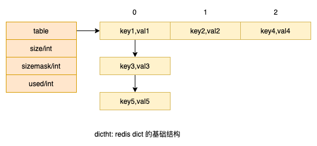
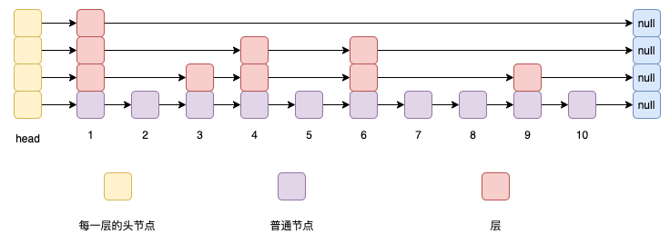
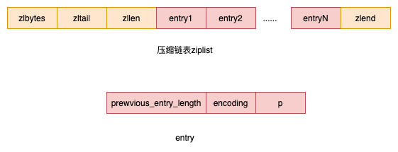
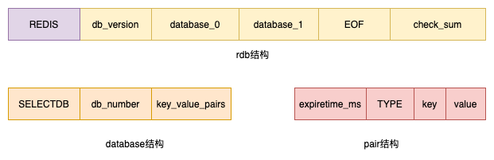
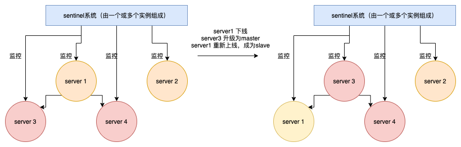
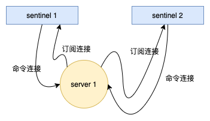

<p align="center">

</p>


## 数据结构
<p align="center">

</p>
&#8195;&#8195;redis里面的每个简直对都是由object组成的，其中键总是一个字符串对象；值可以是字符串对象、列表对象、hash对象、集合对象、有序集合对象这五种对象的其中一种。当然，现在还有HyperLogLog等新结构，但总的来说使用场景较少。我们将先简单介绍一些常见的基本对象（较为简单的对象将简要带过）。

### string/SDS
&#8195;&#8195;由于C语言传统的字符串（以空字符结尾的字符数组，即C字符串）较难使用，因此redis自己构建了一种名为simple dynamic string/SDS的抽象类型。这种字符串类型常见于其他语言，如java/Go StringBuilder等，一种特殊的字符切片。

<p align="center">

</p>

相较于C字符串的优点有：
- O(1)复杂度获取字符串长度
- 减少内存分配次数
- 杜绝缓冲区溢出（C字符串不会做读写检查）
- 二进制安全（允许存储'\0','\n'等分隔符）
- 兼容部分C字符串函数（redis提供很多函数来操作sds，如内容追加、复制等）

### list
&#8195;&#8195;链表在redis中使用较为广泛，如列表等。redis里面的链表是双向链表的一种实现。不赘述。

### dict
<p align="center">

</p>

&#8195;&#8195;其实redis的dict也很类似于其他语言的map。上图是一个dicth，redis的dict包含了两个dicth（用于rehash，比如k-v键值对过多的时候，需要扩大dict的容量，就需要将数据从dicth_1搬到扩容后的dicth_2）。rehash的过程也是渐进的，尽量使得rehash操作不会对服务器性能有太大影响（分多次将dict_1的kv搬运到dict_2）。

### skip list
&#8195;&#8195;跳跃表在redis的唯一作用，就是实现有序集合类型。跳跃表通过有序方式在列表中存储元素，使得增删改查的效率都能在对数消耗下完成。

```c
typedef struct zskiplistNode {

    // member 对象
    robj *obj;

    // 分值
    double score;

    // 后退指针
    struct zskiplistNode *backward;

    // 层
    struct zskiplistLevel {

        // 前进指针
        struct zskiplistNode *forward;

        // 这个层跨越的节点数量
        unsigned int span;

    } level[];

} zskiplistNode;
```
redis的跳跃表节点在标准跳跃表的基础上做了一点修改：
- 允许重复的score
- 每个节点的level都至少有一个节点
- 每个节点都有一个后退指针（图中没有画出来），方便反向遍历：zrevrange

<p align="center">

</p>


```c
typedef struct zskiplist {

    // 头节点，尾节点
    struct zskiplistNode *header, *tail;

    // 节点数量
    unsigned long length;

    // 目前表内节点的最大层数
    int level;

} zskiplist;
```


### zip list
当列表、dict的元素是数字或者字符串，且数量较少时，为了节省内存，redis将使用压缩列表作为底层实现。

<p align="center">

</p>

- 压缩列表
    - zlibytes：记录这个压缩列表占用的字节总数，在对压缩列表进行内存重分配或者计算zlend的位置时使用
    - zltail：表尾节点的字节偏移量
    - zllen：节点数量
    - zlend：特殊值OXFF，用于标记压缩列表的末端 
- 节点
    - previous_entry_lenth:前一个节点的长度，方便计算前一个节点的地址
    - encoding: 节点的长度和值（前两个bit表示类型，后面的bit表示content长度）
    - content：值

在数据量较少的情况下


### 过期策略
&#8195;&#8195;数据库使用一个db对象来表示，包含了一个dict，用来表示该db的所有键，值为具体的类型（如字典dict、列表、集合、字符串等）

一些和过期相关的命令如下(db有一个字典保存每个key的过期时间)：
- expire/pexpire/expireat/pexpireat
- persist: 移除过期时间
- ttl/pttl：查询过期时间

删除策略
- 定时删除：为每个键都创建一个定时器，在过期时间来临时删除
- 惰性删除：当读取某个键时，才进行判断与删除
- 定期删除：每隔一段时间检查键空间里的键，过期则删除

redis使用了惰性删除和定期删除

### RDB
在执行save/bgsave的时候，会创建一个新的rdb文件（一个存储了数据库状态、kv的二进制文件）。

- 如果服务器以主服务器模式运行，那么只会载入rdb中未过期的kv
- 如果服务器以从服务器模式运行，那么会载入所有的kv

redis不允许bgsave/save同时执行：避免父子进程产生竞争条件。bgrewriteaof和bgsave也不能同时执行：
- 如果bgsave正在执行，那么bgrewriteaof会被延迟到bgsave执行完成后执行
- 如果bgrewriteaof正在执行，那么bgsave会被拒绝


<p align="center">

</p>

- REDIS：固定的“REDIS”字符串的二进制表示
- db version: 版本，一个整数，越大，代表该rdb文件版本越新
- database n: 数据库n的数据
- check sum: 校验和，用户判断rdb文件是否有损坏

&#8195;&#8195;键值对pair的key、value也使用一定的组织结构来表示。key是（长度，字符串），value对于不同的类型都有不同的结构，此处不赘述。大家可以使用od命令查看rdb文件的结构。

### AOF
&#8195;&#8195;当服务器以aof持久化模式运行时，如果某个k已经过期，但它还没被删除，那么aof不会因为这个过期键二产生任何影响。当过期键被删除后，程序会向aof追加一条删除记录。

&#8195;&#8195;aof重写：当aof太大，可以对aof执行重写操作，仅将未过期的键写入aof文件。如果同时开启了rdb、aof，当恢复数据库时，redis会优先使用aof。

&#8195;&#8195;相关命令：bgrewriteaof。在重写aof的过程中，新的更新语句会缓存在aof重写缓冲区，待bgrewriteaof进程完成后，再将aof重写缓冲区刷入aof文件。如果有旧的aof文件，则使用rename操作，原子地覆盖旧aof文件。

#### aof写入的三个步骤
- 命令追加：每次有更新操作，redis会将命令写入aof_buf缓冲区
- 文件写入：时间循环将根据配置将aof_buf中的数据追加到文件
- 文件同步：配置有：always、everysec、no。当用户调用了write，现代操作系统仍会将数据保存在内存缓冲区，等缓冲区满后或者到达时限限制，才会落地到磁盘，因此如果计算机宕机，缓冲区里的数据就会丢失，因此，操作系统提供fsync、fdatasync两个系统调用，强制将缓冲区里的数据落地到磁盘。


#### aof载入
redis会创建一个伪客户端，然后执行aof中的命令，从而达到恢复数据库的目标。


## 单机数据库
```conf
port 6379
daemonize yes
pidfile /app/redis/conf/redis-6379.pid
bind 192.168.50.101   # 本机IP
logfile /app/redis/logs/redis-6379.log
dbfilename dump-6379.rdb
dir /app/redis/conf   # 数据文件存放位置
appendonly no  # 是否开启aof
appendfilename "appendonly.aof"

# slaveof 192.168.50.101 6379  # master主的地址和端口

```

```
redis-server path/to/your/redis.conf
```

## 多机数据库

### 复制
```
// 将当前redis设置为host:port的从库
slaveof host port
```

redis的复制功能分为同步和命令传播两个操作：
- 同步操作：将从服务器的数据库状态更新至主服务器的数据库状态
- 命令传播：在服务器的数据库状态被修改，导致主从的数据库状态出现不一致时，让主从服务器的数据库重新回到一致状态

同步操作主要通过sync命令：
- 从服务器想主服务器发送sync命令
- 主服务器收到sync命令后，执行bgsave生成rdb，并将bgsave过程中执行的写命令写入一个缓冲区buf
- 主服务器bgsave完成后，将rdb发送给从服务器；从服务器加载rdb
- 主服务器将buf发送给从服务器；从服务执行bug里的写命令

&#8195;&#8195;当主服务器状态发生变更（如执行了del等写命令），就会造成主从状态不一致。此时，主服务器会将写命令传播给从服务器。

&#8195;&#8195;sync的缺点：当主从断线重连后，会重新执行sync操作（发送rdb、buf）。然而一般情况下，主从很快就能重新连接上，从服务器只需要执行断开期间的写命令就好，无需耗费巨大资源重新加载整个库。因此redis提供了psync命令来解决该问题。

&#8195;&#8195;psync：主服务器有一个buffer（复制积压缓冲区）区间，存储最近的写命令，以及最新命令在buffer中的偏移量offset。从服务器也有offset，当从服务器的offset落后于主服务器，说明从服务器落后于主服务器。当断开从连后，如果从服务器会从offset的位置开始同步主服务器buffer里面的命令（当然，前提是主服务器里的buffer还有缓存，如果断开时间过长，那就会执行sync操作）。

&#8195;&#8195;心跳检测：从服务器每隔一段时间都会发送 “replconf ack $offset”给主服务器。如果主服务器发现offset不一致，会重新发送buffer在offset后开始的命令。


### sentinel
&#8195;&#8195;sentinel是redis的高可用解决方案。一个或多个sentinel可以监控多个主服务器以及这些主服务器下的所有从服务器。如果主服务器下线，就会将其属下的从服务器升级为主服务器。


<p align="center">

</p>

#### 初始化/启动sentinel
sentinel本质上只是一个运行在特殊模式下的redis服务器。

```sh
redis-sentinel /path/to/your/sentinel.conf
// or
redis-server  /path/to/your/sentinel.conf --sentinel
```

以下是一个sentinel的配置样例
```conf
# 后台模式运行
daemonize yes
# sentinel server端口，sentinel实例之间的通讯端口
port 27000
# 设置需要监控的master服务器
# 2（quorum）表示执行故障操作需要多少个哨兵统一，一般设置为N/2+1（因此sentinel的数量最好设置奇数个）
# redis-master是master的别名，可以随意取，只要和本文件的其他别名一致即可
sentinel monitor redis-master 192.168.1.51 7000 2
# master多少ms后无法反应就认为master已经donw了
sentinel down-after-milliseconds redis-master 5000
# 经过多少ms后，就从down掉的master的slave选取出一个升级
sentinel failover-timeout redis-master 900000
# master重新选出来后，其它slave节点能同时并行从新master同步缓存的台数有多少个。
# 显然该值越大，所有slave节点完成同步切换的整体速度越快，但如果此时正好有人在访问这些slave，可能造成读取失败，影响面会更广。
# 为1，表示同一时间，只能有一台salve从新master同步数据；其它slave还能继续服务
sentinel parallel-syncs redis-master 2
# redis master的auth密码
sentinel auth-pass redis-master 123456
# 日志文件
logfile "/data/bd/redis/sentinel/sentinel.log"
```

&#8195;&#8195;多个sentinel实例会从其监控的master节点获知其他sentinel的存在（通过命令连接、订阅连接，类似于广播）；通过向master发送info命令知道slave的存在。因此多个sentinel可以共用一份配置文件（只要用不同的ip/机器或者机器就好）。每个sentinel实例都一个一个masters、slaves数组存储它所知道的redis节点。


<p align="center">

</p>

&#8195;&#8195;sentinel会向其所监听的master实例发送ping命令来检测实例是否在线。经过down-after-milliseconds后会认为主观下线。询问其他sentinel，如果足够数量（quorum个）的sentinel认为其客观下线，则变成客观下线。

&#8195;&#8195;master客观下线后，多个sentinel会进行协商，选举出一个leader sentinel，并由leader sentinel对下线的master进行故障转移。
- 每次进行选举后，不管是否选举成功，所有sentinel的配置纪元都会自增一。每个sentinel在一个纪元里面都只能投一次票给自己或者其他sentinel
- 如果sentinel发现已经master服务器已经客观下线了
    - 如果自己在本纪元没有投票，就将自己的票投给自己
    - 请求其他sentinel将票投给自己
- 如果sentinel收到其他sentinel的本纪元投票请求
    - 如果自己在本纪元还没有投票给任何sentinel（包括自己），就将票投给请求方
- 如果某个sentinel得到了半数以上（N/2+1）的票数，就选举成功，成为leader sentinel
- 如果给定时间内，没有一个sentinel得到半数以上票数，则开启新的一轮纪元并重新投票

#### 故障转移
- 从故障master的slaves里面选取出一个slave
- 向slave发送slaveof no one 命令
- 向其他slave 发送slaveof 命令，让它们成为新master的从节点

### 集群
redis集群是redis提供的分布式数据库方案，集群通过分片进行数据共享，并提供复制和故障转移功能。

```conf
# server端口
port 7001
daemonize yes
pidfile /var/run/redis_7001.pid
bind 127.0.0.1
appendonly yes
cluster-enabled yes
cluster-config-file nodes_7001.conf
cluster-node-timeout 5000
```


```sh
# 启动7001实例，其他实例不赘述
redis-server /path/to/your/node7001.conf
# 创建集群。一个redis集群至少有三个节点，本样例设置三个主节点，三个从节点
redis-cli --cluster create 127.0.0.1:7001 127.0.0.1:7002 127.0.0.1:7003 127.0.0.1:7004 127.0.0.1:7005 127.0.0.1:7006 --cluster-replicas 1

// 连接集群
cluster -c -h $host -p $port // c表示集群模式

// 动态增加节点到当前集群
// 将ip:host添加到当前节点所在的集群中

cluster meet ip host
// 查看当前集群的节点
cluster nodes
```

&#8195;&#8195;每个节点有一个二进制数据来记录自己的槽位。第i位为1，表示本节点负责处理第i个槽的数据。同时，每个节点都会记录其他节点的二进制数组，因此可以方便地读写命令重定向到对应的节点。
```
// 查询key_name所在的槽
cluster keyslot key_name
```

- 查询的key不是本节点负责的时候，会返回moved target_host target_port给客户端，让客户端将命令重新发送到target_host target_port（负责该槽的节点），并且，后续该客户端对该槽的所有的请求都会直接到目标节点（负责该槽的节点），不再查询本节点
- 在slot迁移的过程中，可能存在一个slot的key存放在两个不同的节点的情况。此时如果本节点找不到对应的key，会返回ack target_host target_port给客户端，让客户端尝试查询target_host target_port。但是下次该槽的请求仍然会到达本节点。

&#8195;&#8195;如果某个主节点down了，从节点会自动升级为主节点。当down了的主节点恢复正常，会重新进入集群，作为从节点。每个节点都有一个nodes数据来记录集群中的所有节点。当使用cluster meet增加新节点，redis会使用gossip协议将新节点的消息传播给集群中的其他节点，让其他节点也与新节点进行握手。使用cluster meet的节点默认都将成为master，并且没有分配到clost，无法起作用，因此还需要将slot分配给新节点，本文暂不讲解。
```
// 将当前节点设置为某个节点的从节点
cluster replicate 92fd15d6f67f3944ce241dc99217b4844313c9e4
```

#### 故障转移
非常类似于leader sentinel的选举方法，都是raft算法的实现
- 集群中的每个主节点在每个纪元都有一个投票机会
- 第一个向主节点要求投票的从节点，将获得该主节点的投票
- 本纪元得票数超过一般的从节点将会升级为主节点


## 其他
### 发布与订阅
常用命令
- subscribe channel：订阅某频道
- unsubscribe channel：退订某频道
- publish channel msg：往某频道发送消息
- psubscribe regex：订阅符合该正则表达式的频道

### 事务
乐观锁的实现：multi、exec、watch、discard。如果key1在事务提交前被修改，那么该事务将执行失败。
```
watch key1
multi
set key2 val2
exec
```
redis 有一个watched keys字典，用来保存所有被watch命令监视的key，字典的值是一个链表，存储所有监视该key的客户端。


#### 原子性
redis不支持事务回滚，即使事务队列中的某个命令在执行期间发生错误，整个事务也会继续执行，如:
```
set msg hello
multi
sadd fruit apple
rpush msg "world" // 发生错误
sadd fruit orange
exec
```
&#8195;&#8195;上例在rpush的时候发生错误，但redis没有进行回滚，仍会继续执行，最终结果是fruit集合里面有apple和orange。因此，redis不具备严格的原子性。当然，以上错误一般是有编程错误导致的，所以redis作者认为没必要提供回滚功能

#### 一致性
&#8195;&#8195;一致性，指的是数据符合数据库本身的定义和涉及，对redis来说，意味着不会包含非法或者无效的错误数据。

- 对于不存在的命令或者格式不正确等请求，命令是无法进入事务队列的
- 事务执行间发生的错误，redis是不会执行的，因此不会产生非法或者无效的错误数据，如上例的rpush命令
- 如果服务器发生停机，重启后redis会从rdb/aof恢复数据库，不会产生非法或者无效的错误数据（但可能造成数据丢失，不过这个不是一致性的问题）

因此redis事务具备一致性。

#### 隔离性
&#8195;&#8195;redis是单线程执行的，因此具备隔离性得到满足（redis 6开始有多线程，不过只负责网络数据读写和协议解析，执行命令仍然是单线程的）

#### 持久性
这取决于redis的持久化策略：
- 不进行持久化，一旦宕机，数据即会丢失
- 开启rdb：由于bgsave只有在特定时机才会被触发，因此上一次bgsave后的数据可能被丢失
- 开启ao方：如果appendfsync=always，那么命令执行后总会立即落地到磁盘，因此具备持久性；否则，上一次落地后的命令数据会被丢失

其他知识点
- mysql事务的实现
- 脏读、幻读、不可重复读的概念

### 慢查询
如果命令执行耗时超过slowlog-log-slower-than ms，就会被认为是慢查询。查询慢查询日志：
```
slowlog get
```

slowlog-log-slower-than可以在配置文件设置，也可以在命令行设置：
```
// 如果为0，则会记录所有日志
// 通过这个我们也可以查询得到集群间节点通信的命令
config set slowlog-log-slower-than 10
// 最多保存多少条日志
config set slowlog-max-len 10
```