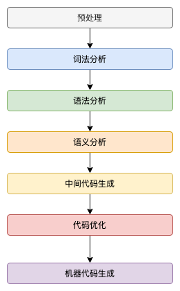
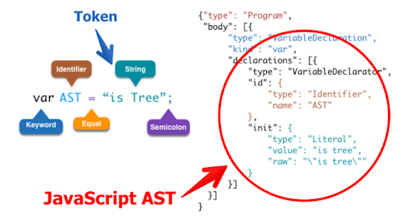
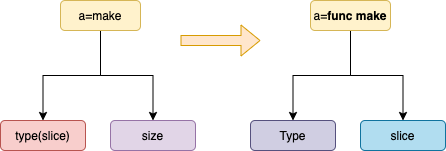
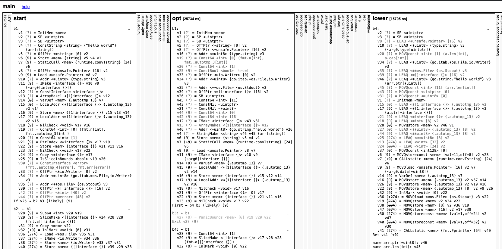
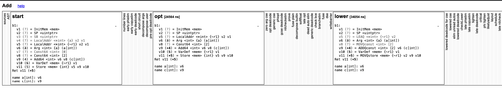

<p align="center">

</p>


Go 语言编译器的源代码在 src/cmd/compile 目录中，目录下的文件共同组成了 Go 语言的编译器。编译器的前端一般承担着词法分析、语法分析、类型检查和中间代码生成几部分工作，而编译器后端主要负责目标代码的生成和优化，也就是将中间代码翻译成目标机器能够运行的二进制机器码

## 词法分析
编译过程其实都是从解析代码的源文件开始的，词法分析的作用就是解析源代码文件，它将文件中的字符串序列转换成 Token 序列，方便后面的处理和解析，我们一般会把执行词法分析的程序称为词法解析器（lexer）。

以下是go的token类型，见/usr/local/go/src/cmd/compile/internal/syntax/tokens.go
```go
const(
    // delimiters
        _Lparen    // (
        _Colon     // :
        _Dot       // .
        _DotDotDot // ...

        // keywords
        _Break       // break
        _Case        // case
        _Chan        // chan
        _Const       // const
        _Continue    // continue
        _Default     // default
        _Defer       // defer
        _Else        // else
        _Fallthrough // fallthrough
        _For         // for
        _Func        // func
```

词法分析的具体实现见 src/cmd/compile/internal/syntax/scanner.go。这部分代码主要工作就是读取一个go文件，然后输出一个token序列，作为下一阶段的输入。
```go
func (s *scanner) next() {
	c := s.getr()
	for c == ' ' || c == '\t' || c == '\n' || c == '\r' {
		c = s.getr()
	}
	s.line, s.col = s.source.line0, s.source.col0
	if isLetter(c) || c >= utf8.RuneSelf && s.isIdentRune(c, true) {
		s.ident()
		return
	}
	switch c {
	case -1:
		s.tok = _EOF
	case '0', '1', '2', '3', '4', '5', '6', '7', '8', '9':
		s.number(c)
    ...
    }
}
```

## 语法分析
<p align="center">

</p>

大部分语言用的文档都是L2上下文无关文法，go也一样。（Go 语言的语法解析器使用的就是 LALR的文法，一种L2上下文无关文法的特例）
```s
𝑆→𝑎𝑆1
𝑆1→𝑏𝑆1
𝑆1→𝜖
```
判断一个token序列是否符合文法规则，一般的方法是使用有限状态机或者栈。

基于token序列，编译器会根据文法来编译ast，每个go文件都对应着一棵ast。一个go文件的ast又由多颗子ast构成，如import子树、const子树、表达式子树等。
```go
// ImportSpec = [ "." | PackageName ] ImportPath .
// ImportPath = string_lit .
func (p *parser) importDecl(group *Group) Decl {
    ...
}

// ConstSpec = IdentifierList [ [ Type ] "=" ExpressionList ] .
func (p *parser) constDecl(group *Group) Decl {
    ...
}

// Expression = UnaryExpr | Expression binary_op Expression .
func (p *parser) binaryExpr(prec int) Expr {
    ...
}
```


当拿到一组文件的抽象语法树之后，Go 语言的编译器会对语法树中定义和使用的类型进行检查，类型检查分别会按照以下的顺序对不同类型的节点进行验证和处理：
- 常量、类型和函数名及类型；
- 变量的赋值和初始化；
- 函数和闭包的主体；
- 哈希键值对的类型；
- 导入函数体；
- 外部的声明；

类型检查阶段不止会对节点的类型进行验证，还会展开和改写一些内建的函数，例如 make 关键字在这个阶段会根据子树的结构被替换成 makeslice 或者 makechan 等函数。我们常见的内置函数（make、channle的读取或写入等）。
<p align="center">

</p>

经过语法、语义分析，我们就基本可以认为源代码没有语法错误，接下来就可以生成中间代码了。（除了ast，也需要生成一些其他的信息，如符号表等）

## 中间代码生成
中间代码是指一种应用于抽象机器的编程语言，它设计的目的，是用来帮助我们分析计算机程序。在编译的过程中，编译器会在将源代码转换成目标机器上机器码的过程中，先把源代码转换成一种中间的表述形式。

Go 语言编译器的中间代码具有静态单赋值（SSA）的特性。如果一个中间代码具有静态单赋值的特性，那么每个变量就只会被赋值一次。
- 常数传播（constant propagation）
- 值域传播（value range propagation）
- 稀疏有条件的常数传播（sparse conditional constant propagation）
- 消除无用的程式码（dead code elimination）
- 全域数值编号（global value numbering）
- 消除部分的冗余（partial redundancy elimination）
- 强度折减（strength reduction）
- 寄存器分配（register allocation）

得到了ast之后，就可以生成中间代码了。Go 语言源代码的 src/cmd/compile/internal 目录中包含了很多机器码生成相关的包，不同类型的 CPU 分别使用了不同的包生成机器码，其中包括 amd64、arm、arm64、mips、mips64、ppc64、s390x、x86 和 wasm，其中比较有趣的就是 WebAssembly（Wasm）了。

编译器的具体实现在：src/cmd/compile/internal/gc/main.go，生成中间代码的部分在AST 的抽象语法树就不再会改变了，Go 语言的编译器会使用 compileSSA 函数将抽象语法树转换成中间代码，可见

通过一下命令，可以查看中间代码
```go
GOSSAFUNC=main go build main.go
```

<p align="center">

</p>

以下是一个更加简单的样例
```go
package add

func Add(a int) int {
        c := a + 2
        return c
}
```
<p align="center">

</p>
最左侧就是源代码，中间是源代码生成的抽象语法树，最右侧是生成的第一轮中间代码**，后面还有几十轮，感兴趣的可以自己尝试编译一下。

中间代码仍然需要编译器进行优化以去掉无用代码并对操作数进行精简，编译器对中间代码的优化过程都是由 src/cmd/compile/internal/ssa 包的 Compile 函数执行


## 机器码生成
src/cmd/internal/obj