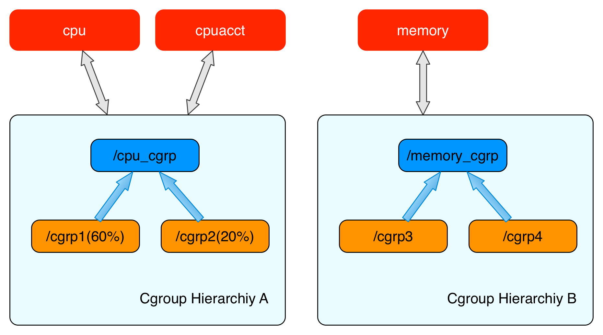
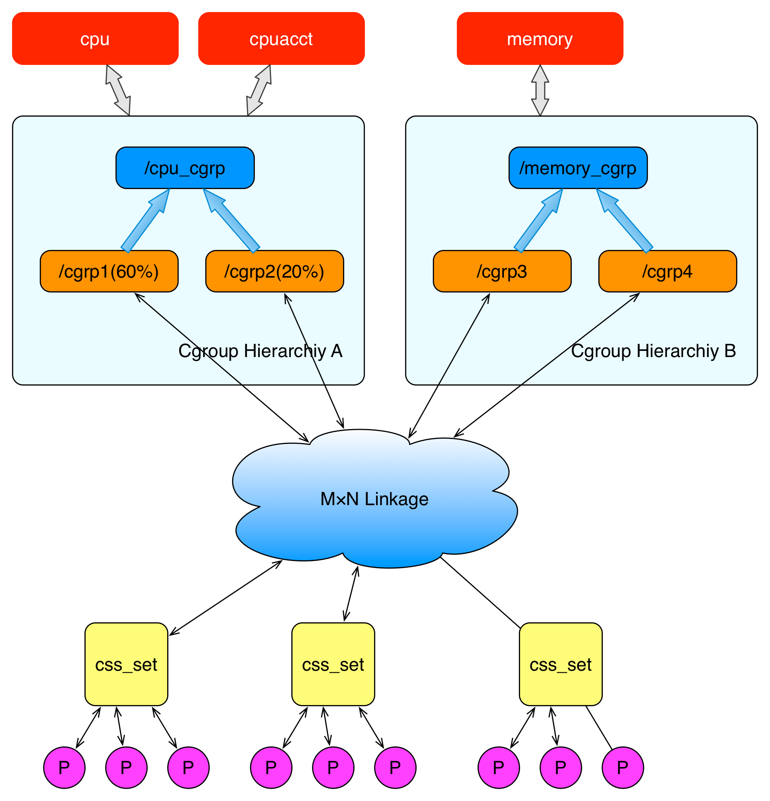
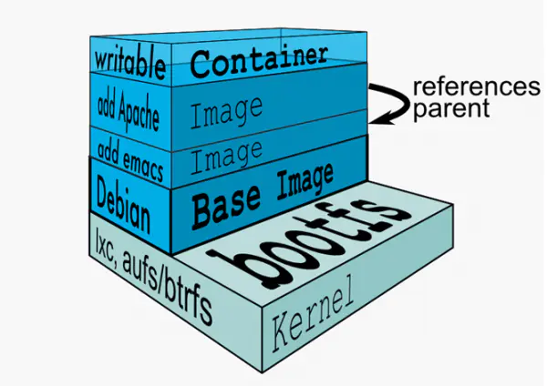
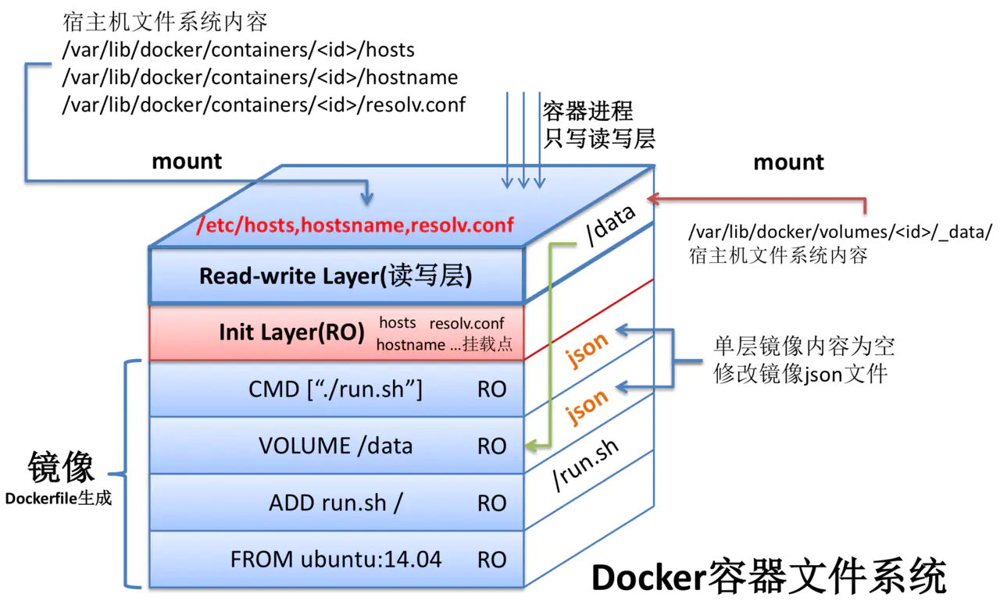
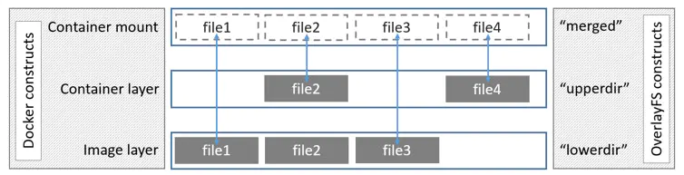

Docker 使用 Google 公司推出的 Go 语言 进行开发实现，基于 Linux 内核的 cgroup，namespace，以及 OverlayFS 类的 Union FS 等技术，对进程进行封装隔离，属于 操作系统层面的虚拟化技术。

- 检查本地是否存在指定的镜像，不存在就从公有仓库下载
- 利用镜像创建并启动一个容器
- 分配一个文件系统，并在只读的镜像层外面挂载一层可读写层
- 从宿主主机配置的网桥接口中桥接一个虚拟接口到容器中去
- 从地址池配置一个 ip 地址给容器
- 执行用户指定的应用程序
- 执行完毕后容器被终止

# cgroup
<p align="center">

</p>

- 资源限制（Resource Limitation）：cgroups可以对任务使用的资源总额进行限制。如设定应用运行时使用内存的上限，一旦超过这个配额就发出OOM（Out of Memory）。
- 优先级分配（Prioritization）：通过分配的CPU时间片数量及硬盘IO带宽大小，实际上就相当于控制了进程运行的优先级。
- 资源统计（Accounting）： cgroups可以统计系统的资源使用量，如CPU使用时长、内存用量等等，这个功能非常适用于计费。
- 进程控制（Control）：cgroups可以对进程组执行挂起、恢复等操作。


<p align="center">

</p>

上图表示两个cgroups层级结构，每一个层级结构中是一颗树形结构，树的每一个节点是一个 cgroup 结构体（比如cpu_cgrp, memory_cgrp)。第一个 cgroups 层级结构 attach 了 cpu 子系统和 cpuacct 子系统， 当前 cgroups 层级结构中的 cgroup 结构体就可以对 cpu 的资源进行限制，并且对进程的 cpu 使用情况进行统计。 第二个 cgroups 层级结构 attach 了 memory 子系统，当前 cgroups 层级结构中的 cgroup 结构体就可以对 memory 的资源进行限制。


<p align="center">

</p>


example 
```
mount -t cgroup -o remount,cpu,cpuset,memory cpu_and_mem /cgroup/cpu_and_mem
# cpu.cfs_quota_us中的默认值是100000，写入50000表示只能使用50%的 cpu 运行时间。
echo 50000 > /cgroup/cpu_and_mem/cpu/cpu_and_mem/cpu.cfs_quota_us

# 运行目标程序
cgexec -g "cpu:/halfapi" php halfapi.php half >/dev/null 2>&1
```

在 cgroups 引入内核之前，想要完成上述的对某一个进程的 cpu 使用率进行限制，只能通过 nice 命令调整进程的优先级，或者 cpulimit 命令限制进程使用进程的 cpu 使用率。但是这些命令的缺点是无法限制一个进程组的资源使用限制，也就无法完成 Docker 或者其他云平台所需要的这一类轻型容器的资源限制要求。


# namespace
namespace 是 Linux 内核用来隔离内核资源的方式。通过 namespace 可以让一些进程只能看到与自己相关的一部分资源，而另外一些进程也只能看到与它们自己相关的资源，这两拨进程根本就感觉不到对方的存在。具体的实现方式是把一个或多个进程的相关资源指定在同一个 namespace 中。

```
ll /proc/[pid]/ns
```

<p align="center">

</p>


example
```
# 创建子进程，并为该子进程设置namespace
int clone(int (*fn)(void *), void *child_stack, int flags, void *arg);

# 将当前进程加入到已有的 namespace 中
int setns(int fd, int nstype);

# 在原进程上进行 namespace 隔离。也就是创建并加入新的 namespace 。
int unshare(int flags);
```

具体使用可参考：https://xigang.github.io/2018/10/14/namespace-md/

```
#define _GNU_SOURCE
#include <sys/types.h>
#include <sys/wait.h>
#include <sys/mount.h>
#include <stdio.h>
#include <sched.h>
#include <signal.h>
#include <unistd.h>

#define STACK_SIZE (1024 * 1024)
// sync primitive
int checkpoint[2];
static char child_stack[STACK_SIZE];
char* const child_args[] = {
	"/bin/bash",
	NULL
};

int child_main(void* arg) {
	char c;
	// init sync primitive
	close(checkpoint[1]);
	// setup hostname
	sethostname("changed namespace", 12);
	// remount "/proc" to get accurate "top" && "ps" output
	mount("proc", "/proc", "proc", 0, NULL);
	// wait...
	read(checkpoint[0], &c, 1);
	execv(child_args[0], child_args);
	printf("Ooops\n");
	return 1;
}
int main() {
	// init sync primitive
	pipe(checkpoint);
	int child_pid = clone(child_main, child_stack+STACK_SIZE,
	  CLONE_NEWUTS | CLONE_NEWIPC | CLONE_NEWPID | CLONE_NEWNS | SIGCHLD, NULL);
	// further init here (nothing yet)
	// signal "done"
	close(checkpoint[1]);
	waitpid(child_pid, NULL, 0);
	printf("quit!\n");
	return 0;
}
```

# unionfs/overlayfs
<p align="center">

</p>

Aufs将挂载到同一虚拟文件系统下的多个目录分别设置成read-only，read-write以及whiteout-able权限，对read-only目录只能读，而写操作只能实施在read-write目录中。重点在于，写操作是在read-only上的一种增量操作，不影响read-only目录。

当挂载目录的时候要严格按照各目录之间的这种增量关系，将被增量操作的目录优先于在它基础上增量操作的目录挂载，待所有目录挂载结束了，继续挂载一个read-write目录，如此便形成了一种层次结构。


<p align="center">

</p>
docker的镜像却不是这样，它在rootfs自检完毕之后并不会把rootfs的read-only改为read-write。而是利用union mount（union FS的一种挂载机制）将一个或多个read-only的rootfs加载到之前read-only的rootfs层之上。


<p align="center">

</p>

overlayFS将一个linux主机中的两个目录组合起来，一个在上，一个在下，对外提供统一的试图。这两个目录就是layer，将两个层组合在一起的技术被称为联合挂载union mount。在overlayFS中，上层的目录被称作upperdir，下层的，目录被称作lowerdir，对外提供的统一试图被称作merged。当需要修改一个文件时，使用copy on write（写时复制）将文件从只读的lowerdir复制到可写的upperdir进行修改，结果也保存在upperdir层。在docker中，底下的只读层就是image，可写层就是container。

- refer: https://juejin.im/post/6844904040103591943#heading-5
- aufs 使用：https://www.cnblogs.com/sparkdev/p/11237347.html