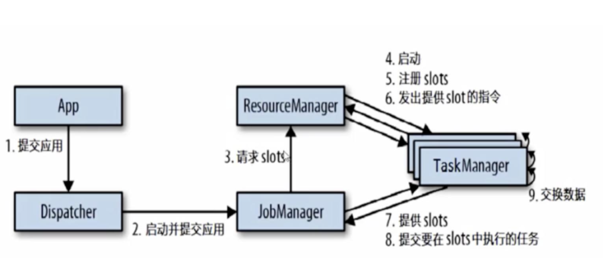

# build & run


```
mvn archetype:generate                               \
      -DgroupId=cn.zenggiven   \
      -DartifactId=flink_quick \
      -DarchetypeGroupId=org.apache.flink              \
      -DarchetypeArtifactId=flink-quickstart-scala     \
      -DarchetypeVersion=1.2.1
```


```
./bin/flink run examples/streaming/WordCount.jar

~/bin/flink-1.9.1/bin/flink run -p2 --class cn.zenggiven.flink.Main target/flink_start-1.0-SNAPSHOT.jar
```


# log
flink/log


# flank执行流程

- client向hdfs提交jar包和相关配置
- 然后向resource manager 提交任务，resource manager 分配Container资源并通知相应的NodeManger启动application master
- application master启动后加载flink jar包和配置，并启动job manager
- application master 向resource manager 申请资源并启动task manager
- resource manager 为task manager 申请资源后，由applicaiton master在对应的node manager上启动task manager
- task manager 启动完成后，加载jar包和相关配置
- task manager 向job manager 发送心跳包汇报运行状况，等待job manager 分配运行任务


如果我们了解yarn任务的执行流程，就会发现，flink的任务执行流程就是基于yarn上的。其中的application master就相当于yarn app master。

 JobManager 和ApplicationMaster(AM)运行在同一个容器中，一旦它们成功地启动了，AM 就能够知道JobManager 的地址，它会为 TaskManager 生成一个新的 Flink 配置文件（这样它才能连上 JobManager），该文件也同样会被上传到 HDFS。另外，AM 容器还提供了 Flink 的Web 界面服务。Flink 用来提供服务的端口是由用户和应用程序 ID 作为偏移配置的，这使得用户能够并行执行多个 YARN 会话。


# flink 任务
- 一个任务对应一个job manager，用于任务调度；有多个task manager负责执行任务；每个task manager有多个slot。
- slot 共享，flink允许一个任务的不同子任务共享同一个slot，也允许不同任务的不同子任务共享同一个slot，前提是这些子任务不是同一种操作类型的任务。通过slot共享，能够让资源密集型（source、map）和资源密集型子任务（keyby、window、apply）能够充分利用资源，避免空闲、饥饿
- 可以通过一下方式之一set parallesim来设置并发度
  - flink-conf.yaml
  - command line:  ./bin/flink run -p 2
  - web ui
  - env.setParallesim
- flink可以设置好几个level的parallelism，其中包括Operator Level、Execution Environment Level、Client Level、System Level，优先级由高到低。实际运行中，如果parallelism大于slot数量，那并发度则以slot数量为准


# flink 执行图


flink会根据代码执行流程生成DAG数据流图，生成顺序为stream graph（ logical dataflow graph）、job graph、executionGraph、物理执行图（可见[flink 执行流程，面试必问](https://www.51gcrc.com/job/57356)）。

- job manager会先接收到要执行的应用程序，这个应用程序包括client生成的stream graph、job graph，以及打包了所有的类、库、和其他资源jar包。
      - job manager会将job graph转化成一个物理层面的数据流图，这个图被称为执行图executionGraph，包含了所有可以并发执行的任务
      - job manager会向resource manager请求任务执行所需的资源，也就是任务管理器task manager上插槽slot。
      - 一旦获得足够的slot，就回将执行图分发给真正运行它们的task manager上
      - 在运行过程中，job manager会负责所有需要中央协调的操作，比如check point的协调

- task manager是flink 的工作进程。通常flink中会有多个task manager 运行，每个task manager有多个slot。slot的数量限定了task manager 能够执行的任务数量
  - 启动后，task manager 会向resource manager 注册它的slot；收到resource manager 的指令后，task manager就会将一个或者多个slot提供给job manager 调用。job manager 就能向slot 分配任务了
  - 在执行过程中，一个task manager 可以和运行同一应用程序的task manager 交换数据

- resoure manager主要负责task manager的slot。slot是flink中定义的处理资源单元。
  - flink为不同的环境和资源管理工具提供了不同的资源管理器，比如yarn、mesos、k8s。以及standalone 部署
  - 当job manager 申请插槽资源时，resource manager 会将有空闲slot的task manager分配给job manager。如果resource manager 没有足够的空闲slot来满足job manager，它（jm）还可以向资源提供平台发起会话，以提供启动task manager进程的容器

- dispatcher 可以跨作业运行，为应用提供rest api
      - 当一个应用被提交执行时，dispather就会启动并将应用移交给job manager
      - dispatcher 会启动一个web ui，用来方便地展示和监控作业执行信息



# 运行模式
- session-cluster：
  - 这种模式是在 YARN 中提前初始化一个 Flink 集群(称为 Flinkyarn-session)，开辟指定的资源，以后的 Flink 任务都提交到这里。这个 Flink 集群会常驻在 YARN 集群中，除非手工停止。这种方式创建的 Flink 集群会独占资源，不管有没有 Flink 任务在执行，YARN 上面的其他任务都无法使用这些资源
  - 所有的client都和同一个dispatcher交互，因此dispatcher可以成为瓶颈
- per-job:
  - 每次提交 Flink 任务都会创建一个新的 Flink 集群，每个 Flink 任务之间相互独立、互不影响，管理方便。任务执行完成之后创建的 Flink集群也会消失，不会额外占用资源，按需使用，这使资源利用率达到最大，在工作中推荐使用这种模式。
  - 这种情况下 Client 首先向资源管理系统 （如 Yarn）申请资源来启动 ApplicationMaster，然后再向 ApplicationMaster 中的 Dispatcher 提交作业。


# refer
- [flink 执行流程，面试必问](https://www.51gcrc.com/job/57356)
- [flink architecture](https://nightlies.apache.org/flink/flink-docs-master/docs/concepts/flink-architecture/)