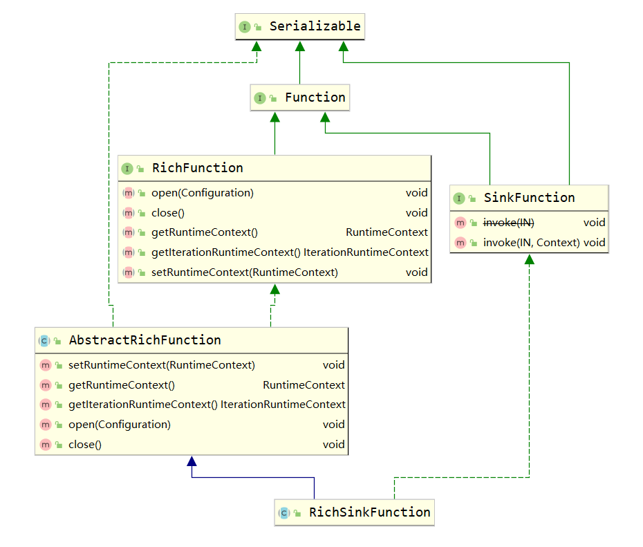

# RichFunction

Function接口是所有用户自定义函数的base interface，RichFunction和SinkFunction都是继承Function的接口。可以看到，SinkFunction和RichFunction接口中有各有不同的方法，而后者的方法更丰富一些，功能也就越多，所以称为“富函数”。

RichFunction与常规函数的不同在于：它拥有一些具有生命周期的方法，并可以获取函数运行时的上下文。
  - open()：在函数调用前，open()函数先被调用，用于初始化操作；
  - close()：生命周期中最后一个被调用的方法，做一些清理工作；
  - setRuntimeContext(RuntimeContext)：设置运行时上下文。每个并行的算子子任务都有一个运行时上下文，上下文记录了这个算子运行过程中的一些信息，包括算子当前的并行度、算子子任务序号、广播数据、累加器、监控数据。最重要的是，我们可以从上下文里获取状态数据；
  - getRuntimeContext()：获取运行时上下文；
  - getIterationRuntimeContext()：获取迭代运行时上下文。

SinkFunction：
  - invoke()：将传入的数据写入Sink。需要强调的是，每传入一个数据就要调用一次该函数。若Sink是MySQl，每次都要创建一个连接。

由此可见，RichFunction可以实现更复杂的功能，并能提高性能，节省资源。上面说到的RichSinkFunction类之所以有上述方法，是因为从RichFunction接口继承而来。其实，在Flink当中，所有函数类都有继承或者间接继承RichFunction，都有其Rich版本。

https://docherish.com/post/flink-richfunction/