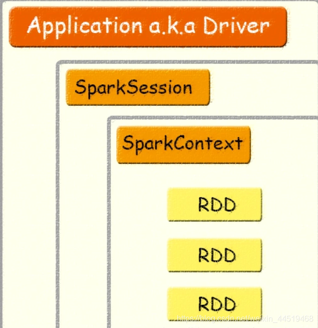

# SparkContext
- 驱动程序使用SparkContext与集群进行连接和通信，它可以帮助执行Spark任务，并与资源管理器(如YARN 或Mesos)进行协调。
- 使用SparkContext，可以访问其他上下文，比如SQLContext和HiveContext。
- 使用SparkContext，我们可以为Spark作业设置配置参数。

# SQLContext
是通往SparkSQL的入口。下面是如何使用SparkContext创建SQLContext。一旦有了SQLContext，就可以开始处理DataFrame、DataSet等。

# HiveContext
HiveContext是通往hive入口。
HiveContext具有SQLContext的所有功能。
实际上，如果查看API文档，就会发现HiveContext扩展了SQLContext，这意味着它支持SQLContext支持的功能以及更多(Hive特定的功能)

# SpakSeesion


SparkSession实质上是SQLContext和HiveContext的组合（未来可能还会加上StreamingContext），所以在SQLContext和HiveContext上可用的API在SparkSession上同样是可以使用的。SparkSession内部封装了sparkContext，所以计算实际上是由sparkContext完成的。

# rdd & data frame & data set


RDD是一种弹性分布式数据集，是一种只读分区数据。它是spark的基础数据结构，具有内存计算能力、数据容错性以及数据不可修改特性。不支持spark sql 操作

Dataframe也是一种不可修改的分布式数据集合，它可以按列查询数据，类似于关系数据库里面的表结构。可以对数据指定数据模式（schema）。

Dataset是DataFrame的扩展，它提供了类型安全，面向对象的编程接口。也就是说DataFrame是Dataset的一种特殊形式。


上图直观地体现了DataFrame和RDD的区别。左侧的RDD[Person]虽然以Person为类型参数，但Spark框架本身不了解 Person类的内部结构。而右侧的DataFrame却提供了详细的结构信息，使得Spark SQL可以清楚地知道该数据集中包含哪些列，每列的名称和类型各是什么。DataFrame多了数据的结构信息，即schema。RDD是分布式的 Java对象的集合。DataFrame是分布式的Row对象的集合。Dataset可以认为是DataFrame的一个特例，主要区别是Dataset每一个record存储的是一个强类型值而不是一个Row。


## rdd to dataframe
```scala
import spark.implicits._
val testDF = rdd.map {line=>
      (line._1,line._2)
    }.toDF("col1","col2")

or

val schema = StructType(FacebookInsightsReportRecord.getFields
      .map(f => StructField(f.getName, StringType)))
    spark.createDataFrame(rdd, schema)
```

## RDD转Dataset
```java
import spark.implicits._
case class Coltest(col1:String,col2:Int)extends Serializable //定义字段名和类型
val testDS = rdd.map {line=>
      Coltest(line._1,line._2)
    }.toDS
```

## Dataset转DataFrame
只要把case class封装成Row即可。
```java
import spark.implicits._
val testDF = testDS.toDF
```


## DataFrame转Dataset
```java
import spark.implicits._
case class Coltest(col1:String,col2:Int)extends Serializable //定义字段名和类型
val testDS = testDF.as[Coltest]
```