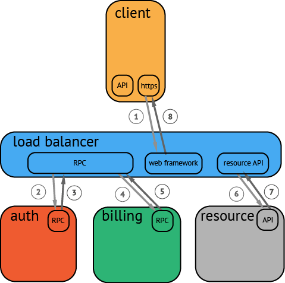
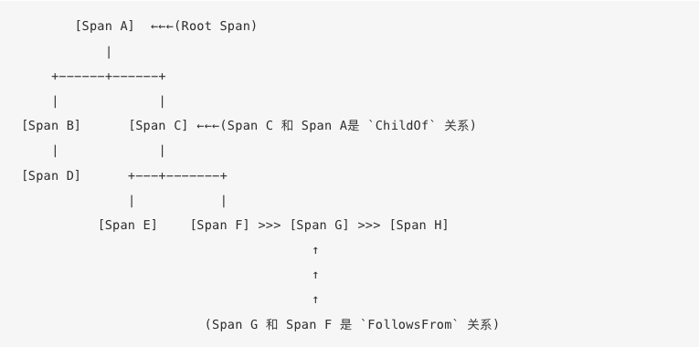
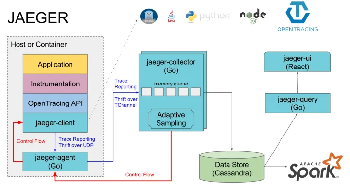

# 什么是opentracing
[Opentracing](http://www.zhaowenyu.com/istio-doc/practice/opentracing.html) 是分布式链路追踪的一种规范标准 (现在改名为OpenTelemetry)，发布于 2016 年 12 月，是 CNCF（云原生计算基金会）下的项目之一。和一般的规范标准不同，Opentracing 不是传输协议，消息格式层面上的规范标准，而是一种语言层面上的 API 标准。

## 为什么要有opentracing
应用架构开始从单体系统逐步转变为微服务，其中的业务逻辑随之而来就会变成微服务之间的调用与请求；资源角度来看，传统服务器这个物理单位也逐渐淡化，变成了看不见摸不到的虚拟资源模式。为了有助于查明故障发生的位置以及导致性能低下的原因，需要提供统一的链路数据采集/展示、链路依赖分析、链路统计分析功能，即实现一套分布式追踪（Distributed Tracing）方案。

分布式追踪系统发展很快，种类繁多，但核心步骤一般有三个：代码埋点，数据存储、查询展示。


<p align="center">

</p>


实现分布式追踪（Distributed Tracing）的方式一般是在程序代码中进行埋点，采集调用的相关信息后发送到后端的一个追踪服务器进行分析处理。在这种实现方式中，应用代码需要依赖于追踪服务器的 API，导致业务逻辑和追踪的逻辑耦合。为了解决该问题，CNCF （云原生计算基金会）下的 OpenTracing 项目定义了一套分布式追踪的标准，以统一各种分布式追踪实现的实现。OpenTracing 中包含了一套分布式追踪的标准规范，各种语言的 API，以及实现了该标准的编程框架和函数库。


OpenTracing由API规范、实现了规范的框架和库以及项目文档组成。OpenTracing允许开发人员使用api向他们的应用程序代码中添加检测，而不会将他们锁定在任何特定的产品或供应商中。有关OpenTracing已经在何处实现的更多信息，请参阅支持OpenTracing规范的语言列表和跟踪程序列表。（定义了整体架构、架构不同组件间的通信方式/协议/api）


# opentracing 的基本概念

## span
Span 代表系统中具有开始时间和执行时长的逻辑单元（比如一个具体的rpc调用、db访问等），Span 之间通过嵌套或者顺序排列建立逻辑因果关系


每个 Span 中可以包含以下的信息：
- 操作名称：例如访问的具体 RPC 服务，访问的 URL 地址等；
- 起始时间；
- 结束时间；
- Span Tag：一组键值对构成的 Span 标签集合，其中键必须为字符串类型，值可以是字符串、bool 值或者数- 字；
- Span Log：一组 Span 的日志集合；
- SpanContext：Trace 的全局上下文信息；
- References：Span 之间的引用关系，下面详细说明 Span 之间的引用关系；


在一个 Trace 中，一个 Span 可以和一个或者多个 Span 间存在因果关系。目前，OpenTracing 定义了 ChildOf 和 FollowsFrom 两种 Span 之间的引用关系。这两种引用类型代表了子节点和父节点间的直接因果关系。

ChildOf 关系：一个 Span 可能是一个父级 Span 的孩子，即为 ChildOf 关系。下面这些情况会构成 ChildOf 关系：
- 一个 HTTP 请求之中，被调用的服务端产生的 Span，与发起调用的客户端产生的 Span，就构成了 ChildOf 关系；
- 一个 SQL Insert 操作的 Span，和 ORM 的 save 方法的 Span 构成 ChildOf 关系。


FollowsFrom 关系：在分布式系统中，一些上游系统（父节点）不以任何方式依赖下游系统（子节点）的执行结果，例如，上游系统通过消息队列向下游系统发送消息。这种情况下，下游系统对应的子 Span 和上游系统对应的父级 Span 之间是 FollowsFrom 关系。


<p align="center">

</p>


# SpanContext
SpanContext 是 OpenTracing 中一个让人比较迷惑的概念。在 OpenTracing 的概念模型中我们讲到 SpanContext 用于跨进程边界传递分布式调用的上下文，但实际上 OpenTracing 只定义一个 SpanContext 的抽象接口，该接口封装了分布式调用中一个 Span 的相关上下文内容，包括该 Span 所属的 Trace id，Span id 以及其它需要传递到下游服务的信息。SpanContext 自身并不能实现跨进程的上下文传递，而是需要由 Tracer（Tracer 是一个遵循 OpenTracing 协议的实现，如 Jaeger，Skywalking 的 Tracer） 将 SpanContext 序列化后通过 Wire Protocol 传递到下一个进程中，然后在下一个进程将 SpanContext 反序列化，得到相关的上下文信息，以用于生成 Child Span。

在基于 HTTP 协议的分布式调用中，通常会使用 HTTP Header 来传递 SpanContext 的内容。常见的 Wire Protocol 包含 Zipkin 使用的 b3 HTTP header，Jaeger 使用的 uber-trace-id HTTP Header，LightStep 使用的 "x-ot-span-context" HTTP Header 等。

假如使用 HTTP header 传递 SpanContext，在向下游服务发起 HTTP 请求时，我们需要在 JAVA 代码中调用 Tracer.inject 方法将 SpanContext 注入到 HTTP header 中。

```java
tracer.inject(tracer.activeSpan().context(), Format.Builtin.HTTP_HEADERS, new RequestBuilderCarrier(requestBuilder));
```

OpenTracing 中的 Tracer API 只定义了 inject 和 extract 两个方法接口，其实现由不同 Tracer 提供。除此之外，我们一般不需要在代码中直接调用这两个方法，因为 OpenTracing 项目已经提供了一些和 Tracer 集成的代码库，可以自动完成该工作。


# 基于Opentracing实现的框架

## [Jaeger](https://www.jaegertracing.io/docs/1.41/)
<p align="center">

</p>

- Jaeger Client - 为不同语言实现了符合 OpenTracing 标准的 SDK。应用程序通过 API 写入数据，- client library 把 trace 信息按照应用程序指定的采样策略传递给 jaeger-agent。
- Agent - 它是一个监听在 UDP 端口上接收 span 数据的网络守护进程，它会将数据批量发送给 collector。- 它被设计成一个基础组件，部署到所有的宿主机上。Agent 将 client library 和 collector 解耦，为 - client library 屏蔽了路由和发现 collector 的细节。
- Collector - 接收 jaeger-agent 发送来的数据，然后将数据写入后端存储。Collector 被设计成无状态- 的组件，因此您可以同时运行任意数量的 jaeger-collector。
- Data Store - 后端存储被设计成一个可插拔的组件，支持将数据写入 cassandra、elastic search。
- Query - 接收查询请求，然后从后端存储系统中检索 trace 并通过 UI 进行展示。Query 是无状态的，您可- 以启动多个实例，把它们部署在 nginx 这样的负载均衡器后面。


# Opentracing在字节的应用

## tracing和日志的关系
流式日志系统提供的调用链搜索 包含了 rpc log（含access log）和 app log两部分，其中 rpc log 是指微服务间调用日志，例如A调用了B是否成功耗时多少的信息，一般由 rpc 框架默认添加，而 app log 是指由在业务研发在业务代码中自行打印的业务日志。在流式日志系统中，rpc log和app log一样，使用全量采集模式，在存储侧和埋点侧的成本都比较高，难以推广扩展到 mysql/redis 等基础组件的 trace，也无法支持更细粒度如函数级 span 的采集。

链路追踪命中采样的调用链条可以比较方便地根据logid跳转到调用链日志。
