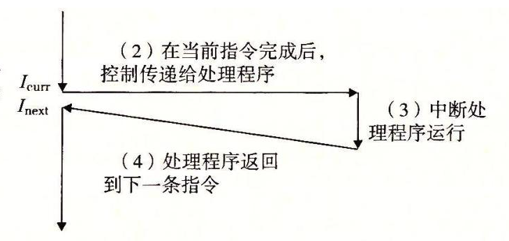
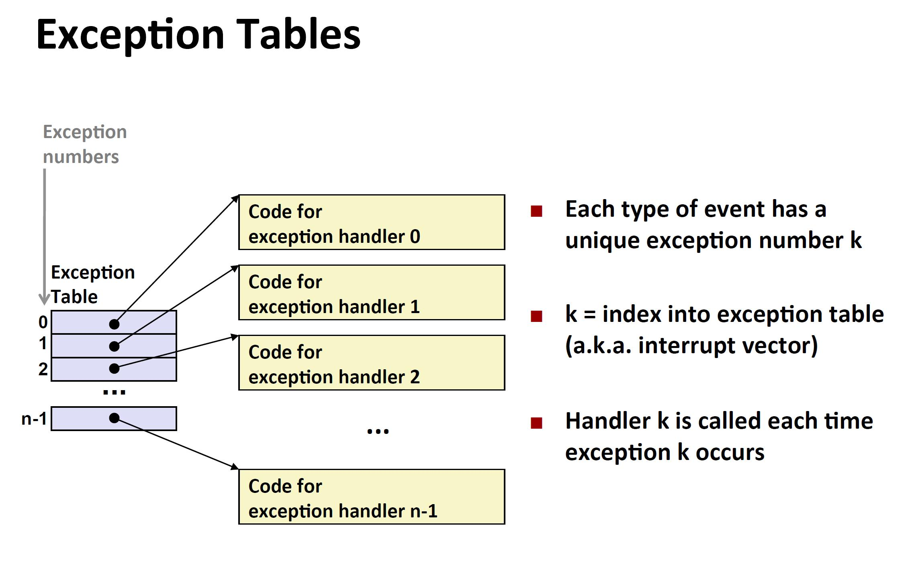
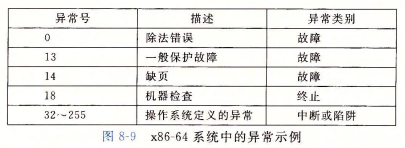
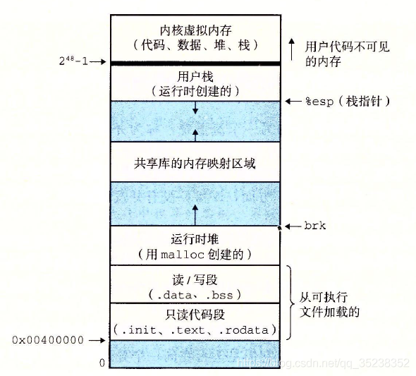
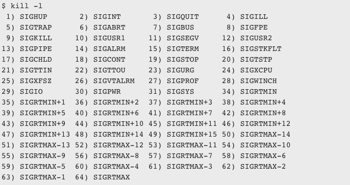

&#8195;&#8195;现代操作系统通过使控制流发生突变来对某些意外情况（磁盘读写数据准备就绪、硬件定时器产生信号等）做出反应。一般而言，我们把这些突变命名为异常控制流（Exceptional Contral Flow ECF）。异常控制流发生在计算机系统的各个层次。比如，在硬件层，硬件检测到时间会触发控制突然转移到异常处理程序。在操作系统层，内核通过上下文切换将控制从一个用户进程转移到另一个用户进程。在应用层，一个进程可以发送信号到另一个进程，而接受者会将控制转移到一个信号处理程序。一个程序可以通过回避通常的栈规则，并执行到其他函数中任意位置的非本地跳转错误做出反应。

为什么需要理解ECF？
- 有助于理解重要的系统概念
- 有助于理解应用程序是如何与操作系统交互
- 有助于理解并发
- 有助于理解软件异常如何工作（如C++/JAVA try-cache-throw软件异常机制）


## 异常

<p align="center">

</p>

&#8195;&#8195;异常是异常控制流的一种形式，它一部分由硬件实现，一部分由操作系统实现。

&#8195;&#8195;异常就是控制流的一种突变，用来响应处理器状态中的某些变化。上图中，当处理器状态发生一个重要的变化时，处理器正在执行某个当前指令Icur。在处理器中，状态被编码为不同的位和信号。状态的变化称为事件。事件可能和当前执行的执行直接相关，比如虚拟内存缺页、算术溢出、除以零，也可能和当前指令没有关系，比如系统定时器产生信号、I/O请求完成等。

&#8195;&#8195;在任何情况下，当处理器检测到有事件发生时，它会通过一张叫做异常表（exception table）的跳转表，进行一个间接过程调用。到一个专门涉及用来处理这类事件的操作系统子程序（异常处理程序（exception handler））。当异常处理程序完成处理后，根据引起异常的事件类型，会发生以下情况：
- 重新执行Icur（如发生缺页中断）
- 继续执行I_next（如收到I/O设备信号）
- 终止程序（如收到kill信号）

### 异常处理

<p align="center">

</p>

&#8195;&#8195;系统中可能的每种类型的异常都分配了一个唯一的非负整数的异常号（exception number）。其中一些号码有处理器的设计者分配，其他号码由操作系统内核（操作系统常驻内存的部分）的设计者分配。前者的示例包括除以零、缺页、内存访问违例（如segment fault）、断点、算术运算溢出等，后者包括系统调用和来自外部I/O设备的信号。在系统启动时（重启或加电时），操作系统分配和初始化一张称为异常的跳转表。每个条目k包含了异常k的处理程序的跳转地址。异常表的起始地址放在一个叫做异常表基址地址寄存器的特俗cpu寄存器内。

&#8195;&#8195;异常类似于过程调用，但仍旧有重要的不同之处：
- 过程调用时，在跳转到处理程序之前，处理器会将返回地址压入栈中。但是对于不同的异常类型，返回地址可能时当前指令，也可能时下一条指令
- 处理器也会把一些额外的处理器状态压入栈里，在处理程序返回时，重新开始执行被中断的程序需要这些状态
- 如果控制从用户程序转移到内核，那么所有这些项目都会压到内核栈中
- 异常处理程序运行在内核模式下，意味着异常处理程序对所有的系统资源都有完全的访问权限（问：用户指定的异常处理程序呢？）

&#8195;&#8195;当异常处理程序完成后，它通过执行一条特殊的“从中断返回”指令，可选地返回被中断的程序，该指令将适当的状态弹回处理器的控制和数据寄存器中。如果异常中断的是一个用户程序，就将状态恢复为用户模式，然后将控制返回给被中断的程序。

### 异常的类别
<p align="center">

</p>

异常分为4类：中断（interrupt）、陷阱（trap）、故障（fault）、终止（abort）:
- 中断：异步发生，是来自处理器外部的I/O设备的信号的结果（如硬盘数据读取完成）。一般这种信号是外部硬件设备向处理器上的一个引脚发信号，并将异常号（标识了引起中断的设备）放到系统总线，来触发中断。当前指令完成后，处理器注意到中断引脚电压变高，就从系统总线读取异常号，并调用适当的异常处理程序。异常处理完成后，执行下一条指令I_next。
- 陷阱和系统调用：是有意的异常，是执行一条指令的结果（如执行malloc、读、写文件、fork、execve、exit等），处理器提供一条特殊的“syscall n”（n是系统调用的编号，操作系统有对应的系统调用表，表中条目i标识系统调用i的处理程序地址）来处理器这些系统调用。中断处理程序执行完成后，将程序切换为用户态，执行下一条指令I_next。运行在用户模式的普通函数只能访问与调用函数相同的栈，但是系统调用运行在内核模式，因此允许一行特权指令，并访问定义在内核中的栈。
- 故障：由错误引起，通常能够被故障处理程序修正。当故障发生，处理器将控制转移给故障处理程序。如果故障处理程序能够修正这个错误，就见控制返回到因此故障的指令，并重新执行它。否处理程序返回到内核中的abort历程，abort会终止引起故障的应用程序。常见的故障如：缺页。
- 终止：不可恢复的致命错误造成结果，通常是一些硬件错误，如比如DRAM/SRAM为被损坏时发生的奇偶错误。终止处理程序从不将控制返回给应用程序，而是直接返回到内核的abort历程。

```
linux系统调用函数先将系统调用好写入寄存器%rax，然后将参数（如mallo的字节数量）写入寄存器%rdi等，然后调用“syscall”指令来调用系统调用。
```


## 进程
&#8195;&#8195;进程的经典定义就是一个执行中的程序的实例。系统中的每个程序都运行在某个进程的上下文中。上下文由程序正确运行所需的状态组成的。这个状态包括存放在内存中的程序的代码和数据，它的栈、通用目的寄存器的内容、程序计数器、环境变量、已经打开文件描述符的集合等。

### 逻辑控制流

<p align="center">

</p>

&#8195;&#8195;进程是轮流使用处理器的。每个进程执行它的流的一部分，然后被抢占，然后轮到其他进程。对于一个运行在这些进程之一的上下文的程序，它看上去就像是在独占地使用处理器。

### 并发流
&#8195;&#8195;一个逻辑流的执行时间上与另一个流重叠，称为并发流。这个两个流被称为并发地运行。多个流并发地执行的一般现象被称为并发（concurrency）。一个进程和其他进程轮流地运行的概念称为多任务（multitasking）。一个进程执行它的控制流的一部分的每一个时间段叫做时间片。

### 私有地址空间
<p align="center">

</p>

&#8195;&#8195;进程也为每个程序提供了一种假象：好像它独占地使用系统地址空间。进程为每个程序提供它自己的私有地址空间。一般而言，和这个空间（也就是我们所说的虚拟地址空间）中某个地址关联的那个内存字节是不能被其他进程读写的。

&#8195;&#8195;尽管和每个私有地址空间相关联的内存的内容一般是不同的，但是每个这样的空间都有相同的通用结构。地址空间地步是保留给用户程序的，包括通常的代码、数据、堆和栈段。代码段总是从0x400000开始。地址空间顶部保留给内核（操作系统常驻内存的部分）。地址空间的这个部分包含内核在带白继承执行指令时（比如当应用程序执行系统调用时）使用的代码、数据和栈。

### 用户模式和内核模式
&#8195;&#8195;为了限制一个应用可以执行的指令以及它可以访问的地址空间范围，处理器使用某个控制寄存器中的一个模式位来描述进程当前享有的权限：模式位为1标识进程运行在内核模式中，可以执行指令集中的任何指令，并访问系统中的任何内存位置。如果没有设置模式位，则标识处于用户模式，不允许执行特权指令（如停止处理器、改变位模式、发起I/O操作、引用地址空间中内核区的代码和数据）。用户程序必须通过系统调用访问内核代码和数据。

&#8195;&#8195;进程从用户模式变为内核模式的唯一方法是通过诸如中断、故障或者陷入系统调用这样的异常。当异常发生，控制传递到异常处理程序，处理器将模式从用户模式变为内核模式。当异常处理程序返回到应用程序代码时，处理器就将模式从内核模式改为用户模式。

&#8195;&#8195;linux中的/proc文件系统允许用户模式进程访问内核结构的内容。/proc文件系统将许多内核数据结构的内容输出为一个用户程序可以读的文本文件的层次结构。
- /proc/cpuinfo 
- /proc/$pid/maps等

> 思考：
> - /proc是否存储到磁盘中？如果不是，那它是怎么实现的？
> - 实现一个程序，仿照/proc，将当前程序使用进程id、内存使用情况写入到某个文件中。

### 上下文切换
&#8195;&#8195;内核为每个进程维持一个上下文（context）。上下文就是内核重新启动一个被抢占的进程所需的状态（通用目的寄存器、浮点寄存器、程序计数器、用户栈、状态寄存器、内核栈、内核数据结构），比如描述地址空间的页表、包含有关当前进程信息的进程表、已打开的文件的描述符等。

&#8195;&#8195;系统调用可能导致上下文切换，如I/O读写。中断也可能引起上下文切换。比如，所有操作系统都有周期性定时器中断的机制，通常为1ms或者10ms。每次发生定时器中断。内核就判定当前进程已经运行了足够长的时间，并切换到一个新的进程。


## 系统调用错误处理
&#8195;&#8195;当unix系统级函数发生错误时，它们通常会返回-1，并设置全局变量errno来标识出错。程序用应该总是检查错误。
```c++
if ((pid = fork()) < 0){
    // strerror 返回一个文本串，描述了和某个error值相关联的错误。
    fprintf(stderr, "fork error: %s\n", strerror(errno));
    exit(0)
}
```


## 进程控制
unix系统提供了大量从C程序操作进程的系统调用。
```c++
pid_t getpid<void>;
pid_t getppid<void>;
pid_t fork(void);
void exit(int status);
```
&#8195;&#8195;新创建的子进程几乎但不完全和父进程相同。子进程得到与父进程用户及虚拟地址空间相同的（且独立的）一份副本，包括代码和数据段、堆、共享库以及用户栈。子进程还获得与父进程任何打开文件描述符相同的副本，意味这子进程可以读写父进程打开的任何文件。后续父子两个进程所做的任何改变都是独立的，都有自己的私有地址空间，不会反映在另一个进程的内存中。

&#8195;&#8195;fork函数只被调用一次，但是会返回两次。一次在父进程，一次在新创建的子进程中。在具有多个fork实例的程序中，这很容易使人迷惑。如下例一共输出多少次hello？
```c
int main(){
    fork();
    fork();
    printf("hello\n");
    exit(0);
}
```

&#8195;&#8195;当一个进程由于某种原因终止时，内核并不是立即把它从系统中清除。相反，进程被保护在一种已终止的状态，知道被它的父进程回收（raped，即子进程退出的信号被父进程处理）。当父进程回收已终止的子进程时，内核将子进程的退出状态传给父进程，然后抛弃已终止的进程，从此时开始，该进程就不存在了。一个终止了但还未被回收的进程被称为僵死进程（zombie）。（僵死进程仍会占用内存，因此我们总应该小心回收自己创建的子进程）。

如果一个父进程终止了，内核会安排init进程称为它的孤儿进程的养父。init进程的PID为1，是系统启动时由内核创建的，它不会终止，是所有进程的祖先。如果父进程没有回收它的僵死子进程就终止了，那么内核会安排init进程去回收它们。
```c
// 成功则返回子进程pid，pid=-1，表示等待所有子进程。statusp用来存储子进程的退出状态
// 如果繁盛错误，则返回-1，并设置errnos（无子进程errno则为ECHILD）
pid_t waitpid(pid_t pid, int *statusp, int options);
// waitpid的简化版本，等价于waitpid(-1, &status, 0)
pid_t wait(int *statusp)
```

```c
// 将进程刮起一段指定的时间
unsigned int sleep(unsigned int secs);
// 将进程休眠，直到该进程收到一个信号
int pause(void);
```

```c
// 加载并运行可执行目标文件filename，argv为参数列表，envp为环境变量列表
int execve(const char *filename, const char *argv[], const char *envp[]);
```

&#8195;&#8195;execve 在当前进程的上下文中加载并运行一个新的程序。它会覆盖当前进程的地址空间，但是并没有创建一个新的进程，并且继承了调用execve函数时已打开的所有文件描述符。可参考《链接》一节。


## 信号
&#8195;&#8195;Linux是一种更高层次的软件形式的异常，它允许进程和内核中断其他进程。

<p align="center">

</p>

&#8195;&#8195;上图展示了linux系统上支持的信号，前30几种在实际应用种最为常见。每种信号类型对应某种系统时间。低层的硬件异常由内核异常处理程序完成，正常情况下，对用户进程不可见。信号提供了一种机制，通知用户进程发生了这些异常，比如，如果一个进程试图除以0，那么内核就发送一个SIGFPE信号；Ctrl-C发送的SIGINT信号；Ctrl-Z则表示发送SIGSTP信号；SIGKILL是强制终止（该信号无法被捕获，处理程序无法被重写）；SIGCHLD是子进程终止。

&#8195;&#8195;传送一个信号到目的程序是由两个不同步骤组成的。
- 发送信号：内核通过更新目的程序上下文中的某个状态（进程的信号位表），发送一个信号给目的程序。发送信号可以有以下两种原因：内核检测到系统事件，如除零错误或子进程终止；一个进程调用kill，显式地要求内核发送一个信号给目的进程。一个进程可以发送信号给它自己。
- 接收信号：当目的进程被内核强迫以某种方式对信号的发送做出反应，它就接收了信号。进程可以忽略这个信号、终止、或者通过执行一个称为信号处理程序的用户层函数来捕获这个信号。

&#8195;&#8195;一个发出而没有被接收的信号叫做待处理信号。在任何时刻，一种类型至多只会有一个待处理信号。因此，如果你重复发送多个信号k给某个进程，如果进程没处理前一个，那么后续的信号k都将被丢弃。

&#8195;&#8195;内核为每个进程在pending位响亮种维护着一个待处理的信号的集合。而blocked位响亮种维护着被阻塞的信号集合。因此，所谓的发送，即内核将pending的第k位置为1，接收则置为0。

### 发送信号
```sh
// 给进程pid发送信号sig
kill -$sig $pid
int kill(pid_t pid, int sig)
```

> &#8195;&#8195;当我们在shell种启动一个job（比如ls|sort），会启动两个进程，二者同属一个进程组。当我们进行Ctrl-C的时候，内核会发送SIGINT给该进程组种的每个进程。

### 接收信号
&#8195;&#8195;当内核把进程p从内核模式切换到用户模式时（例如，从系统调用返回或是完成了一次上下文切换），他会检查进程p的未被阻塞的待处理信号的集合。如果集合为空，那么内核将控制传递到p的逻辑控制流中的下一条指令I_next。然而，如果集合非空，那么内核选择集合种的某个信号k（通常先选取值最小的信号），并强制进程p接收信号k。收到信号会触发进程采取某种行动（信号处理程序）。一旦完成这个行为，进程就将控制传递会p的逻辑控制流的下一条指令I_next。每个信号类型都有一个预定义的默认行为（部分信号的行为允许被用户程序重写，SIGSTOP、SIGKILL不允许被重写），是下面的一种：
- 终止：如收到SIGKILL信号
- 终止并转储到内存
- 停止直到被SIGCONT信号重启
- 忽略：如收到SIGCHLD

> 信号处理程序是可以被其他信号处理程序中断的。

### 阻塞和接触阻塞信号
```c
// how: SIG_BLOCK表示屏蔽信号，SIG_UNBLOCK表示接收信号
// set：需要操作的信号集合
// oldset：非空，则将blocked位向量的值保存在oldset
int sigprocmask(int how, const sigset_t *set, sigset_t *oldset)
```

### 原则
&#8195;&#8195;信号处理是很麻烦的工作：处理程序与主程序并发运行，共享同样的全局变量，因此可能互相干扰；不同的系统有不同的信号处理语义；信号处理程序可能会被其他信号中断。因此，一般我们在编写信号处理程序的时候需要遵循以下原则：
- 处理程序尽可能简单
- 处理程序中仅调用异步信号安全的函数（即可重入或无法被中断的函数）。printf、malloc、exit等均不是异步信号安全
- 保存和恢复errno。许多异步信号安全的函数都会在出错返回是设置errno，因此可能干扰主程序中其他以来errno的部分
- 阻塞所有信号，保护对共享全局数据结构的访问。如果处理程序和主程序会共享一个全局数据结构，那么在访问在结构前，应阻塞所有信号
- 用voliatile声明全局变量
- 用sig_atomic_t声明标志
- 当我们收到一个信号，仅代表该类型事件仅发生过一次（因为重复的待处理信号是会被丢弃的）

下例中，对于job的操作是一个全局操作，而且实际应用中，对于job的操作一般不是原子性的。
```c++
#include "csapp.h"

void initjobs()
{
}

void addjob(int pid)
{
}

void deletejob(int pid)
{
}

/* $begin procmask2 */
void handler(int sig)
{
    int olderrno = errno;
    sigset_t mask_all, prev_all;
    pid_t pid;

    Sigfillset(&mask_all);
    while ((pid = waitpid(-1, NULL, 0)) > 0) { /* Reap a zombie child */
        // 阻塞其他信号，防止job列表被并发修改
        Sigprocmask(SIG_BLOCK, &mask_all, &prev_all);
        deletejob(pid); /* Delete the child from the job list */
        Sigprocmask(SIG_SETMASK, &prev_all, NULL);
    }
    if (errno != ECHILD)
        Sio_error("waitpid error");
    errno = olderrno;
}
    
int main(int argc, char **argv)
{
    int pid;
    sigset_t mask_all, mask_one, prev_one;

    Sigfillset(&mask_all);
    Sigemptyset(&mask_one);
    Sigaddset(&mask_one, SIGCHLD);
    Signal(SIGCHLD, handler);
    initjobs(); /* Initialize the job list */

    while (1) {
        Sigprocmask(SIG_BLOCK, &mask_one, &prev_one); /* Block SIGCHLD */
        if ((pid = Fork()) == 0) { /* Child process */
            Sigprocmask(SIG_SETMASK, &prev_one, NULL); /* Unblock SIGCHLD */
            Execve("/bin/date", argv, NULL);
        }
        Sigprocmask(SIG_BLOCK, &mask_all, NULL); /* Parent process */  
        addjob(pid);  /* Add the child to the job list */
        Sigprocmask(SIG_SETMASK, &prev_one, NULL);  /* Unblock SIGCHLD */
    }
    exit(0);
}
/* $end procmask2 */
```


## 非本地跳转
&#8195;&#8195;C提供了一种用户级异常控制流形式，称为非本地跳转（nonlocal jump），它将控制直接从一个函数转移到另一个正在执行的函数，而不需要经过正常的调用-返回序列。非本地跳转是通过setjmp和longjmp函数来提供的。
```c++
int setjmp(jmp_buf env);
int longjmp(jmp_buf env, int retval);
// sigsetjmp和siglongjmp是setjmp和longjmp的可以被信号处理程序使用的版本
int sigsetjmp(sigjmp_buf env, int savesigs);
int siglongjmp(sigjmp_buf, int retval);
```

&#8195;&#8195;setjmp函数在env缓冲区中保存当前调用环境，以供后面的longjmp使用，并返回0。调用环境包括程序计数器、栈指针和通用目的寄存器。注意setjmp返回的值不能赋值给变量（具体原因可自行思考），不过它可以安全地用在switch或条件语句中测试。
```c++
rc = setjmp(env);       // Wrong
```

&#8195;&#8195;longjmp函数从evn缓冲区恢复调用环境，然后触发一个从最近一次初始化env的setjmp调用的返回。然后setjmp返回，并带有非零的返回值retval。

&#8195;&#8195;setjmp函数只被调用一次，但返回多次：一次是当第一次调用setjmp，将调用环境保存在缓冲区env时；一次是为每个相应的longjmp调用时。另一方面，longjmp函数被调用一次，但从不返回。非本地跳转的一个重要应用是运行一个深层嵌套的函数调用中立即返回，通常是由检测到某个错误情况引起的。我们可以使用非本地跳转直接返回到一个普通的本地化的错误处理程序，而无需费力地解开调用栈。

```c++
/* $begin setjmp */
#include "csapp.h"

jmp_buf buf;

int error1 = 0; 
int error2 = 1;

void foo(void), bar(void);

int main() 
{
    switch(setjmp(buf)) {
    case 0: 
	foo();
        break;
    case 1: 
	printf("Detected an error1 condition in foo\n");
        break;
    case 2: 
	printf("Detected an error2 condition in foo\n");
        break;
    default:
	printf("Unknown error condition in foo\n");
    }
    exit(0);
}

/* Deeply nested function foo */
void foo(void) 
{
    if (error1)
	longjmp(buf, 1); 
    bar();
}

void bar(void) 
{
    if (error2)
	longjmp(buf, 2); 
}
/* $end setjmp */
```

&#8195;&#8195;longjmp允许它跳过中间调用地特性可能产生严重地后果。假如中间函数调用中分配了某些资源（内存、网络连接等），本来预期在函数结尾释放它们，那么这些释放代码会被跳过，因而产生资源泄漏。非本地跳转地另一个重要应用是使一个信号处理程序分支到一个特殊的代码位置，而不是返回到被信号到达中断了的指令的位置，比如，我们可以使用sigsetjmp和siglongjmp来实现软重启。

```c++
/* $begin restart */
#include "csapp.h"

sigjmp_buf buf;

void handler(int sig) 
{
    siglongjmp(buf, 1);
}

int main() 
{
    // 首次调用返回0。当jump 回到这里后，返回非0
    if (!sigsetjmp(buf, 1)) {
        Signal(SIGINT, handler);
	    Sio_puts("starting\n");
    }
    else 
	Sio_puts("restarting\n");

    while(1) {
	Sleep(1);
	Sio_puts("processing...\n");
    }
    exit(0); /* Control never reaches here */
}
/* $end restart */
```

> C++、JAVA提供的异常机制是较高层次的，是C语言的setjmp、longjmp函数的更加结构化的版本。你可以把try语句中的catch看作类似于setjmp函数。相似得，trhow语句就类似于longjmp函数。

以下是一个try-catch-throw 的样例。该程序会一直打印“KeyboardInterrupt”。

```c++
jmp_buf ex_buf__;

#define TRY do{ if(!setjmp(ex_buf__)) {
#define CATCH } else {
#define ETRY } } while(0)
#define THROW longjmp(ex_buf__, 1)

void sigint_handler(int sig) {
  THROW;
}

int main(void) {
  if (signal(SIGINT, sigint_handler) == SIG_ERR) {
    return 0;
  }

  TRY {
    // raise(sig)效果等同kill(getpid(), sig)
    raise(SIGINT); 
  } CATCH {
    printf("KeyboardInterrupt");
  }
  ETRY;
  return 0;
}
```

宏展开后，代码如下：
```c++
jmp_buf ex_buf__;

void sigint_handler(int sig) {
  longjmp(ex_buf__, 1);
}

int main(void) {
  if (signal(SIGINT, sigint_handler) == ((_crt_signal_t)-1)) {
    return 0;
  }

  do{ if(!_setjmp(ex_buf__)) { {
        raise(SIGINT);
      } } else { {
        printf("KeyboardInterrupt");
      }
    } } while(0);

  return 0;
}
```

## 操作进程的工具
Linux系统提供了大量的监控和操作进程的有用工具。
- strace：打印一个正在运行的程序和它的子进程调用的每个系统调用的轨迹。如：strace cat /dev/null
- ps：列出当前系统中的进程（包括僵死进程）
- top：打印关于当前进程资源使用的信息
- pmap：显示进程的内存映射
- /proc：一个虚拟文件系统，以ASCII文本格式输出大量内核数据结构的内容，用户程序可以读取这些内容。如“cat /proc/loadavg”可以看到当前系统的平均负载


> 我们所经历的每个平凡的异常，也许就是连续发生的奇迹。