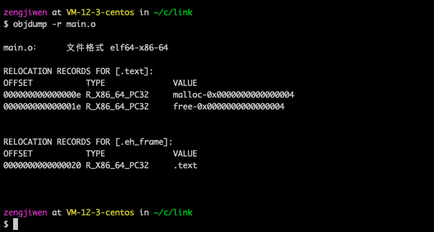

<p align="center">

</p>

- 如何修改一个可执行程序，使其运行我们想要的逻辑？
- 代码断点是怎么实现的？为何能在不修改代码的情况下中断/暂停程序？

- ref：[链接](./链接.html)


<p align="center">

</p>


Linux下的链接器支持库打桩（library interpositioning），允许你拦截对系统标准库、第三方库、甚至官方软件代码中某个目标函数的调用，取而代之执行自己的包装函数。即：给定一个需要打桩的目标函数，它的原型于目标函数完全一样，使用某种特殊的的打桩机制，你就可以欺骗系统，调用包装函数而不是目标函数了。

打桩可以发生在编译时、链接时、运行时。

我们在下文对malloc进行拦截，并运行自己写的malloc。

## 编译时
main.c
```c
#include <stdio.h>
#include <malloc.h>

int main(void)
{
 int *p = malloc(32);
 free(p);
 return 0;
}
```
一个很正常的c程序：使用malloc申请32byte空间，然后立即释放。

malloc.c
```c
#ifdef MOCK
#include <stdio.h>
#include <malloc.h>

// 定义malloc 包装函数
void *mymalloc(size_t size)
{
  void *ptr = malloc(size);
  // do what you want
  printf("malloc(%d) = %p\n", (int)size, ptr);
  return ptr;
}
#endif
```

malloc.h
```c
#define malloc(size)  mymalloc(size)

void *mymalloc(size_t size);
```

```
gcc -DMOCK -c malloc.c
# -I.:指示C预处理器在搜索通常的系统目录前,先在当前目录中查找malloc.h，而非直接从标准库目录找
# 原理同符号链接时“查找外部符号顺序”一致
gcc -I. -o main main.c malloc.o

# output followed
malloc(32) = 0x1487010
```

## 链接时
链接时打桩是在链接时替换需要的函数。Linux链接器支持用--wrap,f的方式来进行打桩，链接时符号f解析成__wrap_f，还会把__real_f解析成f。

malloc.c
```c
#ifdef MOCK
#include <stdio.h>

void *__real_malloc(size_t size);

//定义malloc 包装函数
void *__wrap_malloc(size_t size)
{
  //调用标准库里的malloc
  void *ptr = __real_malloc(size); 
  printf("malloc(%d) = %p\n", (int)size, ptr);
  return ptr;
}
#endif
```

main.c同上节“编译时”

运行
```sh
# 生成malloc.o
gcc -DMOCK -c malloc.c 
# 生成main.o
gcc  -c main.c  
# 将malloc.o 、 main.c链接起来，生成可执行目标文件
gcc -Wl,--wrap,malloc  -o main main.o malloc.o
```

是链接时打桩，本质上可以认为编译器做了字符串替换而已。


## 运行时
上述两种方式（编译时、链接时）都要求我们能够拿到源码或者可重定位目标文件。更多情况下，我们有的仅仅时可执行目标文件。对于可执行目标文件，能否也能注入我们想要执行的代码呢？

联想[链接](./链接.html#动态链接共享库)那一节讲到动态链接库，是否有想法？

方法：将LD_PRELOAD环境变量设置为一个共享路径名的列表（以空格或分号分开），那么在运行一个程序时，动态链接器（LD-LINUX.SO）会先搜索列表里的库，然后才搜素系统其它库。


下文种，我们仍旧是包装malloc函数中，然后在我们自定义的malloc函数种利用dlsym调用libc中的标准函数。

malloc.c
```c
#ifdef MOCK
#define  _GNU_SOURCE
#include <stdio.h>
#include <stdlib.h>
#include <dlfcn.h>
extern FILE *stdout;

// 定义malloc 包装函数
void *malloc(size_t size)
{
  void *(*mallocp)(size_t size);

  // 获得libc中malloc函数的地址
  if( !(mallocp = dlsym(RTLD_NEXT, "malloc")) ){  
    fputs(dlerror(), stdout);
    exit(1);
  }
  // 利用函数指针间接调用libc中的malloc函数
  char *ptr = mallocp(size); 
  printf("malloc(%d) = %p\n", (int)size, ptr);
  return ptr;
}
#endif
```

main.c 同前两节。运行命令如下：

```sh
# 生成动态链接库malloc.so，允许其他可执行程序加载
gcc -DMOCK -shared -fpic -o malloc.so malloc.c -ldl
# 生成可执行目标文件
gcc -o main main.c 
# 使用标准动态链接库运行
./main 
# 使用自定义动态链接库运行
LD_PRELOAD="./malloc.so" ./main  
```

- -fpic：（position independent code）指示生成位置无关的目标文件;编译共享库时该参数为必选！
- -DMOCK：在命令行中定义宏定义MOCK，为了与文件头部ifdef MOCK呼应。
- -shared：指示编译器生成一个共享目标文件。
- -ldl：指示链接器链接到libdl.so 共享库。

下图显示了需要进行重定位的符号
<p align="center">

</p>


## 思考
- 运行以下命令会发生什么？
```sh
export LD_PRELOAD="./malloc.so"
```
- 假设有一款商用程序，需要输入授权码之后才能使用，并且通过符号表我们找到一个函数check_license(声明如下)。能否通过运行时插桩绕过这个检查，使得输入任何授权码都能通过检验？
```
bool CheckLicence(char * license)
```


## 附命令
```sh
# -r 输出o文件中需要进行重定位的符号
# -S 输出o文件中机器指令
# -t 输出o文件中符号表
# -T 输出动态o文件中符号表
objdump -r main.o 
```