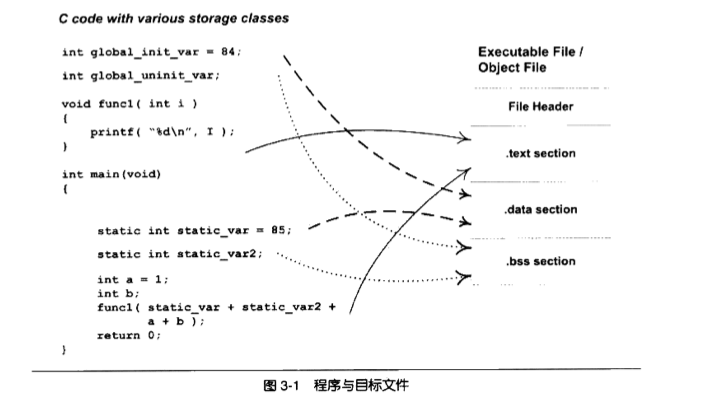
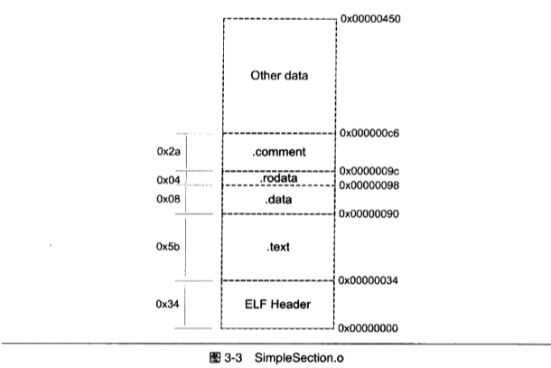
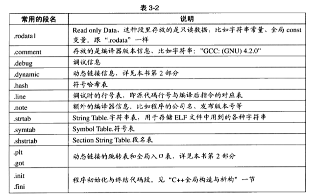

在学习链接之前，我们先看看链接的输入“目标文件Object File”里有什么。我们应该可以猜到，既然链接ld的输入是多个目标文件，那么这些目标文件应该包含的信息至少有以下内容（尚未确定值、地址的函数或者变量）：
- 能够被其他目标文件引用的符号：变量（如全局变量等）、函数
- 尚未定义的符号：即定义在其他目标文件的变量、函数
- 每个变量/函数的地址（至少是在目标文件中的偏移量之类的能够表示位置的信息）

# 目标文件的格式
目标文件从结构上，和可执行文件的格式基本一致的，它是已经编译后的可执行文件的格式，只是还没有经过链接过程，其中可能有些符号或者有些地址还没有被调整。如果我们执行尚未链接的目标文件，操作系统会返回“文件尚未链接完成”之类的错误，这说明操作系统执行程序的模块是能够识别目标文件的，也表明目标文件和可执行文件是同一类型的文件。

Linux下的目标文件、可执行文件、动态链接库ddl都是按照ELF格式存储的，静态链接库（.a）稍有不同，它是将多个目标文件捆绑形成一个文件，再加上索引。我们可以通过file命令查看一个文件的格式：
```zsh
$ file a.out
a.out: ELF 64-bit LSB shared object, x86-64, version 1 (SYSV), dynamically linked, interpreter /lib64/ld-linux-x86-64.so.2, for GNU/Linux 2.6.32, BuildID[sha1]=c047100bad48ae5d82e0e8fc3e04e31b33f89bbe, not stripped
```
可见这是一个共享（shared）目标文件。

目标文件按照数据的类型，以节section的形式存储，有时候也叫段segment。程序编译后的指令一般被存放在代码段，代码段常见的名字为.code或者.text；已初始化全局变量和局部静态变量经常被放在数据段.data；未初始化的全局变量和局部静态变量被存放在.bss段内。由于未初始化的全局变量和局部静态变量默认值都是0，因此为他们在.data段中分配空间并存放数据0是没有必要的。程序运行时他们的确是需要占用空间，并且可执行文件必须记录未初始化的全局变量和局部静态变量的大小总和（用于为这些变量分配空间），记为.bss段，所以.bss仅仅是为这些变量预留位置而已，它并没有内容。

<p align="center">

</p>


ELF文件的开头是一个文件头，它描述的整个文件的文件属性（是否可执行、是静态链接还是动态链接、入口地址、目标硬件、目标操作系统等），还包含一个段表，用于描述文件各个段在文件中的偏移位置及段的属性。

总的来说，代码被编译后主要被分为两种段：代码段和数据段。

面试问题：为什么指令和数据要分开存储？1. 安全：当程序被装载后，数据和指令分别被映射到两个虚拟区域，可以为不同段设置不同的读写权限，可以防止程序的指令被有意或者无意改写。2. 有利于提高程序缓存的局部性；3. 方便不同的进程共享同一个指令副本，节省内存。

## 样例
```c
int printf(const char* format, ...);


int global_init_var = 84;
int global_uninit_var;

void func1(int i){
    printf("%d\n", i);
}

int main(void){
    static int static_var= 85;
    static int static_var2;
    int a =1;
    int b;
    func1(static_var+static_var2+a+b);
    return a;
}
```

我们可以通过objdump查看各段
```sh
$ gcc -c SimpleSection.c
$ objdump -h SimpleSection.o

SimpleSection.o:     file format elf64-x86-64

Sections:
Idx Name          Size      VMA               LMA               File off  Algn
  0 .text         00000057  0000000000000000  0000000000000000  00000040  2**0
                  CONTENTS, ALLOC, LOAD, RELOC, READONLY, CODE
  1 .data         00000008  0000000000000000  0000000000000000  00000098  2**2
                  CONTENTS, ALLOC, LOAD, DATA
  2 .bss          00000004  0000000000000000  0000000000000000  000000a0  2**2
                  ALLOC
  3 .rodata       00000004  0000000000000000  0000000000000000  000000a0  2**0
                  CONTENTS, ALLOC, LOAD, READONLY, DATA
  4 .comment      0000002e  0000000000000000  0000000000000000  000000a4  2**0
                  CONTENTS, READONLY
  5 .note.GNU-stack 00000000  0000000000000000  0000000000000000  000000d2  2**0
                  CONTENTS, READONLY
  6 .eh_frame     00000058  0000000000000000  0000000000000000  000000d8  2**3
                  CONTENTS, ALLOC, LOAD, RELOC, READONLY, DATA
```

除了基本的代码、数据、bss外，还有三个段，分别是只读数据段.rodata、注释信息段.comment和堆栈提示段.note.GNU-stack。
- size表示段的长度；file offset为段在文件中的位置。
- CONTENTS 表示该段在文件中存在（可见bss没有CONTENTS）

<p align="center">

</p>

我们也可以通过size命令查看各段的大小：
```sh
$ size SimpleSection.o
   text    data     bss     dec     hex filename
    179       8       4     191      bf SimpleSection.o
```

## 数据段和只读数据段

- .data保存的是初始化了的全局静态变量和局部静态变量（global_init_varabal, static_var），一共8字节
- 字符串常量“%d\n”是一种只读数据，它被放在.rodata段，一个四个字节，即25640a00（以\0结尾）。（有时候编译器会将字符串常量放在data段）
- .data的前四个字节，是54000000，这个值刚好是global_init_var（84）的小端表示。55000000即是static_var。

```c
$ objdump -x -d -s SimpleSection.o|less
  ...
Contents of section .data:
 0000 54000000 55000000                    T...U...
Contents of section .rodata:
 0000 25640a00                             %d..
Contents of section .comment:
 0000 00474343 3a202844 65626961 6e20362e  .GCC: (Debian 6.
 0010 332e302d 31382b64 65623975 31292036  3.0-18+deb9u1) 6
 0020 2e332e30 20323031 37303531 3600      .3.0 20170516.
  ...
```

## bss
.bss段存储的是未初始化的全局变量和局部静态变量，更准确的说，是存储了这些变量的大小总和。但是我们通过“objdump -h” 命令看到，.bss的size是4，但是我们的样例代码的global_uninit_var、static_var2一共应该占用8个字节。这是因为，有些编译器会将全局的未初始化变量存放在.bss，有些则不存放，只是预留一个未定义的全局变量符号，等到最终链接的时候再在.bss分配空间。（后文的强/弱符号会有更详细的描述）

## 其他段
除了上述常见的段外，还有部分段objdump没有列出来。

<p align="center">

</p>


我们可以指定代码存放在特定的段中，以便实现某些功能，比如linux内核中用来完成一些初始化和用户空间复制时出现页错误异常等。gcc提供了一个扩展机制，可以指定变量所在的段：
```c
__attribute__((section("FOO"))) int global = 42;
__attribute__((section("BAR"))) void foo(){};
```

# ELF 文件结构
结合前文，我们省去一些繁琐的结构，就形成了ELF的基本结构图。
<p align="center">

</p>

## 文件头
我们可以通过如下命令查看ELF文件头的内容：
```c
$ readelf -h  SimpleSection.o
ELF Header:
  Magic:   7f 45 4c 46 02 01 01 00 00 00 00 00 00 00 00 00
  Class:                             ELF64
  Data:                              2's complement, little endian
  Version:                           1 (current)
  OS/ABI:                            UNIX - System V
  ABI Version:                       0
  Type:                              REL (Relocatable file)
  Machine:                           Advanced Micro Devices X86-64
  Version:                           0x1
  Entry point address:               0x0
  Start of program headers:          0 (bytes into file)
  Start of section headers:          1112 (bytes into file)
  Flags:                             0x0
  Size of this header:               64 (bytes)
  Size of program headers:           0 (bytes)
  Number of program headers:         0
  Size of section headers:           64 (bytes)
  Number of section headers:         13
  Section header string table index: 12
```

从上面的输出我们可以看到，ELF文件头定义了ELF魔数、文件机器字节长度、数据存储方式（大小端）、版本、运行平台、ABI白本、ELF重定位类型、硬件平台、硬件平台版本、入口地址、程序头入口和长度、段表的位置和长度及段的数量等。

```
7f 45 4c 46 02 01 01 00 00 00 00 00 00 00 00 00
```
ELF魔术一共16字节，用来标识ELF文件的平台属性：
- 前四个字节（7f 45 4c 46）标识文件类型位ELF
- ELF字长（32/64位）：0x01表示32位，0x02表示64位
- 字节序（大小端）：第六个字节
- ELF文件主版本：第七个字节。因为ELF在1.2版以后就没有更新了，因此一般都是1
- 后续9个字节尚未定义
- 附：a.out的魔数是0x01 0x07。（取用该数字有一个故事）

## 段表

段表是ELF文件中除了文件头以外最重要的结构，它描述了ELF的各个段的信息，如每个段的名字、长度、在文件中的偏移量、读写权限等属性。编译器、链接器和装载器都是靠段表来定位和访问各个段的属性的。

我们可以通过以下命令查看段表的具体信息，如符号表、字符串表等。（objdump -h仅展示ELF文件中的关键段）
```c
$ readelf -S SimpleSection.o
There are 13 section headers, starting at offset 0x458:

Section Headers:
  [Nr] Name              Type             Address           Offset
       Size              EntSize          Flags  Link  Info  Align
  [ 0]                   NULL             0000000000000000  00000000
       0000000000000000  0000000000000000           0     0     0
  [ 1] .text             PROGBITS         0000000000000000  00000040
       0000000000000057  0000000000000000  AX       0     0     1
  [ 2] .rela.text        RELA             0000000000000000  00000348
       0000000000000078  0000000000000018   I      10     1     8
  [ 3] .data             PROGBITS         0000000000000000  00000098
       0000000000000008  0000000000000000  WA       0     0     4
  [ 4] .bss              NOBITS           0000000000000000  000000a0
       0000000000000004  0000000000000000  WA       0     0     4
  [ 5] .rodata           PROGBITS         0000000000000000  000000a0
       0000000000000004  0000000000000000   A       0     0     1
  [ 6] .comment          PROGBITS         0000000000000000  000000a4
       000000000000002e  0000000000000001  MS       0     0     1
  [ 7] .note.GNU-stack   PROGBITS         0000000000000000  000000d2
       0000000000000000  0000000000000000           0     0     1
  [ 8] .eh_frame         PROGBITS         0000000000000000  000000d8
       0000000000000058  0000000000000000   A       0     0     8
  [ 9] .rela.eh_frame    RELA             0000000000000000  000003c0
       0000000000000030  0000000000000018   I      10     8     8
  [10] .symtab           SYMTAB           0000000000000000  00000130
       0000000000000198  0000000000000018          11    11     8
  [11] .strtab           STRTAB           0000000000000000  000002c8
       000000000000007c  0000000000000000           0     0     1
  [12] .shstrtab         STRTAB           0000000000000000  000003f0
       0000000000000061  0000000000000000           0     0     1
Key to Flags:
  W (write), A (alloc), X (execute), M (merge), S (strings), I (info),
  L (link order), O (extra OS processing required), G (group), T (TLS),
  C (compressed), x (unknown), o (OS specific), E (exclude),
  l (large), p (processor specific)
```
SimpleSection.o一共有13段，其中第一个是NULL。段表的结构是一个以“Elf32_Shdr（段描述符）”结构体为元素的数组，数组的每个元素对应一个段。段表的第一个元素是无效的段描述符，它的类型是NULL。段表描述符的属性如下：
- sh_name:段名
- sh_type:段类型
- sh_flags:段的标志位
- sh_addr:段的虚拟地址。如果该段可以被装载，那么该值就行进程地址空间中段的虚拟地址，否则该值为0
- sh_offset:段偏移。如果段存在于文件中，则表示在文件的偏移，否则无意义（如.bss）
- sh_size:段的长度
- sh_addralign:段的对齐，有些段对段地址对齐有要求
- sh_entsize:有些段（如符号表）包含一些固定大小的项，sh_entsize表示每个项大小。如果为0则表示该段不包含固定大小的项

段的名字对于编译器、链接器是有意义的，但是对于操作系统来说并没有实际意义。对于操作系统，一个段该如何处理取决于它的属性和权限，即由段类型和段标志位来决定。（链接器根据段名判断是指令还是数据；os只负责装载、判断对这些段的访问是否非法）。

段的类型sh_type在编译、链接阶段才有意义，但是它并不真正表示段的类型。我们也可以将一个数据段命名为.text。对于编译器和链接器，主要决定段的属性的是段的类型sh_type（代码、数据、字符串表、重定位表、符号表的hash表、动态链接的符号表等）和段的标志位sh_flags（可写、可执行等）。


## 重定位表
链接器在处理目标文件的时候，须要对目标文件的某些部位进行重定位，即代码段、数据段中那些对绝对地址的引用的位置。这些重定位的信息都记录在ELF文件的重定位表中。对于每个需要重定位的代码和数据段，都有一个相应的重定位表。

SimpleSection.o中有一个.rela.text的表，它的类型是重定位表SHT_REL，它是针对.text段的重定位表，因为.text中至少有一个绝对地址的引用，那就是对printf函数的调用；我们的样例中.data中没有对绝对地址的引用，它只包含了常量，所以没有.rela.data。

## 字符串表
ELF中用到了很多的字符串，如段名、变量名，它们的长度是不固定的，所以用固定的结构来表示它比较困难，因此常见的做法是把字符串集中存起来，然后使用字符串在表中的偏移来引用字符串。ELF文件引用字符串只需要给出一个数字下表即可。

字符串表常见的段名为.strtab和.shstrtab，分贝是字符串表（如符号名字）和段表字符串表（段表中用到的字符串，如段名）。

# 符号
在链接中，目标文件之间相互拼接实际上是目标文件之间对地址的引用，即对函数和变量的地址的引用。比如目标文件B用到了目标文件A的foo函数，那么就称目标文件A定义了函数foo，称目标文件B引用了A的函数foo。变量的定义、引用也是同理。在链接中，函数、变量被统称为符号，函数名和变量名就是符号名。

每个目标文件都以一个相应的符号表，它记录了目标文件所有用到的符号。每个定义的符号有一个对应的值，叫做符号值，对于变量和函数，即它们的地址。我们将可以被其他文件引用的符号，称为全局符号。链接过程只关心全局符号的相互“粘合”，局部符号、段名、行号都是次要的，它们对其他目标文件是“不可见”的。样例中用到的符号如下：

```c
$ nm SimpleSection.o
0000000000000000 T func1
0000000000000000 D func1
                 U _GLOBAL_OFFSET_TABLE_
0000000000000004 C global_uninit_var
0000000000000024 T main
                 U printf
0000000000000004 d static_var.1765
0000000000000000 b static_var2.1766
```

U类型的符号（如_GLOBAL_OFFSET_TABLE_、printf）表示尚未定义，它们的地址尚未确定。这些符号需要等静态/动态链接完成后才能确定。


## ELF符号表结构
ELF中的符号表往往是文件中的一个段，名一般为.symtab。符号表是一个Elf32_Sym的数组。数组的第一个元素为无效的符号。符号项结构如下：
- st_name:符号名，即符号名在字符串表中的下标
- st_value:符号相应的值，可能是绝对值，也可能是地址
- st_size:符号大小。如果是数据符号，这个值就是符号类型的大小
- st_info:符号类型（未知、数据、函数或代码、段、文件名）和绑定信息（局部符号、全局符号、弱引用）
- st_other:暂无用
- st_shndx:符号所在的段，即段表的下标

每个符号都有一个对应的值。如果符号是函数或者变量，那么符号的值就是这个函数或者变量的地址：
- 如果是符号的定义切该符号不是COMMON块类型（即st_shndx=SHN_COMMON），则st_value表示符号在段中的偏移，即符号对应的函数或者变量位于由st_shndx指定的段，偏移st_value的位置。这是全局变量的符号的常见情况，如样例中的func1、global_uninit_var、main
- 如果符号是COMMON块类型（即st_shndx=SHN_COMMON），则st_value表示该符号的对齐属性。如global_uninit_var
- 在可执行文件中，st_value表示符号的虚拟地址。这个虚拟地址对动态链接器有用

```c
$ readelf -s SimpleSection.o

Symbol table '.symtab' contains 17 entries:
   Num:    Value          Size Type    Bind   Vis      Ndx Name
     0: 0000000000000000     0 NOTYPE  LOCAL  DEFAULT  UND
     1: 0000000000000000     0 FILE    LOCAL  DEFAULT  ABS SimpleSection.c
     2: 0000000000000000     0 SECTION LOCAL  DEFAULT    1
     3: 0000000000000000     0 SECTION LOCAL  DEFAULT    3
     4: 0000000000000000     0 SECTION LOCAL  DEFAULT    4
     5: 0000000000000000     0 SECTION LOCAL  DEFAULT    5
     6: 0000000000000004     4 OBJECT  LOCAL  DEFAULT    3 static_var.1765
     7: 0000000000000000     4 OBJECT  LOCAL  DEFAULT    4 static_var2.1766
     8: 0000000000000000     0 SECTION LOCAL  DEFAULT    7
     9: 0000000000000000     0 SECTION LOCAL  DEFAULT    8
    10: 0000000000000000     0 SECTION LOCAL  DEFAULT    6
    11: 0000000000000000     4 OBJECT  GLOBAL DEFAULT    3 global_init_var
    12: 0000000000000004     4 OBJECT  GLOBAL DEFAULT  COM global_uninit_var
    13: 0000000000000000    36 FUNC    GLOBAL DEFAULT    1 func1
    14: 0000000000000000     0 NOTYPE  GLOBAL DEFAULT  UND _GLOBAL_OFFSET_TABLE_
    15: 0000000000000000     0 NOTYPE  GLOBAL DEFAULT  UND printf
    16: 0000000000000024    51 FUNC    GLOBAL DEFAULT    1 main
```
printf在SimpleSection.c没有被定义，所以它的Ndx是SHN_UNDEF。对于那些STT_SECTION类型的符号，它们表示下表为Ndx的段的段名。

## 特殊符号
当我们使用链接器来生成可执行文件，它会为我们定义很多特殊的符号，我们可以在程序中直接声明并使用它们。下文我们会介绍在“链接过程”中回顾它们：
- __executable_start: 程序的起始地址，注意不是入口地址，是程序最开始的地址
- __etext或_etext或etext: 代码段结束地址
- _data或edata: 数据段结束地址
- _end或end: 程序结束地址

```c
$ cat SpecialSymbol.c
#include <stdio.h>

extern char __executable_start[];
extern char etext[], _etext[], __etext[];
extern char edata[], _edata[];
extern char end[], _end[];

int main()
{
    printf("executable start %X\n", __executable_start);
    printf("text end %X %X %X\n", etext, _etext, __etext);
    printf("data end %X %X \n", edata, _edata);
    printf("executable end %X  %X\n", end, _end);
}


$ ./SpecialSymbol
executable start 15EE000
text end 15EE7BD 15EE7BD 15EE7BD
data end 17EF030 17EF030
executable end 17EF038  17EF038
```


## 弱符号and强符号
当多个目标文件含有相同名字全局符号的定义，那么这些目标文件链接的时候会出现符号重复定义的错误。这种符号的定义可以被称为强符号。有些符号的定义可以被称为弱符号。对于c/c++来说，编译器默认函数和初始化了的全局变量为强符号，未初始化的全局变量为弱符号。
- 不允许强符号被定义多次
- 如果一个符号在某目标文件是强符号，在其他文件是弱符号，那么就选择强符号
- 如果一个符号在所有目标文件都是弱符号，那么选择其中占用空间最大的那个

编译时，如果没有找到对外部目标文件的符号引用的定义，那么会报符号未定义错误，这种被称为强引用。相对应的，在处理弱引用时，如果符号未被定义，则不报错。弱引用和弱符号主要用于库的链接过程。我们可以通过gcc的扩展关键字来声明一个外部函数的引用为弱引用：
```c
__attribute__ ((weakref)) void foo();

int main(){
    foo();
}
```
当我们编译这个代码，并不会报错，但是运行文件时，会发生错误（因为foo的地址为0）。我们可以将这个代码和其他已经定义了foo的目标文件链接起来，那就能正确运行。通过这种方式实现的程序，可以方便的升级某些功能，或者基于不同的环境，链接不同的模块然后调用，而无需一次性将所有环境的模块都链接起来。

# 调试信息
目标文件里面还有可能保存调试信息，如断点、单步行进、目标代码中地址对应的源代码行号等。我们可以使用“gcc -g”来产生带有调试信息的目标文件。
```c
$ gcc -c -g SimpleSection.c

$ readelf -S SimpleSection.o
There are 21 section headers, starting at offset 0x9b8:

Section Headers:
  [Nr] Name              Type             Address           Offset
       Size              EntSize          Flags  Link  Info  Align
  [ 6] .debug_info       PROGBITS         0000000000000000  000000a4
       00000000000000e9  0000000000000000           0     0     1
  [ 7] .rela.debug_info  RELA             0000000000000000  000006e0
       00000000000001b0  0000000000000018   I      18     6     8
  [ 8] .debug_abbrev     PROGBITS         0000000000000000  0000018d
       0000000000000091  0000000000000000           0     0     1
  [ 9] .debug_aranges    PROGBITS         0000000000000000  0000021e
       0000000000000030  0000000000000000           0     0     1
  [10] .rela.debug_arang RELA             0000000000000000  00000890
       0000000000000030  0000000000000018   I      18     9     8
  [11] .debug_line       PROGBITS         0000000000000000  0000024e
       000000000000004a  0000000000000000           0     0     1
  [12] .rela.debug_line  RELA             0000000000000000  000008c0
       0000000000000018  0000000000000018   I      18    11     8
  [13] .debug_str        PROGBITS         0000000000000000  00000298
       00000000000000ba  0000000000000001  MS       0     0     1
  [14] .comment          PROGBITS         0000000000000000  00000352
       000000000000002e  0000000000000001  MS       0     0     1
Key to Flags:
  W (write), A (alloc), X (execute), M (merge), S (strings), I (info),
  L (link order), O (extra OS processing required), G (group), T (TLS),
  C (compressed), x (unknown), o (OS specific), E (exclude),
  l (large), p (processor specific)
```

这些段中保存的就是调试信息。调试信息在目标文件、可执行文件中占用很大的空间，往往比程序的代码和数据本身大好几倍，所以当我们发布程序的时候，一般会将这些对用户没用的调试信息去掉，以节省大量的空间。在Linx下，我们可以用strip命令去掉ELF文件中的调试信息：
```c
$ ls -l SimpleSection.o
-rw-r--r-- 1 zengjiwen zengjiwen 3832 Feb 13 14:56 SimpleSection.o

$ strip SimpleSection.o

$ ls -l SimpleSection.o
-rw-r--r-- 1 zengjiwen zengjiwen 952 Feb 13 15:00 SimpleSection.o
```
可见，去掉调试信息后，目标文件的大小从3832字节减少到了952字节。