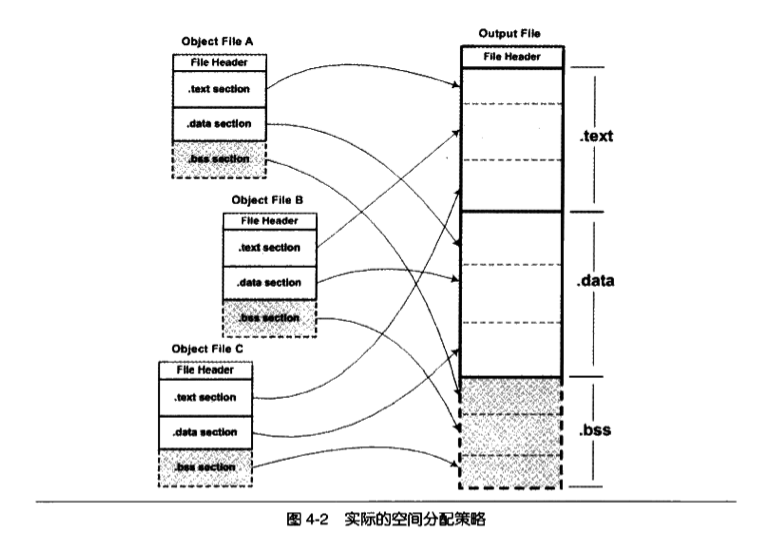
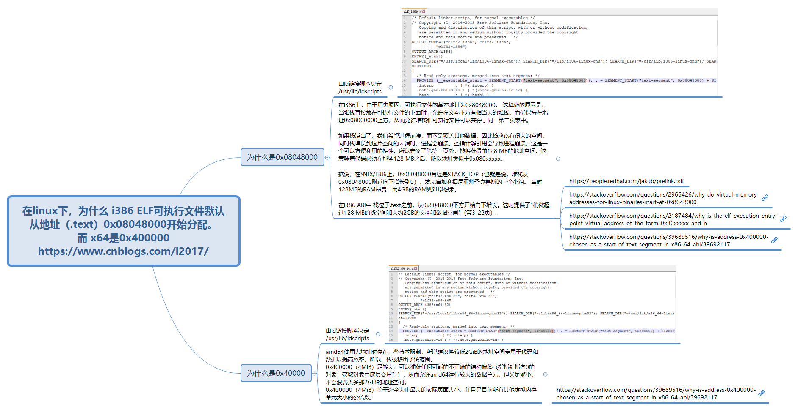
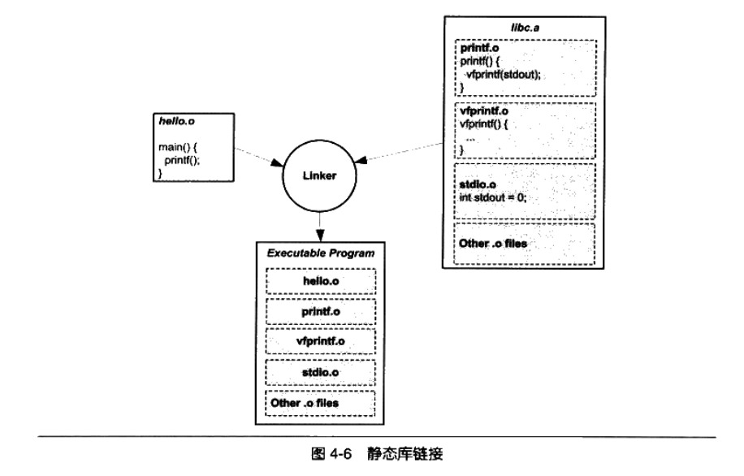

上一文我们学习了目标文件（ELF）的结构：段表、.text、.data、.symtab等知识，接下来的问题是，当我们有两个目标文件，如何将它们链接起来形成一个可执行文件？这个过程发生了什么？这就是链接的核心内容。接下来我们将使用以下代码进行分析：
```c
// b.c
int shared = 1;
void swap(int *a, int *b)
{
	*a ^= *b ^= *a ^= *b;
}


// a.c
extern int shared;

int main()
{
	int a = 100;
	swap(&a, &shared);
}
```
- 当我们运行“gcc -c a.c b.c”，会生成两个目标文件a.o、b.o（编译a.c会有warning：implicit declaration of function ‘swap’ [-Wimplicit-function-declaration]）
- b.c定义一个全局变量shared，以及函数swap
- a.c定义了一个全局符号main，并应用了其他文件的shared、swap
我们的目标就是分析链接器是如何将a.o和b.o链接起来，产生一个可执行文件。

# 空间和地址分配
我们知道可执行文件的代码段和数据段和事由输入的目标文件合并何来的，那链接器是如何将它们的各个段合并到输出文件？或者说，输出文件的空间是如何分配给输入文件？

## 按序叠加
一个最简单的方案就是贱给输入的目标文件按照次序叠加起来：
<p align="center">

</p>

上图将各个目标文件依次合并。但这样做会有很多问题：当输入文件较多的情况下，输出文件会有很多零散的段。比如实际工作的应用程序中会有数百个目标文件，如果每个目标文件都分别有.text、.data、.bss等段，那么最后的输出文件将有成百上千的零散的段。而且这种方式很浪费空间，因为每个段都需要有一定的地址和空间对齐要求，比如对于x86的硬件来说，段的装载地址和空间的对齐单位是页，也就是4k字节。那么如果一个段的长度只有一个字节，它在内存中占用4096字节，会造成内存空间中大量的内存碎片。

## 相似段合并
一个更实际的方法是将相似性质的段合并在一起，如将所有输入文件的.text合并到输出文件.text段：
<p align="center">

</p>

上图将目标文件的代码、数据、bss段分别合并到输出文件的代码、数据、bss段。.bss段在目标文件和可执行文件并不占用空间，它仅仅是在装载时占用地址空间。所以链接器在合并各段的时候，也将.bss合并，并且分配虚拟空间，但并不分配文件空间（.bss段仅仅用来标记全局变量一共占用了多少虚拟空间，值都是0，因此无需占用文件空间）。.text, .data等段，在文件和虚拟地址中都需要分配空间，因为它们在两者中都存在。

实际上，链接器也的确是按这种方式进行链接的。使用这种方法的链接器一般都采用一种叫两步链接的方法：
- 第一步：空间和地址分配，扫描所有输入的目标文件，获取它们各个段的长度、属性、位置，并且将输入目标文件中的符号定义、符号引用收集起来，统一放到一个全局符号表，将各个段合并起来
- 第二部：符号解析和重定位。基于上一步，读取输入文件的段的数据、重定位信息，并且进行符号解析和重定位、调整代码中的地址等

```c
$ ld a.o b.o -e main -e ab

$ ./ab
[1]    3905520 segmentation fault (core dumped)  ./ab

```
- -e main：将main函数作为程序入口，ld链接器默认的程序入口时_start
- -o ab：表示输出文件名为ab，默认为a.out
- 运行ab，发生错误：egmentation fault，我们后续再分析这个问题

现在我们看下链接前后的地址分配情况：
```c
$ objdump -h a.o
b.o:     file format elf64-x86-64

Sections:
Idx Name          Size      VMA               LMA               File off  Algn
  0 .text         0000002e  0000000000000000  0000000000000000  00000040  2**0
                  CONTENTS, ALLOC, LOAD, RELOC, READONLY, CODE
  1 .data         00000000  0000000000000000  0000000000000000  0000006e  2**0
                  CONTENTS, ALLOC, LOAD, DATA
  2 .bss          00000000  0000000000000000  0000000000000000  0000006e  2**0
                  ALLOC
  ...

$ objdump -h b.o

Sections:
Idx Name          Size      VMA               LMA               File off  Algn
  0 .text         0000004b  0000000000000000  0000000000000000  00000040  2**0
                  CONTENTS, ALLOC, LOAD, READONLY, CODE
  1 .data         00000004  0000000000000000  0000000000000000  0000008c  2**2
                  CONTENTS, ALLOC, LOAD, DATA
  2 .bss          00000000  0000000000000000  0000000000000000  00000090  2**0
                  ALLOC
  ...


$ objdump -h ab
Sections:
Idx Name          Size      VMA               LMA               File off  Algn
  0 .text         00000079  00000000004000e8  00000000004000e8  000000e8  2**0
                  CONTENTS, ALLOC, LOAD, READONLY, CODE
  1 .eh_frame     00000058  0000000000400168  0000000000400168  00000168  2**3
                  CONTENTS, ALLOC, LOAD, READONLY, DATA
  2 .data         00000004  0000000000601000  0000000000601000  00001000  2**2
                  CONTENTS, ALLOC, LOAD, DATA
  3 .comment      0000002d  0000000000000000  0000000000000000  00001004  2**0
                  CONTENTS, READONLY
```
- VMA: Virtual Memory Address，即虚拟地址。LMA表示Load Memory Address，即加载地址。一般情况下，这两个值时相同的，但在某些嵌入式系统中，特别是程序放在ROM的系统中是，二者是不同的。我们只关注VMA。

链接前后的程序所使用的地址已经是程序在进程中的虚拟地址，即我们关心上面各个段中的VMA和size，而忽略文件偏移。可以看到，链接之前，目标文件的VMA都是0，这是因为虚拟空间还没有被分配，所以默认都是0。等链接结束后，ab中的各个段都被分配了相应的虚拟地址（我的系统是x86-64）：
- .text 被分配到了0x004000e8，大小为0x79字节（如果你的x86系统，那么.text地址应该是0x08048094）
- .data 被分配到了0x00601000，大小为4个字节（如果你的x86系统，那么.data地址应该是0x08049108）

我们可以看到a.o和b.o的代码段先后叠加起来，合并称ab的一个.text段（0x2e+ox4b=0x79），所以ab的代码段肯定包含了main函数和swap函数的代码。

为什么.text和.data的地址不是从虚拟空间的0地址开始分配呢？这设计到操作系统进程虚拟地址空间的分配规则，在Linux下，x86-ELF可执行文件默认从地址0x0804800开始分配，x86-64是从0x00400000开始分配：

<p align="center">

</p>

## 符号地址的确定
在第一步的扫描和空间分配中，我们已经确定了.text的起始地址为0x004000e8，.data的起始地址为0x00601000（我们仍旧是x86为例）。那么这一步完成后，链接器开始计算各个符号的虚拟地址。因为各个符号在段内的相对地址是固定的，所以这时候main、shared、swap的地址也已经是确定的了，只不过链接器须给每个符号加上一个偏移量，使它们能够调整到正确的虚拟地址。从前面的objdump的输出看出，main位于a.o的.text的最开始，也就是偏移量为0，所有main在最终的输出文件的地址应该就是0x004000e8+0，即0x004000e8。同样，我们可以通过一样的计算方法的值所有符号的地址：main的长度为0x2e(即46)字节，而我们的代码只有两个函数，可以猜到swap应该就在main之后，0x004000e8+0x2e=0x00400116，刚好是swap的虚拟地址。
```c
$ readelf -s ab

Symbol table '.symtab' contains 13 entries:
   Num:    Value          Size Type    Bind   Vis      Ndx Name
   ...
     7: 0000000000400116    75 FUNC    GLOBAL DEFAULT    1 swap
     8: 0000000000601000     4 OBJECT  GLOBAL DEFAULT    3 shared
     9: 0000000000601004     0 NOTYPE  GLOBAL DEFAULT    3 __bss_start
    10: 00000000004000e8    46 FUNC    GLOBAL DEFAULT    1 main
    11: 0000000000601004     0 NOTYPE  GLOBAL DEFAULT    3 _edata
    12: 0000000000601008     0 NOTYPE  GLOBAL DEFAULT    3 _end
```

# 符号解析和重定位
在完成空间和地址的分配步骤后，链接器就进入了符号解析和重定位的步骤，也就是静态链接的核心内容。在分析符号解析和重定位之前，我们先看看编译器在讲a.c编译称指令时，它如何访问shared变量？如何调用swap函数？我们可以反编译看看a.o的代码：
```c
$ objdump -d a.o

a.o:     file format elf64-x86-64


Disassembly of section .text:

0000000000000000 <main>:
   0:   55                      push   %rbp
   1:   48 89 e5                mov    %rsp,%rbp
   4:   48 83 ec 10             sub    $0x10,%rsp
   8:   c7 45 fc 64 00 00 00    movl   $0x64,-0x4(%rbp)
   f:   48 8d 45 fc             lea    -0x4(%rbp),%rax
  13:   48 8d 35 00 00 00 00    lea    0x0(%rip),%rsi        # 1a <main+0x1a>
  1a:   48 89 c7                mov    %rax,%rdi
  1d:   b8 00 00 00 00          mov    $0x0,%eax
  22:   e8 00 00 00 00          callq  27 <main+0x27>
  27:   b8 00 00 00 00          mov    $0x0,%eax
  2c:   c9                      leaveq
  2d:   c3                      retq
```
- 我们可以看到main的其实地址是0x0000000，因为在未进行空间分配之前，目标文件代码是从0x00000000开始的。
  

我们可以看到在第偏移位13的lea指令(48 8d 35 00 00 00 00)中，这个指令共八个字节，他的作用是将shared的地址复制到rsi寄存器中，前面四个字节是指令码，后面四个字节是shared的地址。当a.c被编译的时候，编译器并不知道shared、swap的地址，因为它们定义在其他目标文件中，所以编译器暂时把地址0作为share的地址，因此在lea指令中,shared的地址位0x00000000，这个地址将在重定位过程中，被修正为正确的地址。

我们再看偏移量为22的指令（e8 00 00 00 00），可见swap的地址也是0x0000000。e8是一条近相对位移调用指令，后面四个字节是被调用函数的相对于调用指令的下一跳指令的偏移量。偏移为0x0000000，即偏移为零，所以callq指令的实际调用地址为0x27。但是我们可以看到0x27存放着的并不是swap的地址。跟shared的地址一样，这也是一个临时的假地址。在链接后，swap将被修正为一个正确相对值（即相对地址）。（在x86中，函数调用指令一般被编译为e8 fc ff ff ff）。

编译器把这两条指令的地址部分暂时用0x00000000代替，把真正的地址计算工作留给了链接器。从上一节我们知道，链接器在完成地址和空间分配之后，就已经确定所有符号的虚拟地址了，那么链接器就能够根据符号的地址，对每个需要重定位的指令进行地址修正。我们通过objdump反汇编程序ab的代码段，可以看到main函数中的两个重定位入口都已经被修成成正确的地址了：

```c
$ objdump -d ab

ab:     file format elf64-x86-64


Disassembly of section .text:

00000000004000e8 <main>:
  4000e8:       55                      push   %rbp
  4000e9:       48 89 e5                mov    %rsp,%rbp
  4000ec:       48 83 ec 10             sub    $0x10,%rsp
  4000f0:       c7 45 fc 64 00 00 00    movl   $0x64,-0x4(%rbp)
  4000f7:       48 8d 45 fc             lea    -0x4(%rbp),%rax
  4000fb:       48 8d 35 fe 0e 20 00    lea    0x200efe(%rip),%rsi        # 601000 <shared>
  400102:       48 89 c7                mov    %rax,%rdi
  400105:       b8 00 00 00 00          mov    $0x0,%eax
  40010a:       e8 07 00 00 00          callq  400116 <swap>
  40010f:       b8 00 00 00 00          mov    $0x0,%eax
  400114:       c9                      leaveq
  400115:       c3                      retq

0000000000400116 <swap>:
  400116:       55                      push   %rbp
  ...
```

我们可以看到指令中swap的地址被替换成了0x00000007（指令中是小端表示），下一条指令地址是0x0040010f，0x0040010f + 0x00000007 = 0x00400116，刚好是swap的虚拟地址（和上一节的“readelf -s ab”的输出结果符合）。同理，0x00400102 + 0x00200efe = 0x00601000，也就是shared的虚拟地址。

## 重定位表
现在我们链接器已经知道每个符号的地址了，那它怎么知道哪些指令时需要被调整的呢？这些指令哪些部分需要被调整呢？怎么调整？事实上，在ELF文件中，有一个叫重定位表的结构，准备存储了这些与重定位相关的信息。对于可重定位的ELF文件中，它必须包含重定位表，用来描述如何修改相应的段里的内容。一个重定位表往往就是ELF文件中的一个段。比如代码段.text如有需要被重定位的地方，那么会有一个相应的叫.rel.text的段保存代码段的重定位表。相应的，如果.data需要被重定位，那也有一个.rel.data段保存了数据段的重定位表。

```c
$ readelf -S a.o
There are 12 section headers, starting at offset 0x2d0:

Section Headers:
    ...
  [Nr] Name              Type             Address           Offset
       Size              EntSize          Flags  Link  Info  Align
  [ 1] .text             PROGBITS         0000000000000000  00000040
       000000000000002e  0000000000000000  AX       0     0     1
  [ 2] .rela.text        RELA             0000000000000000  00000228
       0000000000000030  0000000000000018   I       9     1     8
  [ 3] .data             PROGBITS         0000000000000000  0000006e
       0000000000000000  0000000000000000  WA       0     0     1
    ...
```

每个需要被重定位的地方叫一个重定位入口。我们知道看到a.o的.text段里面有两个重定位入口，相对应的，.rela.text保存了代码段的重定位表。我们再看看a.o的重定位表里有什么信息：
```c
$ objdump -r a.o

a.o:     file format elf64-x86-64

RELOCATION RECORDS FOR [.text]:
OFFSET           TYPE              VALUE
0000000000000016 R_X86_64_PC32     shared-0x0000000000000004
0000000000000023 R_X86_64_PLT32    swap-0x0000000000000004


RELOCATION RECORDS FOR [.eh_frame]:
OFFSET           TYPE              VALUE
0000000000000020 R_X86_64_PC32     .text
```

可见，.text中，有两个需要重定位的地方，分别对应shared、swap两个符号；TYPE表示要如何修改这些位置的指令；OFFSET表示需要被调整的位置，这两个符号它们在代码段中的位移分别是0x16和0x23，和前文中a.o的反编译结果刚好吻合。
```c
$ objdump -d a.o
  ...
  13:   48 8d 35 00 00 00 00    lea    0x0(%rip),%rsi        # 1a <main+0x1a>
  1a:   48 89 c7                mov    %rax,%rdi
  1d:   b8 00 00 00 00          mov    $0x0,%eax
  22:   e8 00 00 00 00          callq  27 <main+0x27>
  ...
```
综合，所谓的重定位表，就是描述重定位入口的数组，数组的每个元素描述了：
- 需要被重定位的位置
- 这个位置对应的是什么符号的地址
- 这个位置中的修改方式是什么，比如相对寻址还是绝对寻址

## 符号解析
重定位的过程中，每个重定位入口都是对一个符号的引用，那么当链接器须要对某个符号的引用进行重定位的时候，它就好确定这个符号的目标地址。这个时候链接器就会去查找由所有输入目标文件的符号表组成的全局符号表，找到相应的符号后进行重定位。

比如a.o中，shared和swap都是undefined类型，所有对引用这两个符号的地方，都需要相应的进行重定位。
```c
$ readelf -s a.o

Symbol table '.symtab' contains 12 entries:
   Num:    Value          Size Type    Bind   Vis      Ndx Name
     0: 0000000000000000     0 NOTYPE  LOCAL  DEFAULT  UND
     1: 0000000000000000     0 FILE    LOCAL  DEFAULT  ABS a.c
     2: 0000000000000000     0 SECTION LOCAL  DEFAULT    1
     3: 0000000000000000     0 SECTION LOCAL  DEFAULT    3
     4: 0000000000000000     0 SECTION LOCAL  DEFAULT    4
     5: 0000000000000000     0 SECTION LOCAL  DEFAULT    6
     6: 0000000000000000     0 SECTION LOCAL  DEFAULT    7
     7: 0000000000000000     0 SECTION LOCAL  DEFAULT    5
     8: 0000000000000000    46 FUNC    GLOBAL DEFAULT    1 main
     9: 0000000000000000     0 NOTYPE  GLOBAL DEFAULT  UND shared
    10: 0000000000000000     0 NOTYPE  GLOBAL DEFAULT  UND _GLOBAL_OFFSET_TABLE_
    11: 0000000000000000     0 NOTYPE  GLOBAL DEFAULT  UND swap
```

## 指令修改方式
不同处理器指令对于地址的格式和方式都是不一样的，不同指令的寻址方式页千差万别：有近址和远址寻址，有绝对和相对寻址，寻址长度有8、16、32、64位等等。

前文a.o代码中的重定位入口刚好只用到了两种寻址方式R_X86_64_PC32和R_X86_64_PLT32，且都是相对寻址，寻址长度都是32位。因此，对应的位置都被修改成符号地址相对于下一条指令的偏移量。


# COMMON块
由于弱符号机制允许同一个符号定义在多个文件中，所以可能导致一个问题：如果一个弱符号定义在多个目标文件中，而且它们的类型不同，怎么办？目前链接器不支持符号的类型，因此变量类型对于链接器来说是透明，它只知道一个符号的名字。符号定义类型不一致的情况有：
- 两个或两个以上强符号类型不一致
- 有一个强符号，其他都是弱符号，出现类型不一致
- 两个或者两个弱符号类型不一致

第一种情况无需处理，因为多个强符号定义本身就是非法的，链接器会报符号多重定义错误。对于后面两种情况，现在的编译器和链接器支持一种叫COMMON的块的机制：
- 将未初始化的全局变量定义为COMMON类型
- 有一个强符号，其他都是弱符号，出现类型不一致，则最终输出的结果符号所占的空间与强符号相同（如果有弱符号大小大于强符号，链接器会发出警告warning）
- 两个或者两个弱符号类型不一致，则以占用空间最大的弱符号为最终输出的结果符号

直接导致需要COMMON机制的原因是编译器和链接器允许不同类型的弱符号存在，但最本质的原因还是链接器不支持符号类型，即链接器无法判断各个符号的类型是否一致。

现在我们回到上一文的疑问：在目标文件中，为什不将未初始化的全局变量也当作未初始化的局部静态变量一样处理，为它在BSS段分配空间，而是将其标记为一个COMMON类型的变量？因为在编译过程中，未初始化的全局变量如果出现多重定义，那么编译器是不知道这个变量所占的空间大小的，因此也就无法为其在BSS段中分配空间。而在链接过程中，链接器已经确定了这个弱符号所占空间大小，因此可以在最终输出文件的BSS段为其分配空间。


# C++相关问题
C++的一些语言特性使之必须由编译器和链接器共同支持才能完成工作。最主要的有两个方面，一个是C++的重复代码消除，还有一个是全局构造和析构。

## 重复代码消除
C++编译器在很多时候会产生重复的代码，比如模板、外部内联函数、徐函数表都有可能在不同的编译单元生成相同的代码。最简单的情况就拿模板来说，当一个模板在一个编译但愿被实例化后，它不知道自己是否在别的编译单元也被实例化，所以当一个模板在多个编译单元被同时实例化成相同的类型的时候，必然会产生相同的代码（比如add<T>()，某个编译单元以int类型实例化了该模板，另一个单元以int和float类型实例化了该模板，那么在这两个单元的.text段中，就出现了两个相同的add<int>()函数），这会导致：
- 空间浪费：假如数百个编译单元同时实例化了这些模板，那么最后链接的时候，必须将这些重复代码消除掉，否则将程序大小将发生极大的膨胀
- 地址较易出错：有可能两个指向同一个函数的指针会不等
- 指令运行效率低：现代cpu会对指令和数据进行缓存，如果存在多分指令副本，会导致指令Cache命中率降低

目前主流的方法是编译器将这些实例化的方法进行统一的命名（如.temp.add<int>），链接器就能在最终链接的时候区分这些相同的模板实例段，然后将它们去重后合并入最后的代码段。


另一个问题是一个目标文件中可能包含成千上百个函数或者变量，而这些函数或者变量有可能并没有被用到，但是却被整个链接进了可执行文件，也会导致可执行文件过大。解决方法就是让链接器支持函数级别的链接：链接之前分析整个程序的函数依赖关系，只将需要用到的函数、变量合并到输出文件，减少空间浪费，但是这个分析过程会减慢编译和链接的过程。

## 全局构造和析构
在main函数被调用之前，需要初始化进程执行环境，比如堆分配、线程子系统、全局对象的构造；在main函数执行完后，页需要进行全局对象的析构。

Linux下一般程序的入口时_start，这个函数是Linux系统库Glibc的一部分，当我们的程序和Glibc链接在一起形成可执行文件后，这个函数就是程序的初始化部分的入口，程序初始化部分完成一系列初始化后，就会调用main函数。在main执行完成后，它会进行一些清理工作，然后结束进程。

为了完成全局变量的构造和析构，ELF定义了两个特殊的段：
- .init：保存的可执行指令，它构成了进程的初始化代码。当一个程序开始运行时，Glibc会先执行这个段中的代码，然后再调用main
- .fini：保存着进程终止指令，当main正常退出后，Glibc会执行这个段中的代码


## ABI
我们把符号修饰标准、变量内存布局、函数调用方式等这些跟可执行代码二进制兼容相关的内容称为ABI（Application Binary Interface）。

API和ABI都是源代码级别的接口，只是它们所描述的接口所在的层面不一样。API往往是指源代码级别的借口，比如我们可以说POSIX是一个API标准；而ABI是二进制层面的接口，ABI的兼容程度比API严格，比如我们可以说C++的对象内存分布时C++ ABI的一部分。

影响ABI的因素有很多，硬件、编程语言、编译器、链接器、操作系统等都会影响ABI。对于C语言的目标来说，以下几个方面会决定目标文件之间是否二进制兼容：
- 内置类型（int、float等）的大小和在存储器中的放置方式（大端、小端、对齐方式等）
- 组合类型（struct、union、数组等）的存储方式和内存布局
- 外部符号（external-linkage）与用户定义的符号之间的命名方式和解析方式，如函数名func在C的目标文件中是否被解析成外部符号_func
- 函数调用方式，如参数入栈顺序、返回值如何保存等
- 堆栈的分布方式，比如参数和局部变量在堆栈哪里的位置，参数传递方法等
- 寄存器使用约定，比如函数调用时哪些寄存器可以修改，哪些必须保存，等等

到了C++的时代，语言特性（如成员函数的指针、template、异常捕获等）对ABI的影响的影响又更大了，使得要C++做到二进制兼容比C更为困难。

# 静态链接
现在我们先回到一个问题：程序是如何使用操作系统提供的API？一种语言的开放环境往往会附带语言库，这些库就是对操作系统API的包装，比如C标准库里的额printf函数，就是对字符串进行必要处理后，最后调用操作系统提供的API，比如Liunx的write系统调用。

除了对系统调用的封装，库一般还附带一些常用的函数，如C标准库的strlen，就是获取一个字符串的长度。这些库的存在使得我们开发更为便利。

那我们的程序时如何链接这些库的呢？

一个静态库可以看成是一组目标文件的集合，即很多目标文件经过打包、压缩后产生的一个文件，比如Linux的C语言静态库/usr/lib/libc.a(x86)，或者/usr/lib/x86_64-linux-gnu/libc.a(x64)，它属于glibc项目的一部分。

一个C运行库中，包含了很多和系统功能相关的代码，比如输入输出、文件操作、时间日期、内存管理等。glibc本身就是用C开发的，它由成百上千个C语言源代码文件组成，相应的，libc.a里也包含了相同数量的目标文件，比如printf.o，scanf.o等。为了方便将这些目标提供给使用者，人们使用ar压缩程序将这些文件压缩在一起，并进行编号和索引，以便查找和检索，最终形成了libc.a。

```c
$ ar -t /usr/lib/x86_64-linux-gnu/libc.a |head -n 20
init-first.o
libc-start.o
sysdep.o
version.o
check_fds.o
libc-tls.o
elf-init.o
dso_handle.o
errno.o
errno-loc.o
iconv_open.o
iconv.o
iconv_close.o
gconv_open.o
gconv.o
gconv_close.o
gconv_db.o
gconv_conf.o
gconv_builtin.o
gconv_simple.o
...
```

我系统上的libc.a 包含了1582个目标文件。我们可以使用objdump命令在libc.a中，找到我们所需函数所在的目标文件：
```c
$objdump -t libc.a
...
printf.o:     file format elf64-x86-64

SYMBOL TABLE:
0000000000000000 l    d  .text  0000000000000000 .text
0000000000000000 l    d  .data  0000000000000000 .data
0000000000000000 l    d  .bss   0000000000000000 .bss
0000000000000000 l    d  .note.GNU-stack        0000000000000000 .note.GNU-stack
0000000000000000 l    d  .eh_frame      0000000000000000 .eh_frame
0000000000000000 g     F .text  000000000000009e __printf
0000000000000000         *UND*  0000000000000000 stdout
0000000000000000         *UND*  0000000000000000 vfprintf
0000000000000000 g     F .text  000000000000009e _IO_printf
0000000000000000 g     F .text  000000000000009e printf
...
```
可以看到printf函数被定义在了printf.o这个目标文件中。liba.c里面，一般每个函数都对应着一个目标文件，如fprintf.o、sprintf.o等。因此在链接的时候，链接器会根据我们代码里所用到的函数，到libc.a中找到对应的目标文件及其依赖的其他目标文件，然后进行链接。

<p align="center">

</p>


我们可以使用gcc -verbose讲整个编译过程打印出来：
```c
$ cat hello.c
#include <stdio.h>
int main()
{
        printf("Hello World\n");
}

$ gcc -static --verbose -fno-builtin hello.c
...
gcc version 6.3.0 20170516 (Debian 6.3.0-18+deb9u1)
COLLECT_GCC_OPTIONS='-static' '-v' '-fno-builtin' '-mtune=generic' '-march=x86-64'
 /usr/lib/gcc/x86_64-linux-gnu/6/cc1 -quiet -v -imultiarch x86_64-linux-gnu hello.c -quiet -dumpbase hello.c -mtune=generic -march=x86-64 -auxbase hello -version -fno-builtin -o ccpRKOCX.s
...
 as -v --64 -o /tmp/ccvNJVpW.o /tmp/ccpRKOCX.s
...
 /usr/lib/gcc/x86_64-linux-gnu/6/collect2 -plugin /usr/lib/gcc/x86_64-linux-gnu/6/liblto_plugin.so -plugin-opt=/usr/lib/gcc/x86_64-linux-gnu/6/lto-wrapper -plugin-opt=-fresolution=/tmp/cc3CNcfV.res -plugin-opt=-pass-through=-lgcc -plugin-opt=-pass-through=-lgcc_eh -plugin-opt=-pass-through=-lc --sysroot=/ --build-id -m elf_x86_64 --hash-style=gnu -static /usr/lib/gcc/x86_64-linux-gnu/6/../../../x86_64-linux-gnu/crt1.o /usr/lib/gcc/x86_64-linux-gnu/6/../../../x86_64-linux-gnu/crti.o /usr/lib/gcc/x86_64-linux-gnu/6/crtbeginT.o -L/usr/lib/gcc/x86_64-linux-gnu/6 -L/usr/lib/gcc/x86_64-linux-gnu/6/../../../x86_64-linux-gnu -L/usr/lib/gcc/x86_64-linux-gnu/6/../../../../lib -L/lib/x86_64-linux-gnu -L/lib/../lib -L/usr/lib/x86_64-linux-gnu -L/usr/lib/../lib -L/usr/lib/gcc/x86_64-linux-gnu/6/../../.. /tmp/ccvNJVpW.o --start-group -lgcc -lgcc_eh -lc --end-group /usr/lib/gcc/x86_64-linux-gnu/6/crtend.o /usr/lib/gcc/x86_64-linux-gnu/6/../../../x86_64-linux-gnu/crtn.o
...
```
上述输出主要有三个步骤：
- 调用cc1程序（就是gcc的c编译器），将hello.c变成临时汇编文件ccpRKOCX.s
- 调用as程序（GNU的汇编器），将ccpRKOCX.s汇编成临时目标文件ccvNJVpW.o
- 调用collect2程序（对ld的一个包装），调用ld链接器完成对目标文件的链接，然后对链接结果进行一些处理

我们可以看到最后一步中，crt1.o、crti.o、crtbeginT.o、ccvNJVpW.o、crtend.o都被链接进了最后的可执行文件。关于这些目标文件的作用，我们后续会进行学习。

# 链接过程控制
绝大情况下，我们使用链接器提供的默认链接规则对目标文件进行链接。但是对于一些特殊程序，如操作系统内核、bios、boot loader、内核驱动等程序，往往对程序各个段的地址有特殊的要求。

## 链接控制脚本
链接器提供如下三种方法，让我们控制链接过程：
- 在命令行指定参数，如前面所用到的“ld -o a.out -e main”
- 将链接指令放到目标文件，如指定某段代码位于自定义的段等
- 使用链接控制脚本

我们可以使用以下命令查看ld默认的链接脚本：
```c
ld -verbose
```

我们也可以使用自定义的链接脚本来控制链接过程:
```
ld -static -T your_link_script -o a.out a.o
```
具体的操作同学们可以自行学习。

# 总结
这一次我们学习了链接器是
- 如何将多个输入的目标文件的段进行合并，并如何为他们分配在输出文件的空间和地址
- 如何进行符号解析和重定位
- 为什么未初始化的全局静态变量要使用COMMON块
- C++的特性会对链接器和目标文件有什么要求
- 如何使用链接控制脚本控制链接的过程

下一次我们将介绍可执行文件的装载与进程。