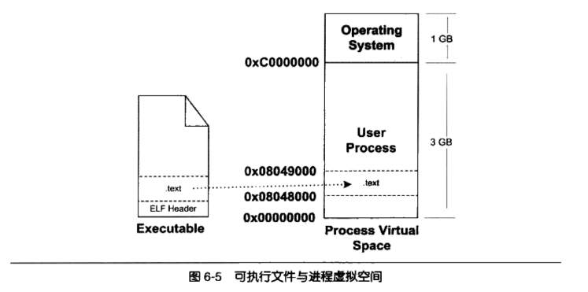
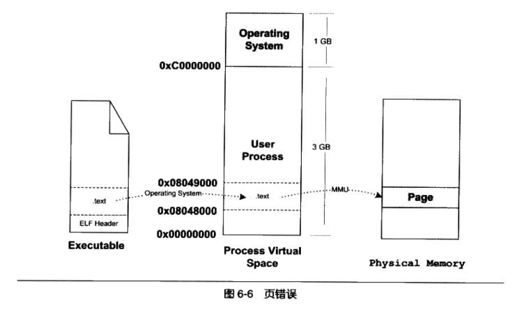
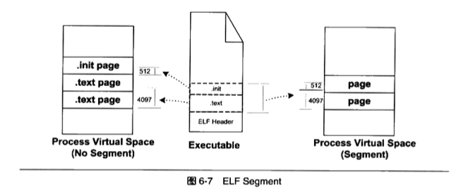
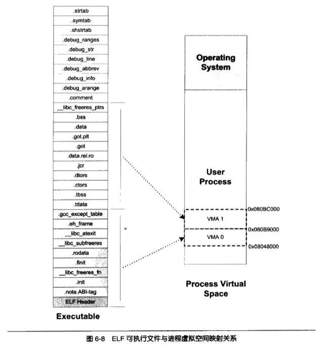
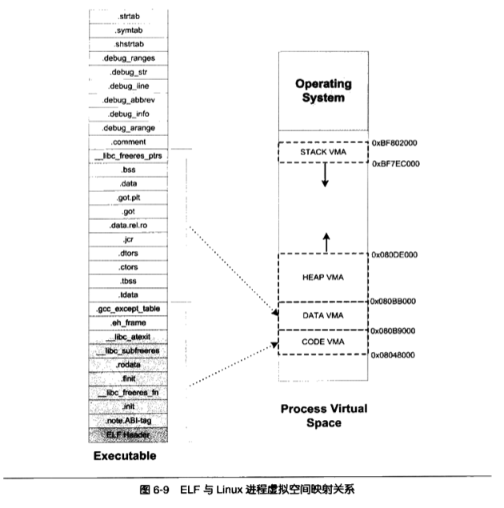
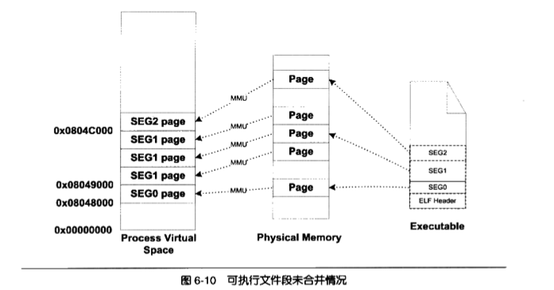
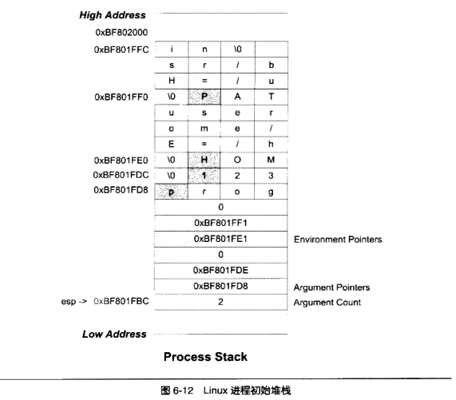

我们在前三章讲述了代码是如何经过编译、链接形成可执行文件，这一章我们来讲操作系统如何装载可执行文件并形成我们所说的进程。


# 进程虚拟地址空间
进程是一个动态的概念，它是程序运行时的一个过程，很多时候把动态库叫做运行时也有一定的含义。进程只能使用那些操作系统分配给进程的地址，如果访问未经允许的空间，那么操作系统就会捕获这些访问，将进程的这种访问当作非法操作，强制结束进程。Linux下的“Segmentation fault”很多时候是因为进程访问了未经允许的地址。那么对于这4GB（32bit）的进程地址空间是怎么分配的呢？

整个空间分成两部分，其中操纵系统占用其中1GB（0xC0000000～0XFFFFFFFF），剩下的3G（0X00000000～0XBFFFFFFF）留给进程自己使用。所以，原则上，我们的进程最多可以使用3GB的虚拟空间，也就是说，所有的代码、数据、包括malloc等方法申请的虚拟空间之和不可以超过3GB。

## PAE
那么32bit的CPU平台能不能使用超过4GB的空间呢？如果问题中的“空间”指的是虚拟地址空间，那么答案为“否”，因为32位机器的最大寻址空间就是4G。如果这里的空间只的是物理内存空间，那就“是”，因为部分cpu架构支持36位（地址线）的物理地址，这意味着它们能够访问64GB的物理内存。那操作系统只有32位的虚址空间，是如何映射的呢？一个很常见的方法就是操作系统提供一个窗口映射的方法，将额外的内存映射到进程的地址空间，即不同时刻内将虚址映射到不同的物理内存块（PAE：physical address extension）。在Linux下，这是使用的是mmap来实现的。

# 装载的方式
为了节省内存，程序所用的数据不是立即就装载到内存中，而是先建立虚址和物理磁盘的映射，等真正用到的时候才将数据加载到物理内存（这利用了程序的局部性原理）。覆盖装入Overlay和页映射Paging是两种很典型的动态装载防范。

## 覆盖装入
覆盖装入是在发明使用虚址之前常用的装载方式。其实就是将程序划分成若干的块，然后编写一个辅助代码来管理这些模块。当需要用到某一模块的时候，就将该块以及该块所依赖的其他模块装载到物理内存。因此，古时候的程序员是需要编写内存置换代码、以及配置模块间的依赖（一般组织成一颗树，而且不同子树之间不能相互调用）。


## 页映射
其实前文已经介绍过页映射的基本原理了（学习过os的同学也基本都应该知道段、页）。页映射机制将内存和所有磁盘中的数据和指令按照页Page为单位划分成若干个页，以后所有的装载和操作的单位就是页。默认情况下页的大小是4K，我们也可以手动设置页的大小。创建进程的时候，先建立好虚拟地址和物理内存的页映射关系，然后跳转到程序入口地址，当程序需要访问数据的时候，通过缺页中断的方式将数据/指令加载到物理内存。


# 从操作系统角度看装载
## 进程的建立
从操作系统角度看来，一个进程最关键的特征就是它拥有独立的虚拟地址。在创建进程的时候，主要做的就是以下三件事：
- 创建一个独立的虚拟地址空间：创建虚拟地址空间，并不是创建空间，而是创建映射函数所需要的相应的数据结构。在Linxu下，创建虚拟空间实际上只是分配一个页目录就可以了，甚至不设置页映射关系，这些映射关系等到后面程序发生页错误的时候再进行设置。
- 读取可执行文件头，并且建立虚拟空间和可执行文件的映射关系：上面那一步的页映射关系函数是虚拟空间到物理内存的映射关系，这一步做的是虚拟空间与可执行文件的的映射关系。

我们假设可执行文件只有一个代码段，它的虚拟地址是0x08048000，大小是0X000e1，对齐为0x1000。由于页映射的单位是页，所以可执行文件的映射关系如下图所示：

<p align="center">

</p>

很明显，映射关系只是保存在操作系统内部的一个数据结构。linux中讲进程虚拟空间中的一个段叫做虚拟内存区域（VMA：virtual memroy area）

- 将cpu的指令寄存器设置成可执行文件的入口地址，启动运行。这是最简单（相对的）的一步，主要是切换内核堆栈、用户堆栈、cpu运行权限、设置pc地址（就是ELF文件中保存的入口地址）。


## 页错误
上述的步骤执行完成后，其实可执行文件的真正指令和数据还没有被装入内存，仅仅是完成了映射关系的建立而已。当CPU执行第一个指令0x08048000时，发现0x08048000～0x080490000是一个空页面，于是就认为这是一个页错误。cpu将控制权交给操作系统，操作系统有专门的错误处理程序来处理这种情况。该错误处理程序的主要工作，就是查询前文第二步建立的数据结构，计算出相应页面在可执行文件中的偏移量，然后在物理内存中分配一个物理页，将进程中该虚拟页和分配的物理内存映射起来，然后讲控制权交还给进程，进程从刚才页错误的位置重新开始执行。（可参考[异常](/计算机/异常.html)）


<p align="center">

</p>

## 进程虚拟空间分布
## ELF文件链接视图和执行视图
实际引用中，我们的可执行文件会有很多个段。ELF文件被映射时，是以系统的页长度作为单位的，那么每个段在映射时长度应该都是系统页长度的整数倍，如果不是，那么多余的部分也会占用一个页。但是如果ELF有多个ELF段，那么每个段都有可能造成碎片（即没有占满一个页），导致内存浪费严重。

当我们站在os的角度，发现它其实并不关心可执行文件中的内容，os只关心一些和装载相关的问题，最主要的是段的权限（读/写/执行）。因此段的权限往往只有为数不多的几种组合：可读可执行（如代码段）、可读可写（如数据段、bss）、只读（如rodata）。

那么，解决前面提到的碎片的方法，就是：对于相同权限的段，把它们合并到一起当作一个段进行映射。比如如果有两个段.text和.init，它们包含的分别是程序的可执行代码和初始化代码，二者权限相同（可读可执行），将这两个段合并映射，就能有效的减少碎片。

<p align="center">

</p>

ELF可执行文件引入了一个概念叫做Segment，一个Segment包含一个或者多个属性相同的Section。操作系统装载的时候，会将一个Segment看作一个整体进行映射，也就是映射后在进程的虚拟空间中只有一个相应的VMA。Segment的概念实际上是从装载的角度重新划分了ELF的各个段。在将目标文件链接成可执行文件的时候，链接器会尽量把相同权限属性的段分配在同一空间，比如把可读可执行的段放在一起。在ELF中把这些属性相似又连在一起的段叫做一个Segment，而系统正式按照Segment而不是Section来映射可执行文件的。

```c
#include <stdio.h>

int main()
{
    while (1)
    {
       sleep(1000);
    }
    return 0;
}
```

```c
gcc -static SectionMapping.c -o SectionMapping.elf
readelf -S SectionMapping.elf
```
使用静态链接的方式将其编译成可执行文件，我们可以看到SectionMapping.elf有32个段(Section)。我们通过readelf页可以看到ELF的Segment（ELF文件中有一个Segment结构，类似于我们前文提到的段表的结构），它描述了ELF文件该如何被操作系统映射到进程的虚拟空间：

```c
$ readelf -l SectionMapping.elf

Elf file type is EXEC (Executable file)
Entry point 0x400990
There are 6 program headers, starting at offset 64

Program Headers:
  Type           Offset             VirtAddr           PhysAddr
                 FileSiz            MemSiz              Flags  Align
  LOAD           0x0000000000000000 0x0000000000400000 0x0000000000400000
                 0x00000000000b1083 0x00000000000b1083  R E    0x200000
  LOAD           0x00000000000b1eb8 0x00000000006b1eb8 0x00000000006b1eb8
                 0x0000000000001c98 0x0000000000003570  RW     0x200000
  NOTE           0x0000000000000190 0x0000000000400190 0x0000000000400190
                 0x0000000000000044 0x0000000000000044  R      0x4
  TLS            0x00000000000b1eb8 0x00000000006b1eb8 0x00000000006b1eb8
                 0x0000000000000020 0x0000000000000050  R      0x8
  GNU_STACK      0x0000000000000000 0x0000000000000000 0x0000000000000000
                 0x0000000000000000 0x0000000000000000  RW     0x10
  GNU_RELRO      0x00000000000b1eb8 0x00000000006b1eb8 0x00000000006b1eb8
                 0x0000000000000148 0x0000000000000148  R      0x1

 Section to Segment mapping:
  Segment Sections...
   00     .note.ABI-tag .note.gnu.build-id .rela.plt .init .plt .text __libc_freeres_fn __libc_thread_freeres_fn .fini .rodata __libc_subfreeres __libc_IO_vtables __libc_atexit __libc_thread_subfreeres .eh_frame .gcc_except_table
   01     .tdata .init_array .fini_array .jcr .data.rel.ro .got .got.plt .data .bss __libc_freeres_ptrs
   02     .note.ABI-tag .note.gnu.build-id
   03     .tdata .tbss
   04
   05     .tdata .init_array .fini_array .jcr .data.rel.ro .got
```
我们可以看到，这个elf文件一共有六个Segment。类型为LOAD的Segment是在装载时被映射的，其他Segment在装载时起辅助作用。我们可以看到第一个LOAD了行的Segment是可读可执行，第二个是读写。这两个Segment将会在装载时被映射成两个VMA。

总的来说，Segment和Section时从不同的角度划分同一个ELF文件。这个在ELF中被称为不同的视图：从Section角度看ELF文件是链接视图，从Segment角度看是执行视图。

<p align="center">

</p>


ELF可执行文件、共享文件中有一个专门的结构叫做程序头表来描述Segment的信息。ELF目标文件中没有该程序头表，因为目标文件不需要被装载。这个头表是一个数组，“readelf -l”命令就是输出这个数组。我们注意到这个命令输出的数据Segment中，它的FileSize比MemSize小，这是因为我们的可执行文件中有bss等段，物理内存初始化的时候，这多出来的部分就是用来存储bss的数据。

## 堆/栈'
在os中，VMA除了被用来映射可执行文件的各个Segemnt外，还用于对进程地址空间的管理。很多情况下，一个进程的栈、堆分别对应一个VMA：
```sh
./SectionMapping.elf

cat /proc/2638670/maps
00400000-004b2000 r-xp 00000000 08:10 14029940                           /data00/home/zengjiwen/project/c/programer_training/6/SectionMapping.elf
006b1000-006b4000 rw-p 000b1000 08:10 14029940                           /data00/home/zengjiwen/project/c/programer_training/6/SectionMapping.elf
006b4000-006b6000 rw-p 00000000 00:00 0
01d23000-01d46000 rw-p 00000000 00:00 0                                  [heap]
7fff2404e000-7fff2406f000 rw-p 00000000 00:00 0                          [stack]
7fff24102000-7fff24105000 r--p 00000000 00:00 0                          [vvar]
7fff24105000-7fff24107000 r-xp 00000000 00:00 0                          [vdso]
```

我们的进程中有6个VMA，前面两个映射到可执行文件的两个Segment，后面的四个VMA的主/次设备号都是0（倒数第三列），说明它们没有被映射到文件中，这种VMA叫做匿名虚拟内存区域。其中两个VMA分别是堆、栈。我们在C中常用的malloc就是从堆里分配内存，堆由系统库管理。每个线程都有属于自己的堆栈，对于单线程的程序来讲，这个VMA堆栈就完全归它使用。vdso VMA 的地址位于内核空间，它是一个内核模块，进程可以通过访问这个VMA来跟内核进行通信。

操作系统给进程空间划分出一个个VMA来管理进程的虚拟空间，基本原则是将相同权限属性、有相同映像文件的映射成一个VMA，一般可划分为以下几种VMA：
- 代码VMA，可读可执行，有映像文件
- 数据VMA，可读写、可执行，有映像文件
- 堆VMA，可读写可执行，匿名（问：为什么可执行）
- 栈VMA，可读写，匿名

<p align="center">

</p>

## 堆的最大申请数量
x86下虚拟地址的空间分配给进程本身的是3GB，那么进程真正可用的有多少呢？可以通过malloc测试一下：
```c
#include <stdio.h>

unsigned maximum = 0;
int main(int argc, char const *argv[])
{
    unsigned blocksize[] = {1024 * 2024, 1024, 1};
    int i, count;
    for (i = 0; i < 3; i++)
    {
        for (count = 1;; count++)
        {
            void *block = malloc(maximum + blocksize[i] * count);
            if (block)
            {
                maximum = maximum + blocksize[i] * count;
                free(block);
            }
            else
            {
                break;
            }
        }
    }
    printf("maximum size = %u bytes", maximum);
    return 0;
}
```
在linux x86下，大概可以申请2.9G的内存。具体数值受os、程序本身、用到的库数量、程序栈数量等大小影响。（部分os使用一种随机地址空间分布技术，可能会导致每次运行结果都不同）。

## 段地址对齐
映射过程中，页是映射的最小单位。因此默认的段（Segment）内存空间长度是4k（在物理空间、虚拟空间的起始地址必须是4k的整数倍）。有了长度和起始地址的限制，那么对于可执行文件而言，它应该尽量优化自己的空间、地址，以节省空间（主要是磁盘空间）。

假如每个Segment/段都分别映射，那就会导致碎片过多。因此有些UNIX系统采用一个很取巧的办法，让各个段的接壤部分共享一个物理页面，然后将该物理页面分别映射两次。而且，UNIX系统将ELF文件头页看作是系统的一个段，将其映射到进程的地址空间，这样做的一个好处是进程的某一段区域就是整个ELF文件的映射，对于一些需要访问ELF文件头的操作，也可以直接通过读写内存地址进行，而无需手动指定文件、offset来读写。
<p align="center">

</p>

因为段地址对齐的关系，各个段的虚拟地址就往往不是系统页面长度的整数倍。可结合前面的例子（如SectionMapping.elf）思考下。


## 进程栈初始化
进程刚启动的时候，需要知道一些进程运行的环境，最基本的就是系统环境变量和进程的运行参数。一种常见的做法就是操作系统在进程启动前将这些信息提前保存到进程的虚拟空间的栈中，也就是VMA中的Stack VMA。假如我们的系统有两个环境变量：
```sh
HOME=/home/user
PATH=/usr/bin
```
当我们运行:
```sh
prog 123
```
我们假设堆栈底部的地址为0xBF802000，那么进程初始化后的堆栈就如下图:
<p align="center">

</p>


栈寄存器esp指向的位置就是初始化后栈的顶部，最前面的四个字节表示命令行参数的数量，我们的例子中有两个，即prog、123，紧接着分布指向这两个参数字符串的指针；后面跟着一个0；接着两个环境变量字符串的指针，它们分别指向“HOME=/home/user”和“PATH=/usr/bin”；后面紧跟着一个0表示结束。


# Linux内核装载ELF过程
当我们在bash输入一个命令执行某个ELF时，linux系统是怎样装载这个ELF文件并执行它的呢？

首先，bash进程会调用fork系统调用创建一个新进程，然后新进程会调用execve系统调用执行指定的ELF文件，原先的bash进程继续返回并等待刚才启动的新进程结束，然后继续等待用户输入命令。execve 系统定义被定义在unistd.h，它的原型如下：
```c
int execve(const char *filename, char *const argv[], char *const envp[])
```

下面是一个简单实用form和execlp（glibc对execve的包装）实现的minibash：
```c
#include <stdio.h>
#include <sys/types.h>
#include <unistd.h>

int main(int argc, char const *argv[])
{
    char buf[1024] = {0};
    pid_t pid;
    while (1)
    {
        printf("minibash$");
        scanf("%s", buf);
        pid = fork();
        if (pid == 0)
        {
            if (execlp(buf, 0) < 0)
            {
                printf("exec error\n");
            }
        }
        else if (pid > 0)
        {
            int status;
            waitpid(pid, &status, 0);
        }
        else
        {
            printf("fork error $d\n", pid);
        }
    }

    return 0;
}
```

在进入ececve后，linux内核就开始真正的装载工作。在内核中，execve系统调用相应的入口是sys_execve，它进行一些参数的检查复制之后，调用do_execve。do_execve会查找被执行的文件，如果找到，则读取文件的钱128个字节（通过魔数判断文件格式，如二进制、文本文件如shell等），然后调用相应文件格式的解析器，对于二进制文件，就调用search_binary_handle()去搜索和匹配合适的可执行文件装载处理过程，然后判断可执行文件的格式（如elf、a.out等），如果是elf，就调用load_elf_binary。load_elf_binary的主要工作是：
- 检查ELF可执行文件的有效性，比如魔数、程序头表中段（Segment）的数量
- 寻找动态链接.interp段，设置动态链接器
- 根据ELF文件可执行文件程序头的描述，对ELF文件进行映射，比如代码、数据、只读数据
- 初始化ELF进程环境，比如进程启动时EDX寄存器的地址应该DT_FINI的地址
- 将系统调用的返回地址修改成ELF可执行文件的入口点，这个入口点取决于程序的链接方式，对于静态链接的ELF可执行文件，这个入口就是文件头中的e_entry所指地址；对于动态链接的ELF可执行文件，这个入口是动态链接器

当load_elf_binary执行完成，sys_execve从内核态返回到用户态，EIP寄存器直接跳转到ELF程序的入口地址，于是新的程序开始执行，ELF可执行文件装载完成。