&#8195;&#8195;虚拟内存为每个进程提供了一个大的、一致的和私有的地址空间。它将贮存看成一个存储在磁盘上的地址空间的高速缓存，在主存中只保留活动区域，并根据需要在磁盘和主存之间来回传送数据，通过这种方式，它高效地使用了主存；为每个进程提供了一致的地址空间，简化了内存管理；保护了每个进程的地址空间不被其他进程破坏。

- 虚拟内存是核心的。遍及计算机系统的所有层面，在硬件异常、汇编器、链接器、加载器、共享对象、文件和进程涉及中扮演着重要角色
- 虚拟内存是强大的。给予应用程序创建、销毁内存片、将内存片映射到磁盘文件的某个部分，以及和其他进程共享内存
- 虚拟内存是危险的。每次进程引用一个变量、间接引用一个指针、调用malloc，它就回和虚拟内存发生交互。使用不当则回遇到危险的错误。（段错误、保护错误等）

# 物理和虚拟寻址
&#8195;&#8195;使用虚拟寻址，CPU通过生成一虚拟地址空间VA来访问主存，这个虚拟地址在被送到内存之前先被转换成适当的物理地址。将一个虚拟地址转换为物理地址的任务叫做地址翻译。同异常处理一样，地址翻译需要CPU硬件和操作系统之间的紧密合作。CPU芯片上叫做内存管理单元MMU的专用硬件，利用存放在主存中的查询表来动态翻译虚拟地址，该表的内存由操作系统管理。


# 虚拟内存作为缓存的工具
&#8195;&#8195;VM系统将虚拟内存分割为称为虚拟页VP的大小固定的块（磁盘和主存的之间的传输单元）来处理问题。每个虚拟页的大小为P=2^p字节。类似的物理内存也被分割为物理页pp，大小同样为P。

在任意时刻，虚拟页的有如下三个状态之一：
- 未分配的：VM系统还没分配的页
- 缓存的：当前已缓存在物理内存中的已分配页（数据已在主存）
- 未缓存的：未缓存在物理内存中的已分配页（数据在磁盘而为缓存到主存）


## DRAM缓存的组织结构
&#8195;&#8195;高速缓存一般使用SRAM，主存使用DRAM。由于磁盘速度极其低下，因此DRAM缓存不命中比SRAM缓存不命中的代价更高。为了降低不命中的代价，虚拟页一般都比较大，通常是4KB～2MB。


## 页表
&#8195;&#8195;同任何缓存一样，虚拟内存系统必须有某个方法判定一个虚拟页是否缓存在DRAM的某个地方，如果是，系统还必须确定这个虚拟页是放在哪个物理页。如果不命中，需要选择一个牺牲页，并将虚拟页从磁盘复制到DRAM，替换这个牺牲页。这些功能由软硬件结合提供，包括操作系统软件、MMU中的地址翻译硬件和一个存放在物理内存中叫做页表的数据结构。页表将虚拟页映射到物理页。每次地址翻译将一个虚拟地址转换为物理地址，都会读取页表。操作系统负责维护页表的内容，以及在磁盘和DRAM之间来回传送页。

<p align="center">
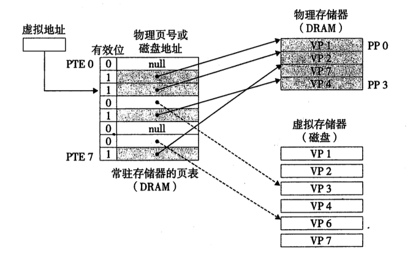
</p>

&#8195;&#8195;页表就是页表条目PTE的数据中。我们将假设PTE是有一个有效位和一个n位地址组成。有效位表明该虚拟页当前是否被缓存在DRAM。如果设置了有效位，则地址字段则表示DRAM中相应的物理页的起始位置。如果没有设置有效位，则这个地址指向该虚拟页在磁盘上的其实位置。（这仅仅是一种朴素的虚拟地址，实际比这复杂，见下文。）

&#8195;&#8195;假如地址位数有n，页表大小位2^p，则整个虚拟地址空间可以有2^(n-p)个页。

## 页命中/缺页
<p align="center">
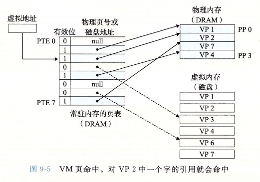
</p>


&#8195;&#8195;如果发生缺页，会触发一个缺页异常。缺页异常调用内核中的缺页异常处理程序，该程序会选择一个牺牲页。如果牺牲页已经被修改，那么内核就回将它复制回磁盘。（下图PTE[3]发生缺页）
<p align="center">
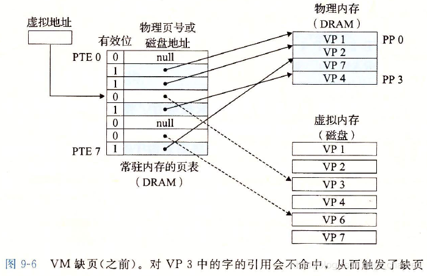
</p>

&#8195;&#8195;接下来，内核从磁盘复制程序所需的内容到物理内存中，并更新PTE[3]（使其指向对应的物理内存地址），随后返回。当异常处理程序返回，它回重新启动导致缺页的令。（可参考章节: [异常](./计算机/异常.html)）


## 分配页面

<p align="center">
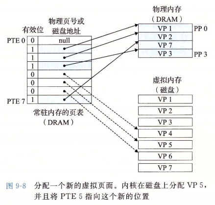
</p>

&#8195;&#8195;上图示例中，当分配页面的时候（例如调用malloc），先在磁盘创建空间，然后更新PTE[5]，使其指向对应的物理地址。（问题：当调用malloc，是否回立即分配物理内存？和swap的大小又有关系？）

## 局部性
&#8195;&#8195;在整个运行过程中，程序引用的不同页面的总数可能超出物理内存总的大小，但是局部性原则保证了在任意时刻，程序在趋向于在一个较小的活动页面（active page）集合上工作，这个集合叫做工作集或者常驻集合。在初始开销，也就是将工作集页面调度到内存之后，接下来对这个工作集的应用将导致命中，不会产生额外的页面中断和磁盘流量。因此，针对性能要求较高的程序，优秀的开发者在设计代码的时候会尽量考虑该项优化）


# 虚拟内存作为内存管理的工具
&#8195;&#8195;虚拟内存极大地简化了内存管理，并提供了一种自然的保护内存的方法。

<p align="center">
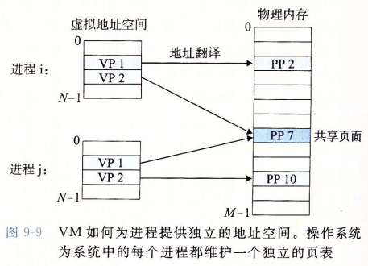
</p>

&#8195;&#8195;操作系统为每个进程提供了一个独立的页表，也就是一个独立的虚拟地址空间。VM因此简化了链接和加载、代码和数据共享，以及应用程序的内存分配。

- 简化链接：独立的地址空间允许每个进程的内存映像使用相同的基本格式，而不管代码和数据实际存放在物理内存的何处。例如，一个给定的linux系统上的每个进程都是用类似的内存格式。对于64位系统，代码段总是从虚拟地址0x400000开始。数据段在代码段之后，中间有一段符合要求的对其空白，栈占据用户进程地址空间最高的部分，并向下生长。这样的一致性，简化了链接器的设计和实现，允许链接器生成完全链接的可执行文件，使其独立于物理内存中代码和数据的最终位置。
- 简化加载：要把目标文件中的.text和.data节加载到一个新创建的进程中，linux加载器位代码和数据段分配虚拟页，把它们标记位无效（未被缓存），将页表条目指向目标文件中适当的位置。加载器不从磁盘到内存实际复制任何数据。在每个页被初次引用时，虚拟内存会按照需要自动调入数据页。将一组连续的虚拟页映射到任意一个文件中的任意位置的表示法称作内存映射。linxu提供一个称为mmap的系统调用，允许应用程序自己做内存映射。
- 简化共享：每个进程都有自己的虚拟地址空间，不和其他进程共享。然而，对于物理内存，不同的进程可以共享代码和数据。例如每个进程都必须调用相同的操作系统内核代码，而每个c程序都会调用c标准库中的程序，如printf。操作系统通过将不同进程中适当的虚拟页面映射到相同的物理页面，从而安排多个进程共享这部分代码的一个副本，而不是在每个进程中都包含单独的内核和c标准库的副本。（可见[链接-共享库](./计算机/链接.html)）
- 简化内存分配：当一个运行在用户进程中的程序要求额外的堆空间时（如malloc），操作系统分配一个适当数字（例如k）个连续的虚拟内存页面，并且将它们映射到物理内存中任意位置的k个任意的物理页面（可能随机在物理内存中随机分布）。

# 虚拟内存作为内存保护的工具
通过在PTE上添加一些额外的许可位来控制一个虚拟页面内容的访问十分简单。

<p align="center">
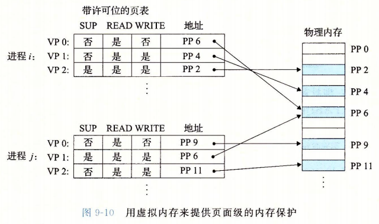
</p>

&#8195;&#8195;每个PTE中已经添加了三个许可位。SUP表示进程是否必须运行在内核（超级用户）模式下才能访问该页。运行在内核模式中的进程可以访问任何页面，但是用户模式中的进程只允许访问那些SUP位为0的页面。READ/WRITE控制对页面的读写。

&#8195;&#8195;如果一条指令违反了这些许可条件，那么CPU就触发一个一般保护故障，将控制传给一个内核中的异常处理程序。Linux shell一般将这种异常称为段错误（segmentation fault）。

# 地址翻译
<p align="center">
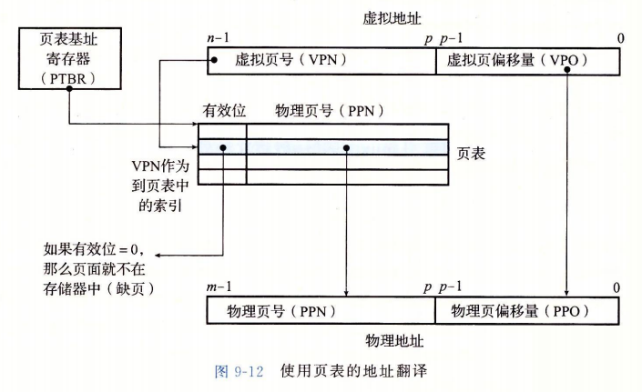
</p>

&#8195;&#8195;CPU中的一个控制寄存器，页表基址寄存器（PTBR）指向当前页表。n为的虚拟地址包含两部分：一个p位的虚拟页面偏移（VPO）和一个（n-p）位的虚拟页号。MMU利用VPN来选择适当的PTE，从中提取对应的物理页号PPN，将物理页号和VPO串联，就得到相应的物理地址。


<p align="center">
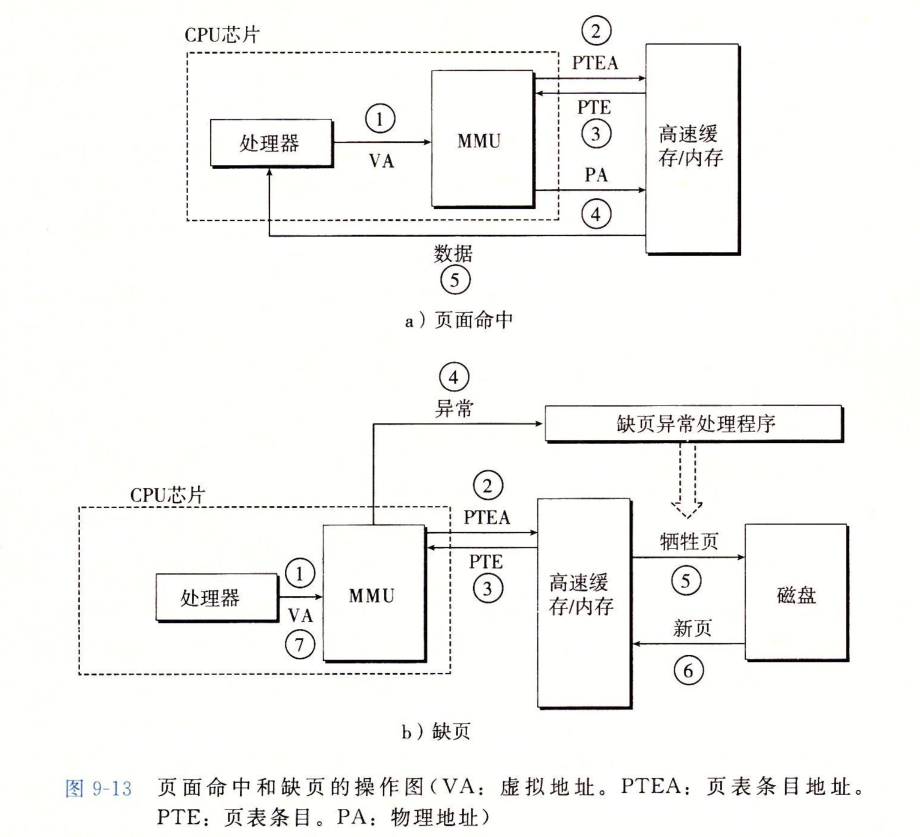
</p>

&#8195;&#8195;页面命中完全是由硬件处理的，与之不同的是，处理缺页要求硬件和操作系统内核协同完成。

## 结合高速缓存和虚拟内存

<p align="center">
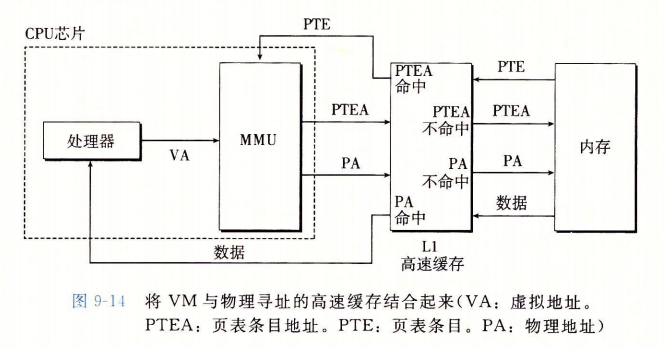
</p>

&#8195;&#8195;在任何既使用虚拟内存又使用SRAM高速缓存的系统中，都有应该使用虚拟地址还是使用物理地址来访问SRAM高速缓存的问题。但是大多数系统是选择物理寻址的。使用物理寻址，多个进程同时在高速缓存中有存储块和共享来自相同虚拟页面的块成为简单的事情。而且，高速缓存无需处理保护问题：访问权限的检查是地址翻译过程的一部分。

## 利用TLB加速地址翻译
&#8195;&#8195;每次CPU产生一次虚拟地址，MMU就必须查阅一次PTE，以将虚拟地址翻译位物理地址。在最糟糕的情况下，这回要求从内存多取一次数据。许多系统试图消除这种开销，它们在MMU中包含了一个关于PTE的小的缓存，称为翻译后备缓冲器TLB。

&#8195;&#8195;TLB是一个小的虚拟寻址的缓存，其中每一行都保存着一个由单个PTE组成的块。TLB同行有高度的相联度。

<p align="center">
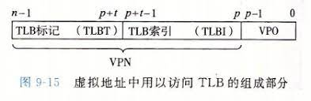
</p>

&#8195;&#8195;TLB索引 (TLBI)是从VPN的t个最低位组成的，而TLB标记（TLBT）是有VPN中剩余的位来组成的。


## 多级页表
&#8195;&#8195;假设系统32位，页大小KB，一个PTE 4B。那么一个进程的页表需要4MB驻留在内存中。对于64位的系统，需要的空间更高。

&#8195;&#8195;我们可以使用多级页表来减少页表的存储成本。将VPN划分位多个段落，每个段落表示一级。假如第k级使用n位，那么这一级就能表示2^n个页表是否至少有一个已经被分配。

<p align="center">
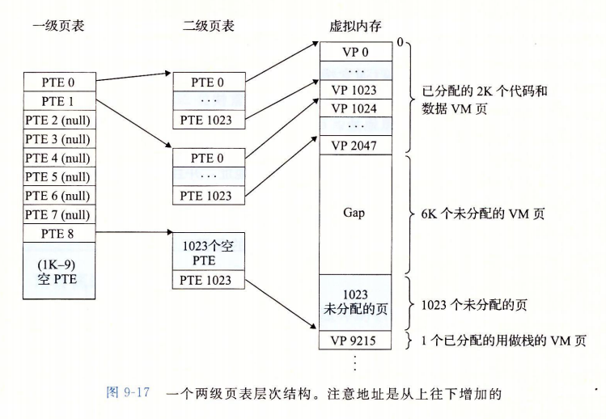
</p>

&#8195;&#8195;可能有人认为多级页表会降低访问速度，但得益于TLB，通过将不同层次上页表的PTE缓存起来，访问速度并不比单级页表慢很多。

问：
- 切换进程的时候，会对操作系统TLB做什么处理？
- CPU有个控制寄存器，存储了每个进程第一级页表的起始地址


# Linxu虚拟内存系统
&#8195;&#8195;每个进程共享内核的代码和全局数据结构。Linxu将一组连续的虚拟页面（大小等于系统中DRAM的总量）映射到相应的一组连续的物理页面。

<p align="center">
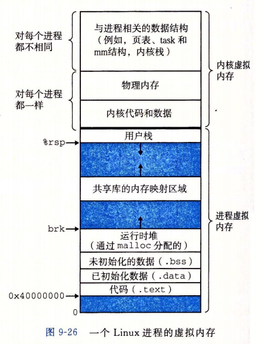
</p>


&#8195;&#8195;内核虚拟内存的其他区域包含每个进程都不相同的数据结构。比如说，页表、内核在进程的上下文中执行代码时使用的栈，以及记录虚拟地址空间当前组织的各种数据结构。

&#8195;&#8195;Linux将虚拟内存组织成一些区域（页叫做段）的集合。一个区域就是已经存在这的（已分配的）虚拟内存的连续片，这些页以某种方式相关联。例如，代码段、数据段、堆、共享库段，以及用户栈都是不同的区域。

&#8195;&#8195;内核位系统中每个进程维护一个单独的任务结构（源代码中的task_struct）。任务结构中的元素包含或者指向内核运行该进程所需的所有信息（如PID、指向用户栈的指针、可执行目标文件的名字，以及程序计数器等。）


<p align="center">
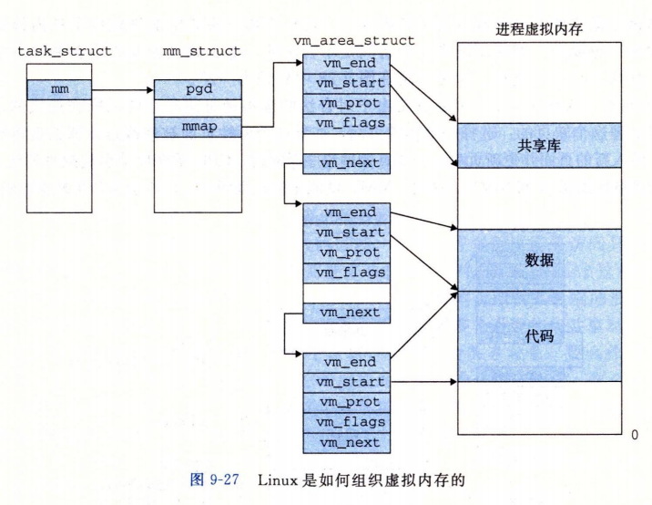
</p>

&#8195;&#8195;task_struct中有一个字段指向mm_struct，它描述了当前虚拟内存的状态。字段gpg指向第一级页表的基址，mmap指向一个vm_area_structs（区域结构）的链表，其中每个vm_area_structs都秒速了当前虚拟地址空间的一个区域/段。当内核运行这个进程时，就将pgd存放到CR3控制寄存器。MMU据此查询数据。

- vm_start、vm_end: 指向这个区域的开始、结束处
- vm_port：描述这个区域内包含的所有页的读写许可权限
- vm_flags：描述了这个区域内的页面是和其他进程共享，还是这个进程私有


&#8195;&#8195;缺页异常处理：当MMU试图翻译一个虚拟地址A，触发了一个缺页，这个异常会将控制转移到内核的缺页处理程序，处理程序含以下步骤：
- 判断A是否合法：A是否在某个区域结构定义的结构内。缺页处理程序会搜索区域结构的链表，把A和每个区域中的vm_start、vm_end做比较，如果执行不合法，会触发一个段错误，从而终止这个进程。（由于链表遍历消耗过大，linux在链表中构建了一颗树，从而加快搜索速度）
- 试图进程的内存访问是否合法：进程是否有读、写、执行这个区域页面的权限。


# 内存映射
&#8195;&#8195;linux通过将一个虚拟内存区域与一个磁盘上的对象（object）关联起来，以初始化这个虚拟内存区域的内容，这个过程称为内存映射。虚拟内存区域可以映射到两种类型的对象中的一种：
- Linux文件系统中的普通文件：一个区域可以映射到一个普通磁盘文件的连续部分，例如一个可执行目标文件。文件区（section）被分为页大小的片，每一片包含一个虚拟页面的初始内容。
- 匿名文件：匿名文件是由内核创建的，包含的全是二进制零。（这种文件，在磁盘和内存之间并没有实际的数据传送）。（问：/proc目录用的是匿名文件吗？）

无论那种感觉情况，一旦一个虚拟页面被初始化了，它就在一个由内核维护的专门的交换文件（swap file）之间换来换去。交换文件也成交换空间（swap space）或者交换区域。

## 再看共享对象
&#8195;&#8195;一个对象可以被映射到虚拟内存的一个区域，要么作为共享对象，要么作为私有对象。如果一个进程将一个共享对象映射到它的虚拟地址空间的一个区域，那么这个进程对这个区域的读写操作，对于那些也把这个共享对象映射到它们虚拟内存的其他进程而言，也是可见的。这些变化，也会反映到在磁盘上的原始对象中。

&#8195;&#8195;另一方面，如果映射的是一个私有对象，那么进程间的写操作互不可见。一个映射到共享内存对象的虚拟区域叫共享区域。私有区域同理。

<p align="center">
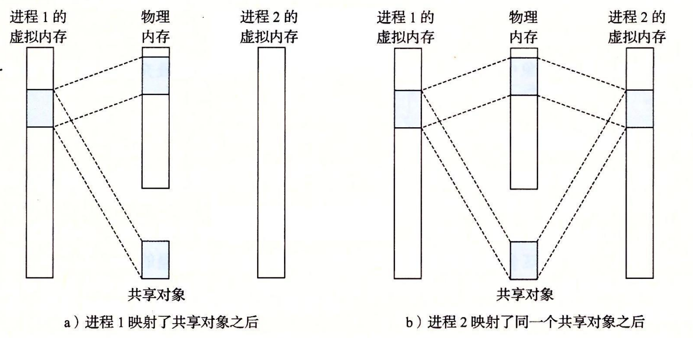
</p>

（上图将一个共享对象加载到一个连续的物理内存空间中，但是实际中对象可能存在于不同的物理分片中，上图仅为方便）

&#8195;&#8195;私有对象使用写时复制（copy-on-write）的方法被映射到虚拟内存中。当一个进程试图写私有区域中的某个页面，那么这个写操作会触发一个保护屏障。（可以联想到《异常控制流》）


## 再看fork
&#8195;&#8195;当fork函数被当前进程调用时，内核为新进程创建各种数据结构，并分配给它一个唯一的PID。为了给这个新进程创建虚拟内存，它创建了当前进程的mm_struct、区域结构和页表的原样副本。它将两个进程的每个页面都标记为只读，并将两个进程中的每个区域结构标记为私有的写时复制。当fork进程返回时，新进程的虚拟内存和父进程调用fork时存在的虚拟内存相同。

## 再看execve
execve可看《链接》一节。
```c
execve("a.out", NULL, NULL);
```

&#8195;&#8195;execve函数在当前进程中加载并运行包含在可执行目标文件a.out中的程序，用a.out程序有效地代替了当前程序：
- 删除已经存在的用户区域：删除当前进程虚拟地址的用户部分中已存在的区域结构
- 映射私有区域：为新程序的代码、数据、bss和栈区域创建新的区域结构。所有这些区域都是私有的、写时复制的。代码和数据区域被映射到a.out文件中的.text和.data区。bss区域是请求二进制零的，映射到匿名文件，其大小包含在a.out中。栈、堆也是二进制零的，初始长度为零。
- 映射共享区域：如果a.out于共享对象链接，比如标准C库libc.so，那么这些对象都是动态连接到这个程序，然后在映射到用户虚拟地址空间的中的共享区域内。
- 设置程序计数器PC：execve做的最后一件事情就是设置当前进程上下文中的程序计数器，使之指向代码区域的入口点。

<p align="center">
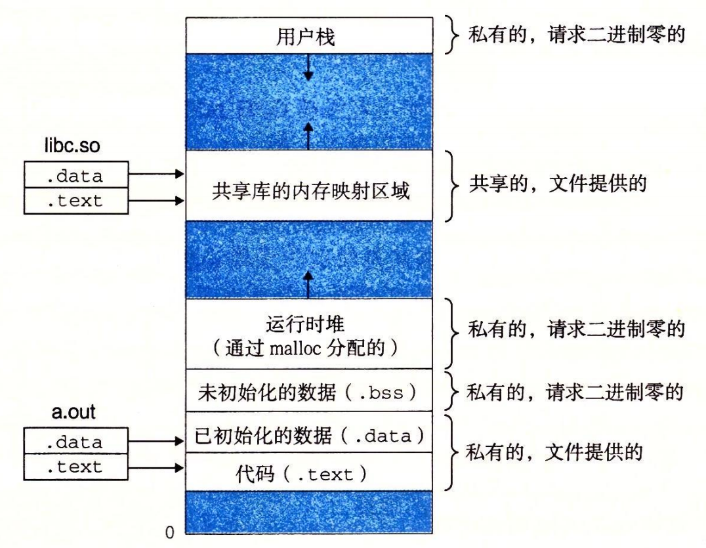
</p>

## mmap-用户级的内存映射
```c
void *mmap(void *start, size_t length, int prot, int flags, int fd, off_t offset);
```

&#8195;&#8195;mmap函数要求内核创建一个新的虚拟内存区域，最好是从地址start开始的一个区域，并将文件描述符fd指定的对象的一个连续的片（chunk）映射到这个新的区域。连续的对象片大小为length字节，从距离文件开始处偏移为offset字节的地方开始。start地址仅仅是一个暗示，通常被定位为NULL。

<p align="center">
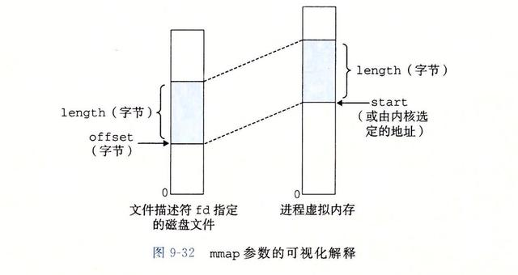
</p>

&#8195;&#8195;参数prot包含新映射的虚拟内存区域的访问权限位（即在相应区域结构中的vm_prot位）
- PROT_EXEC：这个区域的页面是由可以被CPU执行的指令组成的
- PROT_READ：页面可读
- PROT_WRITE：页面可写
- PROT_WRITE：页面不能被访问

&#8195;&#8195;flags参数描述被映射对象类型的位组成
- MAP_ANON：表明对象是匿名对象
- MAP_SHARED：表示是一个共享对象

&#8195;&#8195;munmap函数用来删除虚拟内存区域，从地址start开始，删除length字节组成的区域：
```c
int munmap(void *start, size_t length);
```

可参考[mmap：是什么 为什么 怎么用](https://www.cnblogs.com/huxiao-tee/p/4660352.html)

# 动态内存分配
&#8195;&#8195;虽然可以使用mmap和munmap来创建虚拟呢困的区域，但是还是用动态内存分配器allocator更方便和更好移植。动态内存分配器维护这一个进程的虚拟内存区域，称为堆。分配器将堆视为一组不同大小的快的集合来维护。每个快就是一个连续的虚拟内存片（chunk），要么是已分配的，要么是空闲的。已分配的块显式地保留为供应用程序使用。空闲块可以用来分配。

&#8195;&#8195;分配器有两种基本的风格：
- 显式分配器：要求应用显式地释放任何已分配的块。如C提供的malloc/free程序分配器、C++的new和delete
- 隐式分配器：分配器自动检测一个已分配的块何时不再被应用程序所使用，自动释放块。也叫垃圾收集器GC。Lisp、JAVA等高级语言就依赖此回收空间

常见的函数有：malloc、sbrk（将内核brk指针增加incr来扩展、收缩堆）、free
```c
void *sbrk(intptr_t incr);
```

## 分配器的要求和目标
要求：
- 处理任何请求序列：一个应用程序可以有任意的分配请求和释放请求序列
- 立即响应请求：不允许分配器为了提高性能重新排列或者缓冲请求
- 只使用堆：为了可扩展，任何非标量的数据结构必须保存在堆中
- 对齐块：使块可以保存任何类型的数据对象
- 不修改已分配的块

目标
- 最大化吞吐率：单位时间内完成请求的次数
- 最大化内存使用率：一个系统中被所有进程分配的虚拟内存的全部数量是受磁盘上swap空间限制的。必须高效使用虚拟空间

## 碎片
造成堆利用率低的主要原因是碎片（fragmentation）现象，当有未使用的内存但不能满足分配请求时，就发生了这种现象。
- 内部碎片：一个已分配块比有效载荷大。例如一个分配器的实现可能对已分配块强增加了一个最小的大小值，而这个大小比程序请求需要的载荷更大。
- 外部碎片：当空闲内存合计起来足够满足一个分配请求，但是却没有一个单独的块足够大可以处理这个请求时发生的。


&#8195;&#8195;一个最朴素的分配器的实现是：将堆组织成一个大的字节数组，指针p指向这个数组的第一个字节。当调用size个字节，则将p的当前值保存到栈中，将p增加size，并将p的旧值返回给调用函数。free只是简单的返回调用函数，不做任何操作。这个分配器吞吐率极高，但是却无法重复使用已经分配后被释放的块。

## 隐式空闲链表
&#8195;&#8195;任何分配器都需要一些接口来区别块的边界、大小、分配状态。隐式空闲链表（在头部存储这些信息）是一种简单的方法

<p align="center">
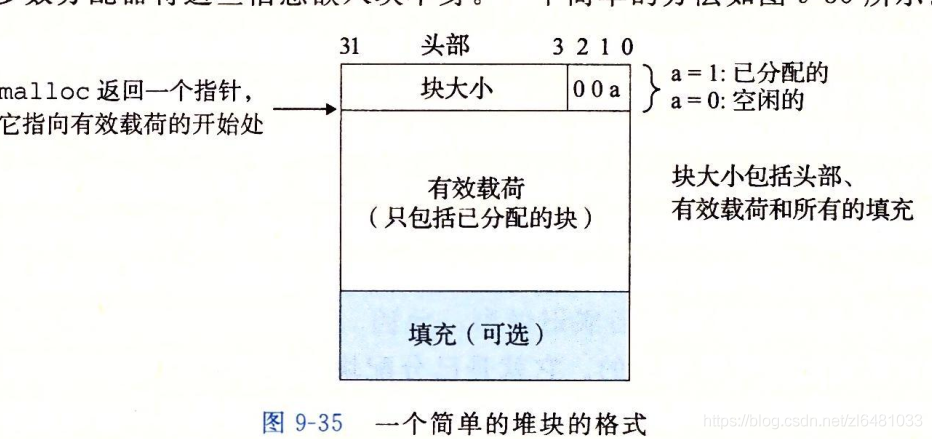
</p>

&#8195;&#8195;我们可以强加对齐条件，那么32位下，块的大小就总是8的总数。

<p align="center">
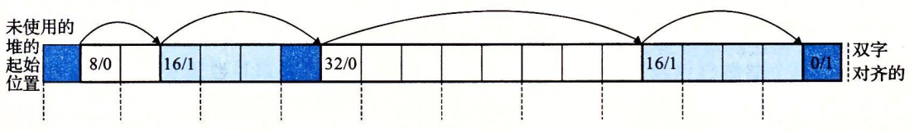
</p>
&#8195;&#8195;深蓝色为块头（块大小+分配标记位）；浅蓝色为已分配；每个方格为一个字。


&#8195;&#8195;隐式空闲链表简单，缺点是任何操作开销需要对空闲链表进行线性时间的搜索。

## 放置已分配的块
&#8195;&#8195;即找寻一个足够大的、可满足请求的空闲块，分配器称之为放置策略（placement policy）。
- 首次适配：从头开始搜索空闲块
- 下一次适配：从上一次查询结束点开始搜索
- 最佳适配：检查所有空闲块，选择最适合所需请求大小的最小空闲块

## 获取额外的堆内存
&#8195;&#8195;如果找不到何时的空闲块，一个选择是合并那些在内存中物理上相邻的空闲块，创建一个更大的空闲块；另一种是，调用sbrk函数，向内核请求额外的堆内存。分配器将额外的内存转化为一个大的空闲块，将这个块插入到空闲链表中。

## 合并空闲块
- 立即合并：每一次被释放，都尝试合并相邻的空闲块
- 推迟合并：等某个稍晚的时机合并

## 带边界的合并
&#8195;&#8195;如何合并前面的块？在前文的隐式空闲链表中，我们无法知道前面的块是否为已分配。唯一的方法，就是遍历整个链表。一种通用的方法，是在每个块的尾部添加一个脚部：记录当前块的大小、是否已分配（脚部是头部的一个副本）。
<p align="center">
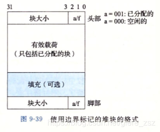
</p>

## 显式空闲链表
&#8195;&#8195;因为块分配和堆块的总数呈线性关系，因此隐式空闲链表不适合作为通用的分配器。

&#8195;&#8195;一种更好的方式是将空闲的块组织成某种显式的数据结构：如双向链表、树等。对于双向链表：
- 先进先出LIFO：将新释放的块放置在链表的开头。使用LIFO和首次适配，分配、释放、合并都能在常数时间完成
- 按地址顺序维护链表：链表中的每个块的地址都小于它后续的地址。释放一个块需要线性时间的搜索来定位合适的先驱块。按地址的排序的首次适配比LIFO的首次适配有更高的内存利用率。

## 分离空闲链表
&#8195;&#8195;使用单向空闲链表的分配器需要与空闲块数量呈线性关系的时间来分配块。一种流行的减少分配时间的方法，通常称为分离存储，就是维护多个空闲链表，其中每个链表中的块有大致相等的大小：1、2、3～4，5～8，...，2^(n-1)~2^n。

根据不同的分割、分类方法，一般可分为三类：
- 简单分离存储：每个大小类的空闲链表都包含大小相等的块。当发生分配请求，则直接查询是否有刚好满足空闲块，如果没有（哪怕存在大于申请的size的空间也不会进行拆分），则向操作系统申请一个固定大小的额外内存片。分配、释放都是常数，但是容易造成内部、外部碎片
- 分离适配：每个大小类都有一个范围，即每个链表都包含潜在的大小不同的块。发生分配请求时，如果没有刚好合适的，就优先切割大的空闲块，并将切割后剩余的空闲块插入到对应大小类的链表。C标准库提供的GNU malloc就采用这种方法。快速、内存利用率高
- 伙伴系统：分离适配的特例，每个大小类都是2的幂。搜索、合并快速，但是可能导致显著的内部碎片。

# 垃圾回收
<p align="center">
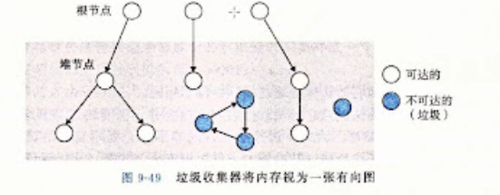
</p>

&#8195;&#8195;垃圾收集器将内存视为一张有向图。每个堆节点对应一个已分配的块。根结点对应于一种不在堆中的位置（如寄存器、栈里的变量，或者虚拟内存中读写区域内的全局变量），它们中包含指向堆中的指针。

&#8195;&#8195;如果存在一条从任意根结点到堆节点的路径，那么该堆节点是可达的。在任何时刻，不可达节点对应于垃圾，是不能被应用再次使用的。

&#8195;&#8195;ML、JAVA等语言的垃圾收集器，对应用创建、使用指针有严格的控制，因此能维护精确的可达图。但是C、C++的收集器通常不能维护可达图的精确表示，是保守的垃圾收集器（可能将不可达的节点标记为可达）。（C没有保存类型信息）

&#8195;&#8195;如果malloc找不到合适的空闲块，那么它就调用垃圾收集器，希望能够回收一些空间。收集器识别出垃圾，然后调用free函数将它们返回给堆。当垃圾收集器返回后，malloc会再次尝试申请空间，如果还是失败，则向操作系统申请额外的内存。

## Mark & Sweep
&#8195;&#8195;标记清除法：标记阶段标记出根结点的所有可达的和已分配的后继，而清除阶段释放每个被标记的已分配块。

&#8195;&#8195;由于C没有保存类型信息，因此无法知道一个变量是否为指针，也无法知道一个指针是否指向一个已分配块的有效载荷中的某个位置。


# C中常见的内存错误
- 间接引用坏指针、野指针
- 读未初始化的内存：malloc是不会自动初始化或者置零的
- 允许栈缓冲区溢出：不应该对用户的输入做任何假设
```c
char buf[64];
gets(bufs);
```
- 假设指针和它们指向的对象是大小相同的
- 错位错误
- 引用指针而不是它所指向的对象
- 误用指针运算
- 引用不存在的变量：如返回临时变量的指针
- 引用空闲堆块中的数据：free后，又对区域进行读写
- 内存泄漏


# 其他
- 内存扫描工具：[scanmem](http://manpages.ubuntu.com/manpages/bionic/man1/scanmem.1.html)，[scanmem source](https://github.com/scanmem/scanmem)
    ```
    sudo scanmem $pid // 问：为何一定要sudo？
    ```
- linux的多节页表： PGD中包含若干PUD的地址，PUD中包含若干PMD的地址，PMD中又包含若干PT的地址。每一个页表项指向一个页框，页框就是真正的物理内存页。
<p align="center">
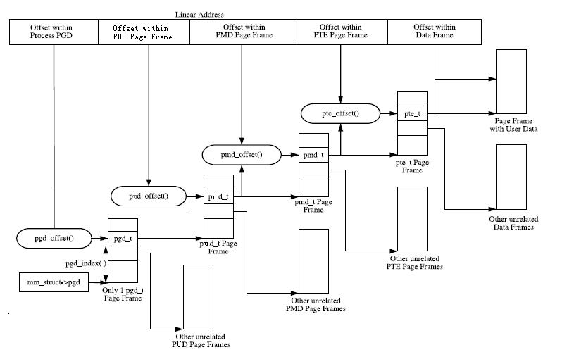
</p>

- insmod：如何编写内核模块并加载运行
- mprotect：如何修改内存页的保护属性
- page_address：如何将物理页转化为虚拟地址
- mmap申请的是一个独立的物理页吗？

- 修改其他进程的内存样例: [Linux内核如何私闯进程地址空间并修改进程内存](https://cloud.tencent.com/developer/article/1521419)

```c++
// test.c
// gcc test.c -o test
#include <stdio.h>
#include <stdlib.h>
#include <string.h>
#include <unistd.h>
#include <sys/mman.h>

int main()
{
    // mmap，申请一块空间
    // mmap最低要求申请一个页，因此此处申请1024，但是实际上还是会申请一个页大小，只是1024~4k的空间无法被读写
    char* addr = mmap(NULL, 1024, PROT_READ | PROT_WRITE, MAP_PRIVATE | MAP_ANONYMOUS, -1, 0);
    // 往写入的空间写入hello
    strcpy(addr, "hello");
    // 打印虚拟地址和进程号
    printf("addr: %lu   pid:%d\n", addr, getpid());
    printf("before:%s  \n", addr);
    // 等待输入一个字符
    getchar();
    // 打印修改后的值
    printf("after:%s\n", addr);
    return 0;
}
```


```c++
// test.c
// make -C /lib/modules/`uname -r`/build SUBDIRS=`pwd` modules
#include <linux/mm.h>
#include <linux/sched.h>
#include <linux/module.h>

static int pid = 1;
module_param(pid, int, 0644);

static unsigned long addr = 0;
module_param(addr, long, 0644);

// 获取某个进程、某个虚拟地址对应的物理页
static pte_t* get_pte(struct task_struct *task, unsigned long address)
{
    pgd_t* pgd;
    pud_t* pud;
    pmd_t* pmd;
    pte_t* pte;
    struct mm_struct *mm = task->mm;

    pgd = pgd_offset(mm, address);
    if(pgd_none(*pgd) || pgd_bad(*pgd))
        return NULL;

    pud = pud_offset(pgd, address);
    if(pud_none(*pud) || pud_bad(*pud))
        return NULL;

    pmd = pmd_offset(pud, address);
    if(pmd_none(*pmd) || pmd_bad(*pmd))
        return NULL;

    // 获取物理页
    pte = pte_offset_kernel(pmd, address);
    if(pte_none(*pte))
        return NULL;

    return pte;
}

static int test_init(void)
{
    struct task_struct  *task;
    pte_t* pte;
    struct page* page;
    // 获取某个进程task_struct
    task = pid_task(find_pid_ns(pid, &init_pid_ns), PIDTYPE_PID);
    if(!(pte = get_pte(task, addr)))
        return -1;

    // 获取物理页
    page = pte_page(*pte);
    // 建立本程序虚拟地址到物理页映射，并返回虚拟页的起始地址
    addr = page_address(page);
    // 写入
    strcpy(addr, (char *)"world");
    return 0;
}

static void test_exit(void)
{
}

module_init(test_init);
module_exit(test_exit);
MODULE_LICENSE("GPL");
```

```sh
./test
addr: 140338535763968   pid:9912
before: hello

// 允许test.ko后，此处输入了一个回车
after: world
```

```sh
insmod test.ko pid=9912 addr=140338535763968
```

- 使用/proc/pid/pagemap 获取某个地址的物理地址

```c++
// getphys.c
// gcc getphys -o getphys
#include <fcntl.h>
#include <stdio.h>
#include <stdlib.h>

int main(int argc, char **argv)
{
    int fd;
    int pid;
    unsigned long pte;
    unsigned long addr;
    unsigned long phy_addr;
    char procbuf[64] = {0};

    pid = atoi(argv[1]);
    addr = atol(argv[2]);

    sprintf(procbuf, "/proc/%d/pagemap", pid);

    fd = open(procbuf, O_RDONLY);
    size_t offset = (addr/4096) * sizeof(unsigned long);
    lseek(fd, offset, SEEK_SET);

    read(fd, &pte, sizeof(unsigned long));

    phy_addr = (pte & ((((unsigned long)1) << 55) - 1))*4096 + addr%4096;
    printf("phy addr:%lu\n", phy_addr);

    return 0;
}
```