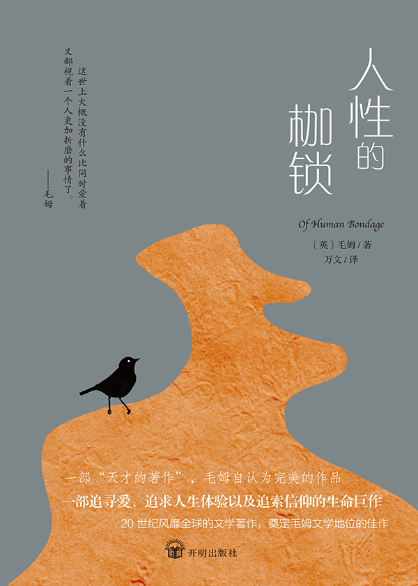

&#8195;&#8195;这是我阅读的第三本的毛姆的书籍。对于这位作家的调性我大概已经摸索清楚了：做一位在幕后讲好故事的老头，赋予角色生命力，让其在自己的时代背景下，演一出自己的戏，无关他人和社会。

&#8195;&#8195;先天跛脚的菲利普在母亲死后就寄住在伯父家。身为神父的伯父和视其如己出的伯母，都希望菲利普能够继承伯父的衣钵。在坎特伯雷皇家神学院的过程中，菲利普认识了富有激情的校长铂金斯先生，并希望将整个身心都交付给上帝，整夜虔诚诵读《圣经》，祈求上帝治愈自己跛脚。但是上帝长久的沉默、好友的离开、伯父和其他牧师的言行不一，使得菲利普心灰意冷的离开学校，决心遁入尘世。

&#8195;&#8195;在一意孤行的德国学习过程中，菲利普开始意识到宗教的虚无，并有了初次懵懂的情愫。后来到巴黎学习绘画、艺术，希望借着自己的绘画天赋，让艺术成为人生后续的主要道路。在巴黎，菲利普和朋友针砭时弊，讨论艺术、哲学、社会。也是在巴黎，菲利普认识了赠与其“人生的毛毯”的克朗肖、毫无天赋且脾气古怪的普莱斯小姐。普莱斯暗中喜欢菲利普，但最后只能在穷苦潦倒中死去，只留下一封向菲利普表明心意的信。在认识到自己毫无绘画天赋并得知伯母死讯后，菲利普离开了巴黎，在伯父母同意后，来到伦敦学医。

&#8195;&#8195;在伦敦求学的过程中，菲利普爱上了女招待米尔德拉德。米尔德拉德冷漠无情刻薄庸俗，总梦想嫁入富有之家。她的傲慢和刻薄严重地伤害了菲利普的自尊心，而这反而使菲利普对她的鄙夷、厌恶逐渐转为萦绕情愫，甚至丢弃尊严和求学。米尔德拉德后来和一位富有的人离开后，菲利普投入了温良的女作家诺拉的怀抱。后来，米尔德拉德被有妇之夫欺骗，怀孕生下一个孩子后被抛弃，最后只能找到菲利普求助。在情感的奴役下，菲利普抛弃诺拉，再次接济落魄的米尔德拉德，甚至出钱给米尔德拉德，露水情人度假寻欢。在一次次被抛弃、欺瞒、玩弄后，菲利普最后摆脱了这种感情的奴役。而米尔德拉德论入风尘。

&#8195;&#8195;在一次投机南山矿山失败后，菲利普破产，并只能在商店的打工，但在伯父死亡并继承其遗产后得以恢复学业。后来菲利普和前同事的女儿萨利相恋。在得知萨利怀孕之后，放弃长久以来的游历行医的计划，同萨利订婚，并接受一位老医生的诊所的邀请。

&#8195;&#8195;菲利普的人生，和我们大部分普通人有着极高的相似性。

&#8195;&#8195;不断的剖析自我、年少轻狂赴德求学、巴黎学画，也能坦然接受失败，不怨天尤人，仍旧富有尝试人生不同可能的勇气。对威尔金森小姐、诺拉的抛弃，和米尔德拉德的卑贱的感情，二者一对比，我们也发现菲利普是个不折不扣的薄凉负心之人。换个角度想，也许正是从小就被鄙夷跛脚、双亲离世、不被伯父关心，才导致菲利普的感情在米尔德拉德一次又一次的践踏、欺骗中，升起这种畸形的感情。

&#8195;&#8195;一些受我们当代教育影响比较深的人，就会使用“改造社会、环境”，“主观能动性”来辩驳或者反对这本书。他们想表达：其实人对社会的意义，而不是存在的意义，亦或者二者是等价的。（当然你也可以说人是社会关系的总和等等之类的话）。关于人生的意义，我就不再这里在重复地表达我的看法了。

&#8195;&#8195;我们人生的轨迹，也只是对于环境的应激反应，对于重大的事情，很多时候就已经是有一个大概的轮廓的了。如同我们看到菲利普远赴巴黎学画，就基本能预测出他最后折戟沉沙；看到对米尔德拉德的迷恋，就知道菲利普一定会遭受巨大的感情痛苦、财产损失，甚至伤害到身边的人。不是所有人都有斯特里克兰的决心、果断的。说到底，菲利普和我们都只是正常的普通人，都会衡量利弊、适时取舍。

&#8195;&#8195;去读更多的书，认识更多有趣的人，努力地活完短暂的一生，细致地经历由于自己人性、时代所造就的苦难、幸福，这就足够了。