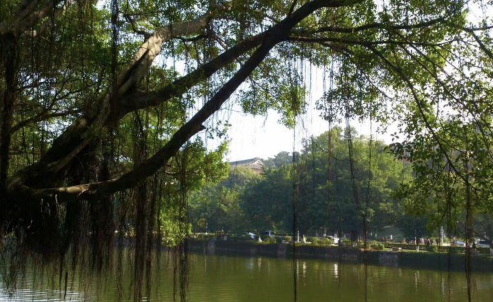
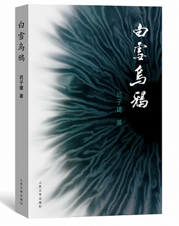

&#8195;&#8195;上次回五山也已经是很久之前的事了，自己也已经毕业近两年了。上一篇已经是近两个月前的事了，本来定好的两周一篇水文也没能按时完成。下一篇打算写一下Redis的总结。

&#8195;&#8195;最近虽说也看了几本书，但也没能有太大的收获。迟子建女士的散文总的来说还是不错的，但是不知为何，我最喜欢的散文作者仍然是史铁生。可能相对于寓意明确的故事，平凡人生的日常生活（特别是《我与地坛》）更是我着迷。

&#8195;&#8195;记得是19年年底，初次入职到北京熟悉异地的同事，回程那天的早上，跑去了地坛公园看看当年被史铁生的轮椅轧过的小径是否仍有书中的给人的感慨。和公园的其他区域比起来，小径所在的角落却是人流最是少、最是清幽。当然，我最喜欢的除了这一路的小径，就是相亲角了，毕竟有好多富婆在征婚。

&#8195;&#8195;《白雪乌鸦》被誉为东方《鼠疫》，这使我很期待它的表现。毕竟加缪大叔可是我最新欢的作者之一。

&#8195;&#8195;不知从何开始，我也觉得生活本身就是一场荒谬的长篇影视剧。“我们站在荒谬的起点，唯一有意义的行动就是经历，所以我们不应该希望生活得更好，而是生活得更多”。在我们这场新冠病毒中，我总是会不时联想到里厄医生、朗贝尔、塔鲁。荒谬的生活是一种常态，西斯弗斯式的反抗总是让我着迷。“生命的光芒只有在抗争中才能被激发出来，因此生命的意义就在于和困难的斗争。苦难越深，生命的意义因之越深”。

&#8195;&#8195;所有的抗争，会随着岁月的蔓延，散发出越来越亮的光。

- recommend： https://book.douban.com/review/1143003/