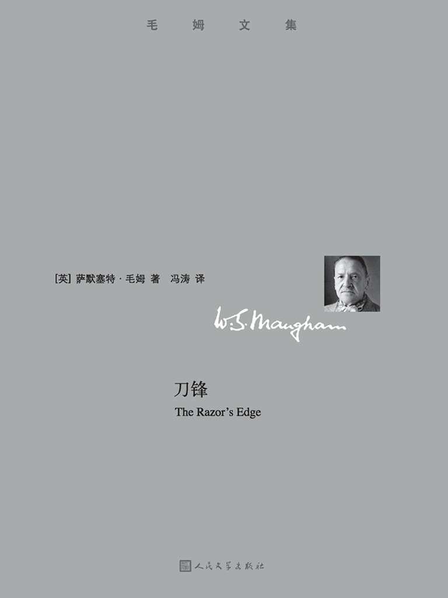

&#8195;&#8195;距离上一次写阅读相关的东西已经过去几近半年。这半年来岁说也读了一些书（《安静的美国人》、迟子建、...），但总的来说，能触动我的也没多少，《刀锋》是其中之一。

&#8195;&#8195;一战过后的拉里·达雷尔决心寻找真正的幸福与生命的意义，离开心爱的未婚妻与国家，十数年间流连多国，探索人间为什么会有恶与不幸......

---
&#8195;&#8195;“我多希望你能懂得我向你建议的生活要比你想象的任何生活都要充实得多。我真希望能让你看到精神生活是多么令人兴奋，经验多么丰富。它是没有止境的。它是极端幸福的生活。只有一件事同它相似，那就是当你一个人坐着飞机飞到天上，越飞越高，越飞越高，只有无限的空间包围着你，你沉醉在无边无际的空间里。你感到那样的极度幸福，使你对世界上任何权力和荣誉都视若敝屣。前几天，我读了笛卡儿，那样的痛快，文雅，流畅。天哪！”

&#8195;&#8195;“可是，拉里，”她急腔急调滴打断他，“你难道看不出你在要求我做一件我做不来的事情，是我不感兴趣而且不想感兴趣的事情吗？我对你讲过多少遍了，我只是一个平常的、正常的女孩子，我现在二十岁，再过十年我就老了，我要及时行乐。唉，拉里，我的确非常爱你。所有这些全都是无聊的玩意儿。它不会使你有什么出息的。……人家都在分秒必争地干，你却在浪费宝贵光阴。拉里，你要是爱我的话，你就不会为了一个梦想而抛弃我。……”

---

&#8195;&#8195;我觉这段文字真是写的太好了，有时甚至想强烈的向身边人朗诵这段对话：它将两个互相深爱的、思维互斥的的人之间的精神世界进行强烈的碰撞，最后带着满身伤痕背道而驰。

&#8195;&#8195;毛姆使用了不少笔墨来描述伊莎贝尔的灿烂美好，从青梅竹马的天真，到订婚时对美好未来的欢乐、遐想，都表示这是个无数人梦寐以求的伴侣。就是这样一个优秀到能够吸引所有男人的佳人，在经济大萧条破产后，也没有自怨自哀、自暴自弃，而是打理好其整个家庭，照顾失意的丈夫以及一对儿女。她是时间打磨后的光芒四射的宝石。

&#8195;&#8195;拉里是这本书的主轴，也是整本书精神的重要载体。他代表的是对生命意义的探索、对自由的渴望、对超脱一切的极致追求。不同于书中乃至人世间大多书人类的迷茫、矜矜业业，拉里从一开始就明白自己未来应该去做什么，那就是去探索、去感受、去领悟。从一开始的巴黎数年学习、阅读，到煤矿中尝试用身体的磨练来突破肉体的界限、再到大山大川追求圣徒、最后于风云交互的天地中顿悟，拉里都在一点点的前进，并最终云销雨霁，彩彻区明。

---
&#8195;&#8195;“当我清算了今生的前因后果之后，我就不会再回到世界上来。一想到这里，我不禁充满惶惑……我愿意接受形形色色的生活，不管它是怎样忧伤痛苦；我觉得只有生生不息，一个生命接一个生命，才能满足我的企求，我的活力，我的好奇心。”

---

&#8195;&#8195;本来我期待《刀锋》能带给我比《月亮与六便士》更大的冲击。但毕竟珠玉在前，就如同儿时的那袋子果糖一样，你没法要求下一颗会更甜。总的来说，《刀锋》是一本和《月亮与六便士》一样非常优秀的作品。

&#8195;&#8195;我爱拉里对生命真谛的追求的奋不顾身，也爱伊莎贝尔对美好生活的向往和努力，更爱芸芸众生的努力生活的每一个人。