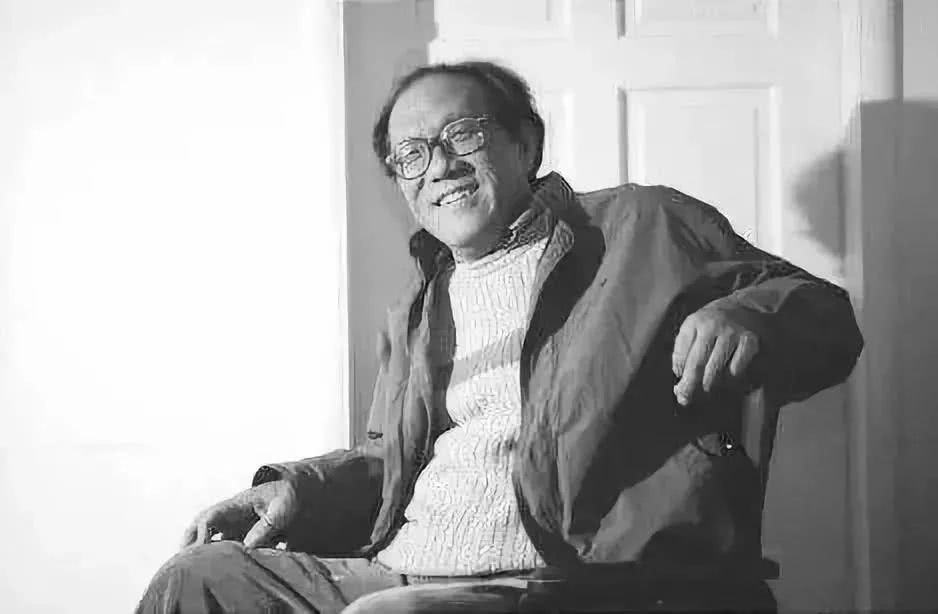
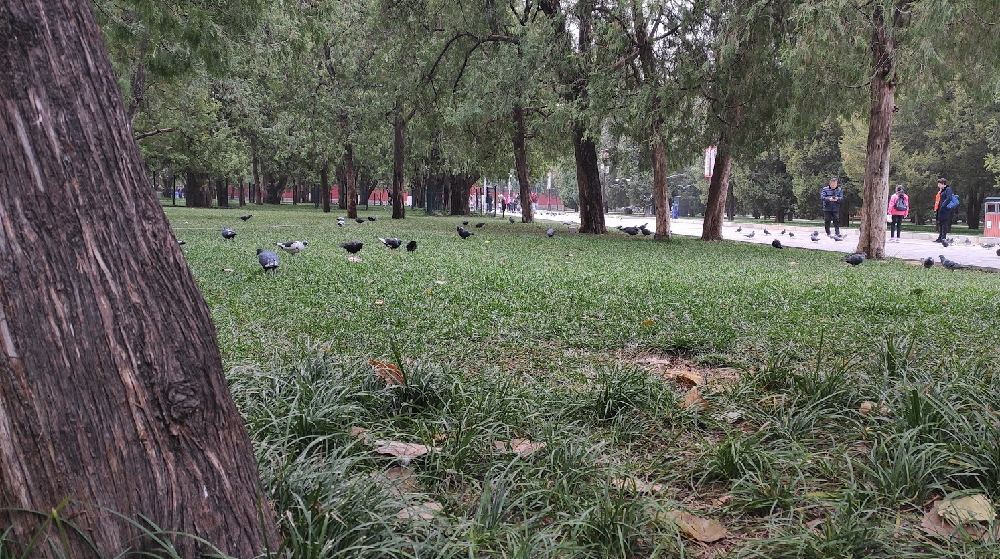

&#8195;&#8195;史铁生是我最喜欢的作家之一。

&#8195;&#8195;第一次知道史铁生，是初中的一篇课文————《我与地坛》。这大概是一篇选修或者无需背诵的课文，以至于我对此没有很深的印象，只记得和其他两三页的课文相比，它实在是冗长、啰嗦。没有完整的故事逻辑和任务叙述，分成了多个章节，写着几个看起来完全无关的事情。到了大学，又在图书馆偶尔看到史铁生的书。当我再次去读的时候，竟无语、凝噎：命运对于绝大部分人，都是残忍无情，对于极其少部分人，则是狠下摧残之意。

&#8195;&#8195;在遇到史铁生之前，我从未认真思考过：一个自小能跑能跳人，在满怀雄心壮志的青年，被残酷的命运拦腰折断，会是怎样的心情。2019年我第一次去北京，在回程的最后一天早上，做地铁去了一趟地坛公园。2019年的地坛没有以前史铁生影像里的那般荒芜，所有的泥土都覆满青草，几十年上百年的大树也还在透着绿意，不怕生人的鸟也在树林间跑来爬去。公园很大，绿意遍布所有的小道和分叉。我漫步在公园的每条小道上，总是不自觉的想起他写过的文字。我走过的每到小路，史铁生的轮椅也都轧过。

&#8195;&#8195;为什么会喜欢史铁生呢？大概是因为大部分人类总是能从同类的痛苦中获得安慰。难道上天在摧残人类的过程中也能获得快乐？

&#8195;&#8195;无论如何，永远也不要放弃生的希望。死亡是一件总会达到的节日，无需期盼，无需害怕，耐心等待就可以了。如果在这之前，还有需要做的事情，那就勇敢努力的去做。