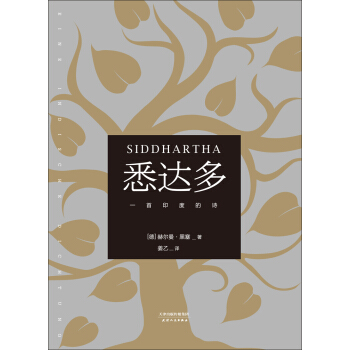

&#8195;&#8195;最近工作比较忙，很久没运动，也没有看书了。前几天刚到了几本书，其中一本就是黑塞的《悉达多》。趁着今天周六，我先把这本比较薄的书先看完了。

&#8195;&#8195;读完这本书，总是让我想起十六七岁是思考的问题：我是谁。其实这问题的答案对每个人都不一样，甚至没有答案。我就是我，是世间，是这茫茫宇宙中的一粒灰层，与河边的石头、垃圾堆里的老鼠、博物馆里的壁画同样平凡、肮脏、美丽。

&#8195;&#8195;吾与子渔樵于江渚之上，侣鱼虾而友麋鹿，驾一叶之扁舟，举匏樽以相属。寄蜉蝣于天地，渺沧海之一粟。