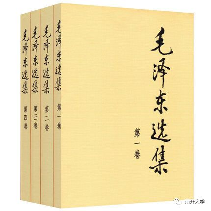
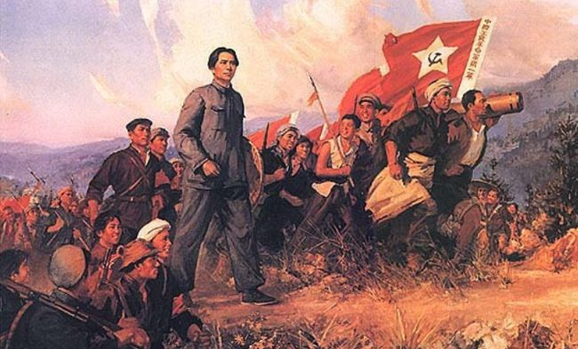

&#8195;&#8195;最近花了点时间阅读毛选。当下的青年人中，流行着针砭时弊、社会批评的时尚，特别是批评那些已经作古或者日落西山的人，其中以批评毛泽东同志之风最盛。但是，假如这些“批评家”们真的有读过那个时代的人（毛选、蒋介石等）的作品，那相信大部分人都会认识到自己的肤浅、错误了。

&#8195;&#8195;《毛泽东选集》整体风格简单明了，开门见山，直来直去，文字近乎口语化，只要识字，哪怕是没有受过高等教育的人，也能理解到书中文意的十之八九。比如他说“革命不是请客吃饭，不是做文章，不是绘画绣花，不能那样雅致，那样丛容不迫，文质彬彬，那样温良恭俭让。革命是暴动的，是一个阶级推翻一个阶级的暴裂的行动”。相对于同时代蒋介石的《中国之命运》的文绉绉，不着实际，毛选实在是容易读太多了。这也很好的符合两方的立场：毛泽东的文章主要面向对象是共产党人、革命党人、人民群众，而国民党政府代表的是大资产阶级、买办阶级，双方面向的对象是完全不同的。

&#8195;&#8195;《毛泽东选集》体现了一个共产党员革命性的、务实的、果敢的情怀。比如在《没有调查，就没有发言权》一文中，毛泽东同志就着重的分析了党内当时存在的一种现象：领导干部到新辖区履职，连所在地的情况多搞不清楚，就开始烧三把火，下政令，后来发现与当地情况不符合，政令作废，令人烦不胜烦；首长看到士兵犯错，不由分说就给士兵几个巴掌，后来发现是误会，次数一多，在军队中的威信就下降了，队伍也没有以前团结了。其实在我们日常工作生活中，也经常存在这种现象，新领导上台没多久，就开始发布三年小BP，五年大BP，彼时他可能不知道那块功能是哪个团队负责、我们的主要客户是谁、甚至连业务的大致流程都还不知道。毛泽东同志就坚决地抨击了这种现象，并提出“没有调查，就没有发言权”。当然如果仅仅是批评，那毛泽东思想也就仅此而已。更难能可贵的是，毛泽东同志还针对性的提出“调查问题的方法”：去找你的下属提问、去问人民群众或者士兵兄弟生活中有什么困难、去看下这个县区有几条主要干道、去探访当地的老人家等等，只要做多点调查，多搜索相关资料，新情况的一团乱麻的线头是不是就能被抓住了？是不是就有解决群众的困难的法子了？

&#8195;&#8195;在《矛盾论》之前，毛泽东同志就着重的分析当前社会的主要矛盾，次要矛盾，并有效地提出“谁是我们的敌人，谁是我们的朋友”的问题，并找到解决社会问题的方法：坚决进行以中国共产党为核心的、以无产阶级领导的、团结一切可团结的力量、坚决推翻封建主义、官僚资本主义、帝国主义对中国人民的压迫。《矛盾论》就是毛泽东“剖析事物内部组成部分、分析主要和次要矛盾、并提出解决矛盾所需的工作”的方法论。

&#8195;&#8195;读完毛选，我发现毛泽东同志还是乐观派（当然这也是因为他对党内外、国内外的阶级矛盾有着深刻的认识而产生的必然认知）。1927年，大革命失败后，中国共产党就明白，革命必须要有自己的军事力量，一切主要依靠外部进行革命的想法都是错误的、致命的。此后的数年内，红军力量就逐渐的曲折成长起来了了。在第五次反围剿（1933）失败后（这也导致了我们后来熟知的“万里长征”），红军力量受到极大的损害，甚至连当时的林彪、张国焘（党的早起创始人）等都产生了悲观情绪。毛泽东分析了红军当时的情况，认为红军力量暂时弱小不假，但是这些都是表象，不能因此判断战争的失败或者胜利，正确的判断方法应该是不被表象迷惑，而是分析事物的本质，对于中国革命而言，具体就是观察引起革命高潮的矛盾是否真正发展了，这样才可以做出正确的决定和判断。这篇极大鼓舞共产党、红军士气文章，就是著名的《星星之火，可以燎原》。当然，一般人不被表象迷惑才怪，要是我处于当时的环境，大概率也是悲观消极，甚至认为中国革命毫无希望，这也更突显除了毛泽东同志对革命矛盾的深刻认知，和对革命发展的乐观，这也就是为什么他能提出“在战略上蔑视敌人，在战术上重视敌人”的重要论断。

&#8195;&#8195;除了上述对于革命形势的正确判断，《毛泽东选集》中的《关系群众生活，注意工作方法》还表达了中国共产党员和人民群众的关系。和国民党政府的大话式、空话式的宣言、公告甚至宪法比起来，以毛泽东同志为核心的党中央，在革命环境如此恶劣的情况下，仍能够全心全意的关系人命群众的柴米油盐的问题，我真的十分感动：

&#8195;&#8195;“解决群众的穿衣问题，吃饭问题，住房问题，柴米油盐问题，疾病卫生问题，婚姻问题。总之，一切群众的实际生活问题，都是我们应当注意的问题。假如我们对这些问题注意了，满足了群众的需要，我们就真正成了群众生活的组织者，群众就回真正围绕在我们周围，热烈的拥护我们。

&#8195;&#8195;一切群众生活上的问题，都应该把它提到自己的议事日常上。应该讨论，应该决定，应该实行，应该检查。要让广大群众认识我们是代表他们的利益的，是和他们呼吸相通的。

&#8195;&#8195;要群众拿出他们的全力，就得和群众在一起，就得去发动群众的积极性，就得关系群众的痛痒，就得真心实意的为群众谋利益，解决群众的生产和生活的问题，盐的问题，米的问题，房子的问题，衣的问题，生小孩的问题，解决群众的一切问题。”

&#8195;&#8195;除了前文的提到的内容，《毛泽东选集》里还有很多关于实际问题（阶级分析、个人主义、教条主义、持久战等等）的讨论，不仅仅结论十分精彩，而且其中的分析逻辑也是极其有意思。(在这里，我们需要严肃批评当前中小学教育中的历史和政治学科，只知道让学生死记硬背中国共产党发展过程中的总结得到的道理，而忽略了背后的历史背景和其中的推论逻辑)

&#8195;&#8195;至此，我们可以毫不夸张地说，毛泽东同志是中华民族上个世纪最伟大的思想家、军事家，毛泽东思想是中国共产党的瑰宝，是中华民族历史上璀璨的明珠。当代青年都应该学习毛泽东思想，学习其中分析社会问题的方法、调查问题的方法、和群众相处的方法、解决事物主要矛盾的方法等等。
